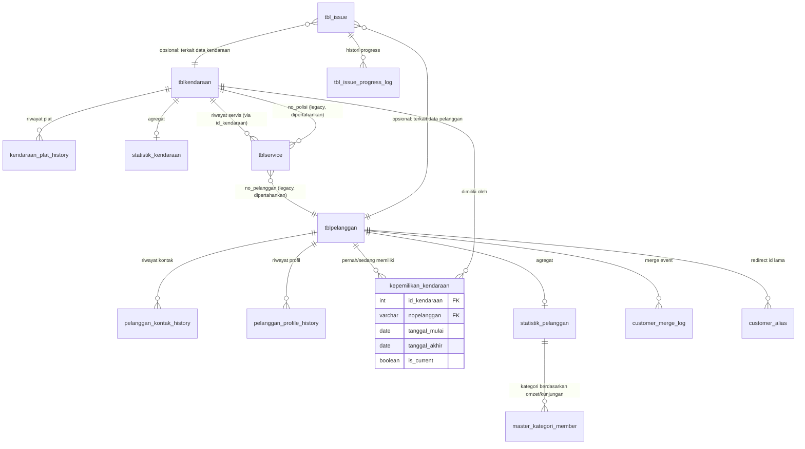

# Analisis Arsitektur Data Pelanggan & Kendaraan — Migrasi Access → MySQL

**Peran:** Senior System Analyst / Database Architect / Software Architect
**Tanggal:** 2026-07-03
**Scope:** `tblpelanggan`, `tblkendaraan`, `tblservice`, `statistik_pelanggan`, `tblpelanggangrup`, `master_kategori_member` (skema aktual MySQL, diverifikasi langsung dari database produksi)

> Dokumen ini analisis saja. Tidak ada perubahan skema/kode yang dieksekusi.

---

## 0. Fakta Skema Aktual (Baseline)

Diverifikasi langsung via `SHOW COLUMNS` + `information_schema.KEY_COLUMN_USAGE` pada database produksi (bukan asumsi):

| Tabel | Primary Key | Baris | Catatan |
|---|---|---|---|
| `tblpelanggan` | `nopelanggan` (varchar 20, natural key) | 37.673 | tidak ada surrogate `id` |
| `tblkendaraan` | `nopolisi` (varchar 20, natural key) | 37.354 | tidak ada surrogate `id`, tidak ada FK ke pelanggan |
| `tblservice` | `no_service` + `kd_cabang` (composite) | 103.546 | `no_pelanggan`, `no_polisi` cuma varchar copy, **tanpa FK constraint** |
| `statistik_pelanggan` | `id_statistik`, unique `no_pelanggan` | 37.110 | 1 baris per **pelanggan**, tidak per-kendaraan |
| `tblpelanggangrup` | `kgrup` | — | katalog lama: BENGKEL/GOLD/SILVER/UMUM |
| `master_kategori_member` | `id_kategori` | — | katalog baru: Bronze/Silver/Gold/Platinum, dua sistem tier paralel |

**Temuan struktural kunci (fakta, bukan dugaan):**

1. `tblkendaraan` **tidak punya foreign key ke `tblpelanggan`**. Kepemilikan disimpan sebagai `pemilik VARCHAR(50)` — string nama bebas, bukan relasi.
2. `tblservice.no_pelanggan` dan `no_polisi` **tidak punya FK constraint** ke tabel manapun — hanya nilai varchar yang *diasumsikan* cocok.
3. Tidak ada surrogate integer key (`id` auto increment) di `tblpelanggan` maupun `tblkendaraan`. Primary key-nya adalah nilai bisnis yang **bisa berubah** (nomor polisi ganti, nomor pelanggan bisa direkode saat migrasi).
4. Cek duplikat langsung di data produksi (bukan hipotetis) — nama pelanggan generik tanpa nomor telepon sudah terjadi masif:
   ```
   SUGENG, BPK   -> 43 baris duplikat, notlp kosong
   YUSUF, BPK    -> 35 baris duplikat, notlp kosong
   PAK           -> 22 baris duplikat, notlp kosong
   NURUL,KAK     ->  6 baris duplikat, notlp kosong
   ```
   Ini bukan risiko masa depan — ini **utang data yang sudah ada sekarang**, kemungkinan besar diwariskan dari pola input Access (nama panggilan tanpa validasi identitas).
5. `nopolisi` sejauh ini tidak ada duplikat aktif (PK effectively enforced) — tapi karena PK = nilai bisnis yang bisa berubah, ganti plat otomatis berarti *record kendaraan baru* dari sudut pandang database, bukan update.

Baseline ini yang jadi dasar semua analisis kasus di bawah.

---

## 1. Arsitektur Database — Temuan & Rekomendasi

### 1.1 Temuan Masalah

| # | Temuan | Bukti |
|---|---|---|
| M1 | Kepemilikan kendaraan disimpan sebagai teks (`pemilik`), bukan FK | `tblkendaraan` tidak referensi `tblpelanggan.nopelanggan` |
| M2 | Tidak ada surrogate key — PK = business key yang mutable | `nopelanggan`, `nopolisi` keduanya varchar natural key |
| M3 | Tidak ada FK enforcement antara transaksi (`tblservice`) dan master (`tblpelanggan`/`tblkendaraan`) | Hasil query `KEY_COLUMN_USAGE` kosong untuk relasi ini |
| M4 | Statistik pelanggan hanya level pelanggan, tidak per kendaraan | `statistik_pelanggan` unique per `no_pelanggan`, tidak ada tabel `statistik_kendaraan` |
| M5 | Dua sistem membership paralel tidak sinkron penuh | `tblpelanggangrup` (kgrup) vs `master_kategori_member` (status_member) — beda basis diskon (0/5/10% vs 0/10/15/20%) |
| M6 | Data pelanggan sudah terkontaminasi duplikat nama generik tanpa telepon | 43+35+22+... baris pada sample kecil saja |
| M7 | Field alamat/kota/propinsi tersebar flat, tidak dinormalisasi ke wilayah master meski sudah ada modul wilayah | Struktur `tblpelanggan` masih simpan `kota`, `propinsi` sebagai varchar bebas, bukan FK ke master wilayah |
| M8 | `tblservice` satu tabel menampung >70 kolom mencampur: data transaksi, alokasi staff (mekanik1-4, admin1-2, kepala mekanik1-2), pembayaran multi-channel, cancel-reason, garansi | Struktur wide-table, rawan null sparse dan sulit index selektif |

### 1.2 Analisis Penyebab

Pola ini khas hasil migrasi langsung dari Access: Access tidak punya foreign key enforcement yang dipaksakan secara default dan lazim memakai nilai teks sebagai "kunci" relasi antar tabel/query linked. Saat porting ke MySQL, struktur logika Access (relasi by convention, bukan by constraint) ikut terbawa apa adanya — tabel MySQL jadi punya bentuk relasional tapi berperilaku seperti flat-file Access.

Root cause intinya: **belum ada identity layer independen** untuk pelanggan dan kendaraan yang tahan terhadap perubahan atribut (nama, WA, plat). PK yang dipakai justru atribut yang paling sering berubah di lapangan.

### 1.3 Risiko Bila Tidak Diperbaiki

- Histori servis "putus" tiap kali plat ganti atau nomor pelanggan direkode saat sinkronisasi Access.
- Laporan omzet per pelanggan/kendaraan makin tidak akurat seiring waktu (duplikat bertambah linear terhadap volume transaksi — 103rb baris servis sudah berjalan tanpa integrity constraint).
- Tidak mungkin membangun statistik per-kendaraan yang solid tanpa refactor (butuh untuk fitur "Motor A / Motor B / Motor C").
- Program membership makin sulit dipertahankan konsisten karena title "member Gold" tidak attached ke identity yang stabil.
- Migrasi Access lanjutan (cabang lain, data historis lama) akan **memperbanyak** duplikat karena tidak ada mekanisme dedup/identity-resolution di titik masuk data.

### 1.4 Alternatif Solusi

**Opsi A — Non-invasive: Identity Layer Tambahan (tanpa ubah PK lama)**
Tambah tabel baru `customer_identity` dan `vehicle_identity` sebagai layer identitas independen, dengan `nopelanggan`/`nopolisi` LAMA tetap ada sebagai kolom biasa (bukan PK) untuk kompatibilitas mundur. Semua tabel transaksi baru pakai `id_customer`/`id_vehicle` (integer, immutable). Tabel lama tidak disentuh strukturnya — cukup ditambah kolom FK opsional dan view kompatibilitas.

**Opsi B — Invasive: Redesign PK penuh (ganti PK ke surrogate id)**
Ubah `tblpelanggan`/`tblkendaraan` PK jadi `id INT AUTO_INCREMENT`, `nopelanggan`/`nopolisi` jadi kolom biasa dengan unique index. Semua FK di 100rb+ baris `tblservice` dan tabel lain harus di-remap.

**Opsi C — Status quo + patch di level aplikasi**
Tidak ubah database, hanya tambah validasi & pencarian fuzzy di form input untuk mencegah duplikat baru, plus proses "merge" manual di level UI.

### 1.5 Kelebihan & Kekurangan

| Opsi | Kelebihan | Kekurangan |
|---|---|---|
| A (identity layer tambahan) | Tidak mengganggu operasional berjalan; bisa rollout bertahap per modul; histori lama tidak perlu di-remap massal; risiko downtime rendah | Ada 2 layer identitas untuk sementara (lama+baru) sampai migrasi tuntas; butuh disiplin agar modul baru konsisten pakai id baru |
| B (redesign PK) | Struktur akhirnya paling "benar" secara relasional; FK enforcement penuh | Sangat invasive — 103rb+ baris servis, semua laporan, semua query hardcode `no_pelanggan`/`no_polisi` harus disentuh; risiko downtime & bug regresi tinggi; tidak cocok dilakukan sekali jalan pada sistem yang masih dipakai harian |
| C (patch aplikasi saja) | Paling cepat, tanpa migrasi data | Tidak menyelesaikan akar masalah; duplikat & histori putus tetap terjadi di masa depan; tidak scalable untuk fitur statistik per-kendaraan |

### 1.6 Solusi yang Direkomendasikan

**Opsi A (Identity Layer Tambahan), dieksekusi bertahap.**

Alasan: sistem sedang berjalan produksi (103rb+ servis, 37rb+ pelanggan/kendaraan), best practice DMS/ERP otomotif (Auto2000, Astra, dealer management systems umumnya) selalu mempertahankan **backward-compatible identity bridge** saat migrasi legacy — pola yang dipakai adalah *strangler pattern*: sistem baru dibangun di sisi tabel lama tanpa mematikannya, baru dipindah penuh setelah data tervalidasi. Opsi B secara teoretis lebih bersih tapi risikonya tidak proporsional dengan manfaat jangka pendek, dan bisa dilakukan **belakangan** setelah Opsi A stabil (opsi A adalah prasyarat aman untuk opsi B, bukan pengganti).

---

## 2. Tracking Identitas Pelanggan

### Prinsip dasar yang dipakai DMS/CRM Automotive profesional

Toyota (T-CRM/Autoline), Auto2000, dan dealer Honda/Yamaha pada umumnya memisahkan tiga konsep yang sering dicampur di sistem sederhana:

1. **Identity** — siapa orang ini secara unik, tidak berubah walau atribut berubah (di sistem modern: `customer_id`, disamakan lewat NIK/KTP kalau ada, atau composite matching kalau tidak).
2. **Contact/Profile** — atribut yang bisa berubah (nama panggilan, no WA, alamat, email) — disimpan dengan **histori versi**, bukan overwrite.
3. **Asset (kendaraan)** — dimiliki identity tertentu pada rentang waktu tertentu (ownership punya `tanggal_mulai`/`tanggal_akhir`), bukan relasi permanen 1-ke-1.

Struktur yang direkomendasikan di bawah mengikuti pola ini.

### Kasus 1 — Nama tetap, nomor WA berubah

**Analisis:** Karena saat ini identity pelanggan = `nopelanggan` (yang tidak diubah user, cuma dipakai sistem), no WA ganti **seharusnya** tidak memutus histori — asal alur update di aplikasi melakukan `UPDATE tblpelanggan SET no_wa=... WHERE nopelanggan=...`, bukan membuat baris pelanggan baru. Tapi resiko nyata: kalau CS mencari pelanggan pakai *nomor WA* sebagai kunci pencarian utama (pola umum di form kasir "cari by nopol/nama/no WA"), begitu WA lama tidak dikenali, CS cenderung membuat pelanggan baru manual — itulah yang menyebabkan duplikat "SUGENG, BPK" x43.

**Rekomendasi:** Simpan riwayat nomor kontak di tabel anak `pelanggan_kontak_history(nopelanggan, no_wa, tanggal_mulai, tanggal_akhir, is_current)` — nomor lama tetap bisa dipakai sebagai kunci pencarian sekunder ("nomor ini pernah dipakai oleh pelanggan X"), sehingga histori tetap terbaca dan tidak memicu pembuatan pelanggan ganda.

### Kasus 2 — Ganti nomor polisi

**Analisis:** Ini masalah paling struktural. Karena `nopolisi` adalah PK, "ganti plat" di sistem sekarang hanya bisa direpresentasikan dengan dua cara buruk:
- (a) UPDATE PK langsung (berbahaya — MySQL bisa `ON UPDATE CASCADE` kalau FK ada, tapi FK-nya sendiri tidak ada, jadi update PK ini **akan memutus semua baris `tblservice.no_polisi` lama** karena mereka cuma string copy yang tidak ikut ter-update).
- (b) Insert baris kendaraan baru dengan plat baru — histori lama "menggantung" di plat lama, seolah dua motor berbeda.

**Rekomendasi:** Buat surrogate `id_kendaraan` (int, immutable) di `tblkendaraan` (tambahan, PK lama `nopolisi` tetap ada sebagai unique key demi kompatibilitas). Tambah tabel `kendaraan_plat_history(id_kendaraan, nopolisi, tanggal_mulai, tanggal_akhir, is_current)`. Semua servis baru dicatat dengan `id_kendaraan`; pencarian tetap bisa lewat plat lama maupun baru karena riwayat plat tersimpan. Histori servis lama (yang masih pakai `no_polisi` sebagai teks) di-backfill `id_kendaraan`-nya lewat proses migrasi satu kali (matching by `nopolisi` snapshot terakhir sebelum ganti).

### Kasus 3 — Motor dijual, pindah ke pelanggan lain

**Analisis & pilihan:**

| Pilihan | Deskripsi | Kelebihan | Kekurangan |
|---|---|---|---|
| Histori ikut kendaraan | Semua servis motor tetap terhubung ke 1 `id_kendaraan`, siapapun pemiliknya | Berguna untuk garansi part/servis berbasis kondisi motor, tracking KM, recall servis pabrikan | Histori "milik siapa" bercampur — pemilik baru bisa lihat riwayat servis pemilik lama kalau UI tidak difilter |
| Histori ikut pelanggan | Servis "menempel" ke pelanggan, motor dianggap entitas terpisah per kepemilikan | Privasi pemilik lama terjaga | Riwayat perawatan motor jadi terputus-putus per pemilik — buruk untuk analisis kondisi motor & garansi teknis |
| **Dipisah: histori kendaraan + histori kepemilikan** (direkomendasikan) | Kendaraan (`id_kendaraan`) punya histori servis penuh sepanjang umur motor. Terpisah, ada tabel `kepemilikan_kendaraan(id_kendaraan, nopelanggan, tanggal_mulai, tanggal_akhir, is_current)` yang mencatat siapa pemilik pada periode tertentu | Dapat keduanya: histori teknis motor utuh untuk kebutuhan servis/garansi, DAN privasi terjaga karena tampilan "riwayat pelanggan" difilter hanya periode dia jadi pemilik (`WHERE tanggal_servis BETWEEN tanggal_mulai AND tanggal_akhir`) | Butuh 1 tabel tambahan + logic filter tanggal di query pelanggan; sedikit lebih kompleks dari 2 opsi ekstrim |

Ini pola yang dipakai dealer resmi (Auto2000/Astra) — kendaraan (by nomor rangka/mesin) adalah *asset record* independen; kepemilikan adalah relasi bertanggal ke asset itu. Nomor rangka (`no_rangka`) yang sudah ada di `tblkendaraan` sangat cocok jadi kunci natural sekunder untuk kasus ini (nomor rangka tidak pernah berubah walau plat & pemilik berubah) — sebaiknya dijadikan unique index karena saat ini kolom `no_rangka` ada tapi nullable tanpa index.

### Kasus 4 — Ganti nama, WA, alamat, email sekaligus

**Analisis:** Sama seperti Kasus 1 tapi multi-atribut. Karena identity (`nopelanggan`/`id_customer` baru) sudah independen dari atribut, sistem "tahu" ini orang yang sama selama operasi dilakukan sebagai UPDATE pada baris identity yang sama — bukan INSERT baru. Masalah utamanya bukan struktur database, tapi **alur UI**: kalau CS mengetik ulang semua field karena tidak menemukan pelanggan lama (pencarian gagal match), sistem akan menganggapnya pelanggan baru.

**Rekomendasi:**
- Tabel histori atribut (`pelanggan_profile_history`) untuk audit trail — siapa ubah apa, kapan (berguna juga untuk kasus sengketa "kok datanya berubah").
- Pencarian pelanggan di UI **wajib multi-kriteria dengan fuzzy match** (nama mirip + potongan nomor HP + plat kendaraan yang pernah terdaftar) sebelum tombol "Pelanggan Baru" bisa ditekan — mencegah duplikat di titik input, bukan cuma di titik database.

### Kasus 5 — Merge Customer

**Analisis:** Ini operasi paling berisiko karena menyentuh histori transaksi (103rb+ baris `tblservice` referensi `no_pelanggan` sebagai string tanpa FK).

**Prosedur merge yang aman (best practice — reversible, auditable):**

1. **Tidak pernah hard-delete** baris pelanggan yang di-merge. Tandai `status='merged'`, `merged_into_nopelanggan='<target>'`.
2. Buat tabel `customer_merge_log(id, nopelanggan_source, nopelanggan_target, dilakukan_oleh, alasan, tanggal, snapshot_json_before)` — snapshot data sebelum merge untuk rollback.
3. Re-point semua baris transaksi anak (`tblservice`, `tblservice_advisor`, `statistik_pelanggan`, kendaraan yang atribut `pemilik`-nya match) dari `nopelanggan_source` → `nopelanggan_target` dalam **satu transaction SQL** (all-or-nothing).
4. Rebuild `statistik_pelanggan` target (agregasi ulang total_transaksi/omzet/kunjungan gabungan source+target), lalu hapus/nonaktifkan baris statistik source.
5. Sediakan tabel `customer_alias(nopelanggan_lama, nopelanggan_baru)` sebagai *redirect* permanen — kalau ada laporan lama/link lama yang masih mereferensikan `nopelanggan_source`, sistem tetap bisa resolve ke target tanpa 404/data hilang.
6. Proses ini **harus lewat approval role tertentu** (bukan CS biasa) mengingat dampaknya ke laporan omzet & komisi historis — sejalan dengan kebutuhan modul ticketing di section 6 (merge = kandidat kuat untuk punya workflow approval sendiri, bukan tombol bebas klik).

---

## 3. Statistik Pelanggan — Struktur Data & Tampilan Dashboard

### 3.1 Kondisi Saat Ini

`statistik_pelanggan` adalah **tabel ringkasan pre-agregat per pelanggan** (bukan on-the-fly query ke `tblservice` tiap kali dashboard dibuka) — pendekatan ini sudah benar untuk performa, tapi granularitasnya cuma level pelanggan. Tidak ada padanan per-kendaraan.

### 3.2 Rekomendasi Struktur Bertingkat

Ikuti pola *rollup* dua level, sama seperti dashboard CRM Automotive (mis. Auto2000 "riwayat kendaraan pelanggan"):

```
statistik_pelanggan          (agregat level PELANGGAN — sudah ada)
   └── statistik_kendaraan   (agregat level KENDARAAN per pelanggan — BARU, direkomendasikan)
```

**Tabel baru `statistik_kendaraan`** (mirror pola `statistik_pelanggan`, tapi keyed `id_kendaraan`):

| Kolom | Tujuan |
|---|---|
| `id_kendaraan` (unique) | key ke kendaraan |
| `nopelanggan_current` | pemilik saat ini (denormalized untuk kecepatan query, sumber kebenaran tetap di `kepemilikan_kendaraan`) |
| `total_transaksi`, `total_kunjungan`, `total_nominal` | agregat servis untuk motor ini |
| `total_jasa`, `total_sparepart` | breakdown, untuk kebutuhan tampilan "total jasa / total sparepart" per motor |
| `km_terakhir`, `tanggal_servis_terakhir` | untuk reminder & estimasi servis berikut |
| `updated_at` | trigger refresh |

**Kenapa tabel terpisah, bukan VIEW agregat langsung dari `tblservice`:**
Dengan 103rb+ baris servis dan bertambah terus, `GROUP BY no_polisi` on-the-fly di setiap load dashboard tidak scalable jangka panjang, apalagi kalau tanpa index dan FK yang benar (kondisi sekarang). Pre-agregat + refresh via trigger/event saat servis selesai/bayar (pola yang sepertinya sudah dipakai untuk `statistik_pelanggan`) menjaga konsistensi arsitektur.

### 3.3 Layout Dashboard yang Disarankan

```
+-----------------------------------------------+
| RINGKASAN PELANGGAN (dari statistik_pelanggan) |
| Total Transaksi (semua kendaraan) | Kunjungan  |
| Total Omzet | Status Member: GOLD | Poin: 1240 |
| Terakhir Servis: 12 hari lalu                  |
+-----------------------------------------------+
+--- Motor A (G 1234 XX) ------------------------+
| Total Transaksi: Rp X | Kunjungan: n kali      |
| Jasa: Rp X | Sparepart: Rp X                   |
| Terakhir Servis: tgl | KM Terakhir: 12.400     |
+-------------------------------------------------+
+--- Motor B (G 5678 YY) ------------------------+
| ...                                            |
+-------------------------------------------------+
```

Bagian atas dari `statistik_pelanggan` (1 query, cepat). Bagian bawah dari `statistik_kendaraan WHERE id_kendaraan IN (SELECT id_kendaraan FROM kepemilikan_kendaraan WHERE nopelanggan=? AND is_current=1)` — expand/collapse per motor di UI supaya tidak berat kalau pelanggan punya kendaraan sangat banyak (lihat section 5, kasus >10 motor).

---

## 4. Membership — Perilaku Saat Perubahan Data

### 4.1 Temuan

Membership saat ini nempel di **level pelanggan** (`statistik_pelanggan.status_member`, `master_kategori_member`), dihitung dari akumulasi transaksi/kunjungan pelanggan — **bukan** dari kendaraan. Ini sudah pilihan arsitektur yang tepat secara bisnis (member itu status orang, bukan status motor), tapi implementasinya rentan terhadap Kasus 1-5 di atas karena identity pelanggan sendiri belum solid.

### 4.2 Efek Perubahan Data terhadap Status Gold

| Perubahan | Efek yang seharusnya terjadi | Syarat teknis |
|---|---|---|
| Ganti no WA | Status Gold **tetap** | Identity (`nopelanggan`) tidak berubah, cukup UPDATE kontak |
| Ganti nopol | Status Gold **tetap** | Identity pelanggan tidak tersentuh oleh ganti plat (yang berubah cuma sisi kendaraan) — asal Kasus 2 diimplementasi via `id_kendaraan`, bukan re-insert pelanggan |
| Tambah kendaraan | Status Gold **tetap/naik** (transaksi baru ikut terakumulasi ke pelanggan yang sama) | `kepemilikan_kendaraan` baru menunjuk `nopelanggan` yang sudah ada, statistik pelanggan re-agregat otomatis |
| Jual kendaraan lama | Status Gold pelanggan **lama** tetap (dihitung dari histori transaksi dia, bukan dari kepemilikan aktif kendaraan) | `statistik_pelanggan` tidak boleh recalculate mundur saat kendaraan pindah tangan — histori transaksi tetap milik dia |
| Beli kendaraan baru dari pihak lain (motor second yang sudah pernah servis di sini) | **Isu tersembunyi:** kalau motor itu match `id_kendaraan` yang sudah ada (riwayat servis lama attached ke pemilik sebelumnya), status member pemilik BARU tidak boleh ikut mewarisi omzet pemilik lama | Filter agregasi pelanggan-vs-kendaraan wajib pakai rentang tanggal `kepemilikan_kendaraan` (lihat Kasus 3) |

### 4.3 Mekanisme yang Direkomendasikan

- Kategori member dihitung murni dari `statistik_pelanggan` (agregat by `nopelanggan`/`id_customer`), **independen** dari `id_kendaraan` mana pun.
- Saat merge customer (Kasus 5), status member ikut aturan "ambil yang lebih tinggi" (`GREATEST` antara dua level, bukan re-hitung dari nol) sebagaimana pola *upgrade-only floor* yang sudah dipakai sistem ini untuk sinkronisasi tier, supaya merge tidak pernah menurunkan benefit yang sudah didapat pelanggan.
- Satukan `tblpelanggangrup` dan `master_kategori_member` dalam roadmap jangka menengah (2 sumber kebenaran diskon adalah data-integrity risk sendiri) — di luar scope inti dokumen ini tapi perlu masuk roadmap section 9.

---

## 5. Brainstorming Isu Lapangan Tambahan

Selain yang diminta, isu realistis lain untuk konteks bengkel Indonesia:

| Isu | Penjelasan Singkat | Dampak |
|---|---|---|
| Motor perusahaan/rental/ojol dengan turnover pengemudi tinggi | Pemilik terdaftar (perusahaan) beda dengan yang bawa motor & telepon CS | Butuh flag `tipe_pelanggan IN ('perorangan','perusahaan','fleet')` + kontak PIC terpisah dari kontak "yang antar motor" |
| Nomor WA dipakai bersama (bapak & anak, suami istri) | Satu nomor mewakili >1 identity pelanggan | Larangan pakai no WA sebagai *primary key* pencarian tunggal — harus kombinasi dgn nama/plat |
| Admin salah input nopol (typo) | Kendaraan baru "hantu" tercipta, servis attached ke sana | Perlu tombol "Koreksi Nopol" yang beda dari "Ganti Plat" (Kasus 2) — yang ini murni typo-fix, harus rename in-place tanpa buat riwayat plat baru |
| Admin salah pilih pelanggan existing saat cari (mirip nama) | Transaksi nyasar ke pelanggan lain | Perlu tombol "Pindahkan Transaksi" (mirip partial-merge, 1 transaksi bukan seluruh histori) — beda mekanisme dari full merge Kasus 5 |
| Duplicate kendaraan by no_rangka berbeda plat entry manual | Dua baris `tblkendaraan` untuk motor fisik yang sama | Unique index di `no_rangka` (nullable-safe) untuk deteksi dini saat input |
| Import data lama / sinkron Access berjalan paralel dengan input harian real-time | Race condition: CS input manual di MySQL bersamaan proses sync dari Access | Perlu locking/staging layer sebagai buffer, bukan insert langsung ke tabel transaksi |
| Histori pasca-migrasi Access (servis yang no_pelanggan/no_polisi lama tidak ketemu padanan di MySQL) | Baris "orphan" tanpa FK valid | Perlu tabel `migration_unresolved_refs` untuk baris yang gagal di-link, supaya tidak silently hilang atau silently salah-link |
| Kendaraan ganti pemilik tapi servis terakhir masih "menunggu bayar" atas nama pemilik lama | Piutang/hutang nyangkut di identitas yang sudah tidak relevan | Proses ganti pemilik harus mengecek dan mem-block kalau ada transaksi open (belum lunas) atas kendaraan tsb |
| Multi-cabang: pelanggan sama servis di cabang berbeda | Statistik per cabang vs global harus konsisten | `statistik_pelanggan` perlu breakdown per cabang opsional di masa depan, jangan cuma agregat global |

---

## 6. Forward Issue Antar Divisi

### 6.1 Rekomendasi Pendekatan

Untuk skala bengkel ini (multi-cabang, tim terbatas, kebutuhan approval untuk operasi sensitif seperti merge customer, ganti kepemilikan, koreksi data), **ticketing sederhana** lebih tepat daripada workflow engine generik (BPMN dsb) yang overkill untuk kebutuhan ini, tapi juga jangan sekadar tabel log tanpa status — perlu state machine minimal.

### 6.2 Struktur Tabel yang Disarankan

```
tbl_issue
  id_issue (PK, format: ISS-YYYYMMDD-####)
  tanggal_lapor
  pelapor (FK ke tbuser_karyawan)
  divisi_terkait (enum: CS, Kasir, Mekanik, Gudang, Owner, IT)
  kategori (enum: data_pelanggan, data_kendaraan, komisi, stok, sistem, lainnya)
  prioritas (enum: low, medium, high, critical)
  status (enum: open, in_progress, waiting_approval, resolved, closed, rejected)
  pic (FK ke tbuser_karyawan, nullable sampai di-assign)
  deadline
  deskripsi
  solusi
  created_at, updated_at

tbl_issue_progress_log
  id, id_issue (FK), tanggal, oleh (FK), catatan, status_before, status_after
```

Field `kategori` disengaja mencakup `data_pelanggan`/`data_kendaraan` supaya proses merge customer (Kasus 5), koreksi nopol (section 5), dan pindah kepemilikan kendaraan (Kasus 3) **wajib** lewat tiket ini sebelum dieksekusi — bukan tombol bebas di form, sejalan dengan rekomendasi approval di 2.5.

### 6.3 Kelebihan Pendekatan Ini

- Cukup ringan untuk diimplementasi cepat (2 tabel), tidak butuh workflow engine terpisah.
- `status` sebagai enum sederhana sudah cukup untuk kebutuhan tracking dasar; state machine transition (open->in_progress->resolved) dikontrol di layer aplikasi.
- Bisa langsung diintegrasikan ke operasi sensitif di section 2 (merge, ganti kepemilikan) sebagai *gate* — operasi tidak bisa dieksekusi tanpa `id_issue` berstatus `waiting_approval` -> `resolved` oleh role yang berwenang.

---

## 7. Gambaran ERD yang Disarankan



Catatan desain ERD:
- `tblpelanggan`/`tblkendaraan`/`tblservice` **tidak diganti PK-nya** — semua tabel baru menempel sebagai *satelit*, kompatibel dengan seluruh kode existing yang masih query pakai `nopelanggan`/`no_polisi` string.
- `kepemilikan_kendaraan` adalah tabel penghubung baru yang secara eksplisit modelkan Kasus 2, 3, dan 4 sekaligus (riwayat plat, riwayat pemilik).
- FK dari `tblservice` ke master tetap "legacy" (soft reference by value) untuk servis lama; servis **baru** setelah migrasi didorong pakai `id_kendaraan`/`id_customer` eksplisit (kolom tambahan, nullable dulu, wajib belakangan).

---

## 8. Dampak terhadap Sistem yang Sudah Berjalan

| Area | Dampak Opsi A (Rekomendasi) | Mitigasi |
|---|---|---|
| Query existing (`WHERE no_polisi=...`, `WHERE no_pelanggan=...`) | **Tidak ada breaking change** — kolom lama tetap ada, tidak diubah tipe/nama | — |
| Form input servis (servis-input-reguler.php dkk) | Tidak wajib ubah langsung; bisa jalan dengan kolom lama sampai `id_kendaraan`/`id_customer` di-adopsi bertahap | Rollout per modul, mulai dari yang paling sering menyebabkan duplikat (form cari pelanggan) |
| Laporan omzet/komisi historis | Tidak berubah nilainya — agregasi tetap dari `tblservice` yang sama | Rebuild `statistik_kendaraan` di background job, tidak real-time-block operasional |
| Performa | Tabel baru (`kepemilikan_kendaraan`, `*_history`) kecil dibanding `tblservice` (103rb baris) — index minimal, tidak signifikan pengaruhi write-path servis | Index `id_kendaraan`, `nopelanggan`, `is_current` |
| Storage | Tambahan tabel histori bertumbuh lambat (hanya nambah baris saat ganti plat/kontak, bukan tiap transaksi) | Tidak perlu partisi/arsip di tahap awal |

Tidak ada operasi yang memerlukan downtime — semua `CREATE TABLE` baru + `ALTER TABLE ... ADD COLUMN` nullable, aman dijalankan di jam operasional dengan migration tool yang sudah dipakai project ini (`db/migrations/*.sql`).

---

## 9. Roadmap Implementasi Bertahap

**Prinsip: tidak ada fase yang mengubah/mematikan struktur lama sebelum fase berikutnya terbukti stabil di produksi.**

| Fase | Cakupan | Output | Tidak Mengganggu Operasional Karena |
|---|---|---|---|
| **Fase 1 - Fondasi (1-2 minggu)** | Buat tabel satelit: `kepemilikan_kendaraan`, `kendaraan_plat_history`, `pelanggan_kontak_history`, `pelanggan_profile_history`, `customer_alias`, `customer_merge_log`. Tambah kolom `id_kendaraan` (nullable) ke `tblkendaraan` sebagai surrogate. | Skema baru siap, kosong/backfill awal | Additive only, tidak ada DROP/ALTER destruktif |
| **Fase 2 - Backfill Data Historis** | Isi `kepemilikan_kendaraan` dari data `tblkendaraan.pemilik` existing (1 baris per kendaraan, `is_current=1`, `tanggal_mulai`=tanggal_masuk terdeteksi). Isi `id_kendaraan` semua baris. | Semua kendaraan existing punya representasi kepemilikan yang valid | Proses baca+insert, tidak menyentuh tabel transaksi |
| **Fase 3 - Statistik Per-Kendaraan** | Buat `statistik_kendaraan`, job refresh (trigger saat servis `status_servis='bayar'`). Bangun UI dashboard section 3. | Fitur "Motor A/B/C" per pelanggan live | Tabel baru murni tambahan, tidak mengubah alur bayar servis |
| **Fase 4 - UI Anti-Duplikat** | Perbaiki form pencarian pelanggan: fuzzy match nama+HP+plat sebelum tombol "Pelanggan Baru" aktif. Deteksi duplikat existing (43+35+22 kasus yang sudah ditemukan) -> masuk antrian review manual via `tbl_issue`. | Laju duplikat baru menurun; backlog duplikat lama mulai dibersihkan terkontrol | Perubahan di layer UI/validasi, database tetap sama |
| **Fase 5 - Ticketing & Approval Gate** | Bangun `tbl_issue` + `tbl_issue_progress_log`. Wire merge customer, ganti kepemilikan, koreksi nopol supaya wajib lewat tiket approved. | Operasi sensitif ter-audit, tidak bisa dieksekusi sembarangan | Independen dari skema pelanggan/kendaraan |
| **Fase 6 - Adopsi id_kendaraan/id_customer di Modul Baru** | Modul servis/penjualan baru (bukan yang lama) mulai pakai kolom id eksplisit sebagai kunci utama, kolom lama tetap terisi untuk kompatibilitas | Ketergantungan ke natural key mutable berkurang bertahap | Modul lama tidak disentuh, jalan berdampingan |
| **Fase 7 - Konsolidasi Membership** | Satukan `tblpelanggangrup` dan `master_kategori_member` jadi satu sumber kebenaran diskon (di luar scope teknis dokumen ini, masuk backlog terpisah) | Satu formula diskon, tidak ambigu | Perlu keputusan bisnis dulu (persentase mana yang dipakai) - bukan keputusan teknis semata |

Tidak direkomendasikan melakukan Opsi B (redesign PK penuh) dalam roadmap ini — itu keputusan terpisah yang baru relevan setelah Fase 1-6 stabil dan tim punya data cukup untuk menilai apakah masih dibutuhkan (kemungkinan besar tidak, karena Opsi A sudah menutup gap fungsional utama tanpa risiko migrasi masif).

---

## Ringkasan Rekomendasi Prioritas

1. **Jangan ubah PK lama** (`nopelanggan`, `nopolisi`) — terlalu berisiko untuk sistem 103rb+ transaksi berjalan.
2. **Tambah identity layer satelit** (kepemilikan kendaraan bertanggal, riwayat kontak/plat) — solusi terhadap Kasus 1-4 tanpa breaking change.
3. **Proses merge customer wajib terstruktur & auditable**, tidak sekadar UPDATE manual — pakai `customer_merge_log` + `customer_alias`.
4. **Statistik per-kendaraan butuh tabel baru** (`statistik_kendaraan`), bukan query on-the-fly ke `tblservice` yang sudah besar.
5. **Duplikat pelanggan sudah terjadi hari ini** (bukan risiko teoretis) — perlu program pembersihan data + pencegahan di form input secara paralel dengan pengembangan struktural.
6. **Sensitivitas operasi tinggi** (merge, ganti kepemilikan, koreksi identitas) sebaiknya lewat ticketing internal sederhana, bukan tombol bebas.
