# Diagram Alur Sistem Web Bengkel

## Tujuan Dokumen

Dokumen ini menyajikan alur sistem dalam bentuk ringkasan naratif dan diagram Mermaid agar lebih mudah dipahami oleh developer, analis, atau owner produk.

## Peta Besar Sistem

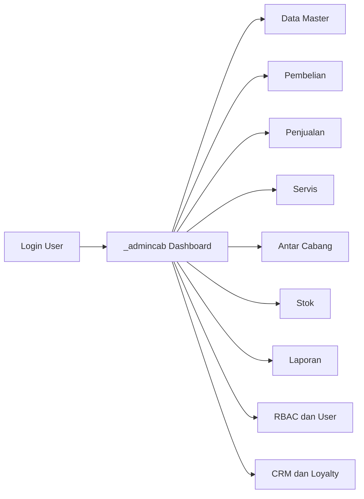
```mermaid
flowchart LR
    A[Login User] --> B[_admincab Dashboard]
    B --> C[Data Master]
    B --> D[Pembelian]
    B --> E[Penjualan]
    B --> F[Servis]
    B --> G[Antar Cabang]
    B --> H[Stok]
    B --> I[Laporan]
    B --> J[RBAC dan User]
    B --> K[CRM dan Loyalty]
```

## Alur Login dan Session

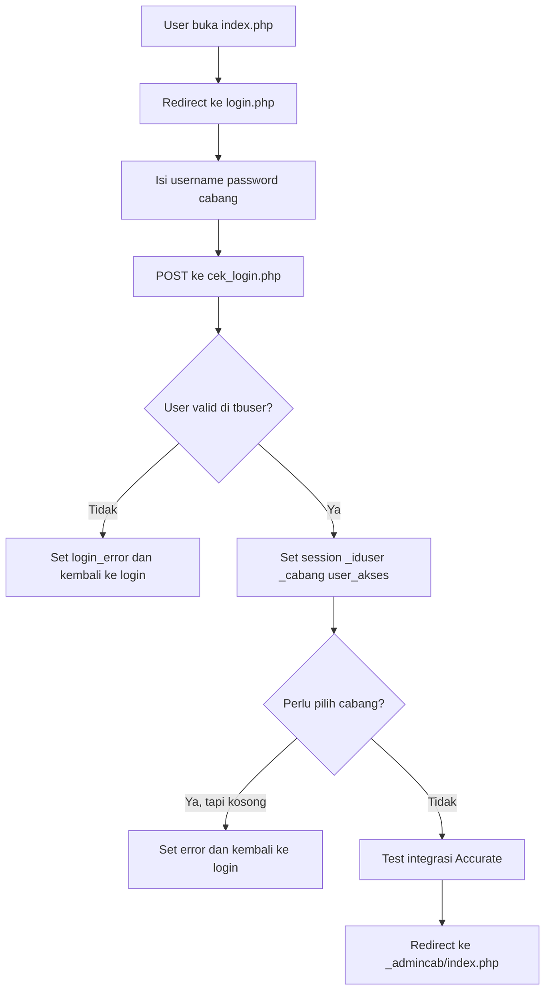
```mermaid
flowchart TD
    A[User buka index.php] --> B[Redirect ke login.php]
    B --> C[Isi username password cabang]
    C --> D[POST ke cek_login.php]
    D --> E{User valid di tbuser?}
    E -- Tidak --> F[Set login_error dan kembali ke login]
    E -- Ya --> G[Set session _iduser _cabang user_akses]
    G --> H{Perlu pilih cabang?}
    H -- Ya, tapi kosong --> I[Set error dan kembali ke login]
    H -- Tidak --> J[Test integrasi Accurate]
    J --> K[Redirect ke _admincab/index.php]
```

## Alur RBAC Baru

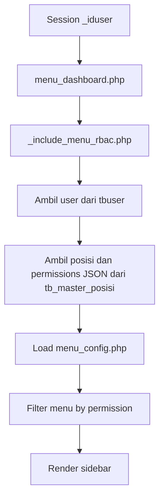
```mermaid
flowchart TD
    A[Session _iduser] --> B[menu_dashboard.php]
    B --> C[_include_menu_rbac.php]
    C --> D[Ambil user dari tbuser]
    D --> E[Ambil posisi dan permissions JSON dari tb_master_posisi]
    E --> F[Load menu_config.php]
    F --> G[Filter menu by permission]
    G --> H[Render sidebar]
```

## Alur Master Posisi dan Permission

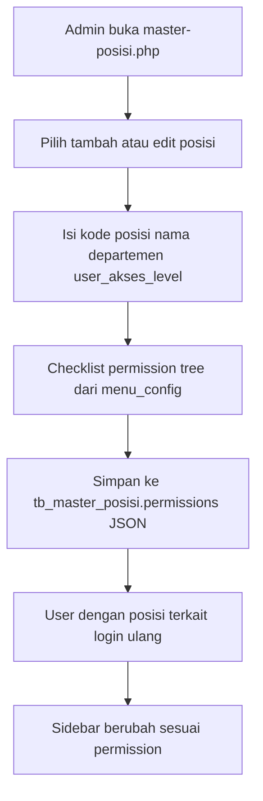
```mermaid
flowchart TD
    A[Admin buka master-posisi.php] --> B[Pilih tambah atau edit posisi]
    B --> C[Isi kode posisi nama departemen user_akses_level]
    C --> D[Checklist permission tree dari menu_config]
    D --> E[Simpan ke tb_master_posisi.permissions JSON]
    E --> F[User dengan posisi terkait login ulang]
    F --> G[Sidebar berubah sesuai permission]
```

## Alur Servis Reguler

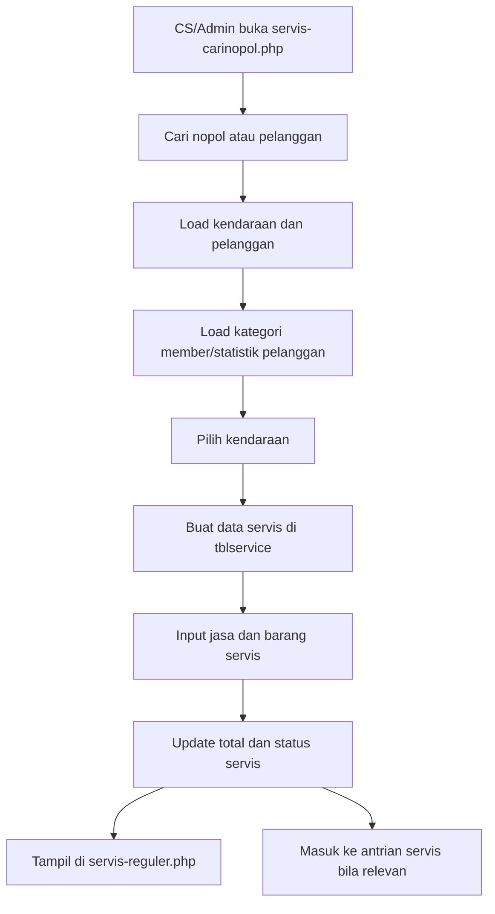
```mermaid
flowchart TD
    A[CS/Admin buka servis-carinopol.php] --> B[Cari nopol atau pelanggan]
    B --> C[Load kendaraan dan pelanggan]
    C --> D[Load kategori member/statistik pelanggan]
    D --> E[Pilih kendaraan]
    E --> F[Buat data servis di tblservice]
    F --> G[Input jasa dan barang servis]
    G --> H[Update total dan status servis]
    H --> I[Tampil di servis-reguler.php]
    H --> J[Masuk ke antrian servis bila relevan]
```

## Alur Antrian Servis

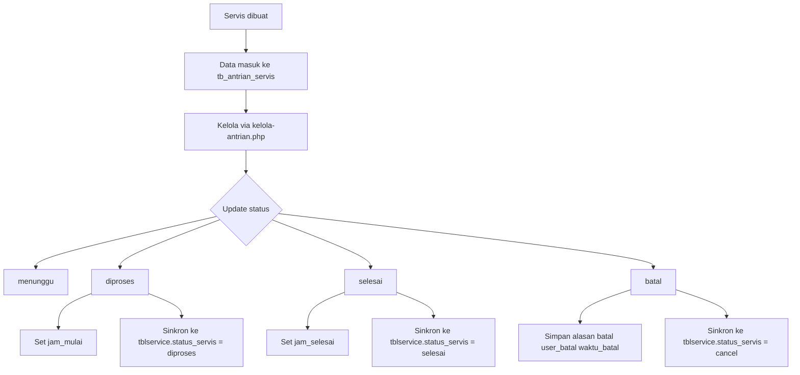
```mermaid
flowchart TD
    A[Servis dibuat] --> B[Data masuk ke tb_antrian_servis]
    B --> C[Kelola via kelola-antrian.php]
    C --> D{Update status}
    D --> E[menunggu]
    D --> F[diproses]
    D --> G[selesai]
    D --> H[batal]
    F --> I[Set jam_mulai]
    G --> J[Set jam_selesai]
    H --> K[Simpan alasan batal user_batal waktu_batal]
    F --> L[Sinkron ke tblservice.status_servis = diproses]
    G --> M[Sinkron ke tblservice.status_servis = selesai]
    H --> N[Sinkron ke tblservice.status_servis = cancel]
```

## Alur Dashboard Operasional Servis

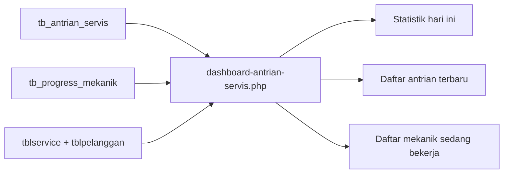
```mermaid
flowchart LR
    A[tb_antrian_servis] --> D[dashboard-antrian-servis.php]
    B[tb_progress_mekanik] --> D
    C[tblservice + tblpelanggan] --> D
    D --> E[Statistik hari ini]
    D --> F[Daftar antrian terbaru]
    D --> G[Daftar mekanik sedang bekerja]
```

## Alur Keluhan -> Work Order -> Temuan

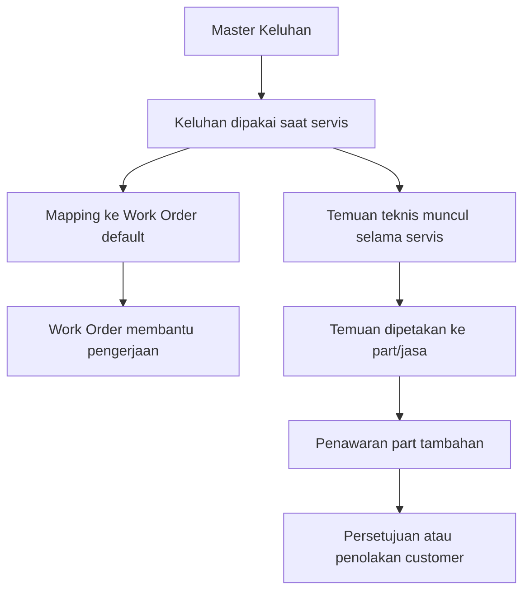
```mermaid
flowchart TD
    A[Master Keluhan] --> B[Keluhan dipakai saat servis]
    B --> C[Mapping ke Work Order default]
    C --> D[Work Order membantu pengerjaan]
    B --> E[Temuan teknis muncul selama servis]
    E --> F[Temuan dipetakan ke part/jasa]
    F --> G[Penawaran part tambahan]
    G --> H[Persetujuan atau penolakan customer]
```

## Detail Alur Approval Keluhan

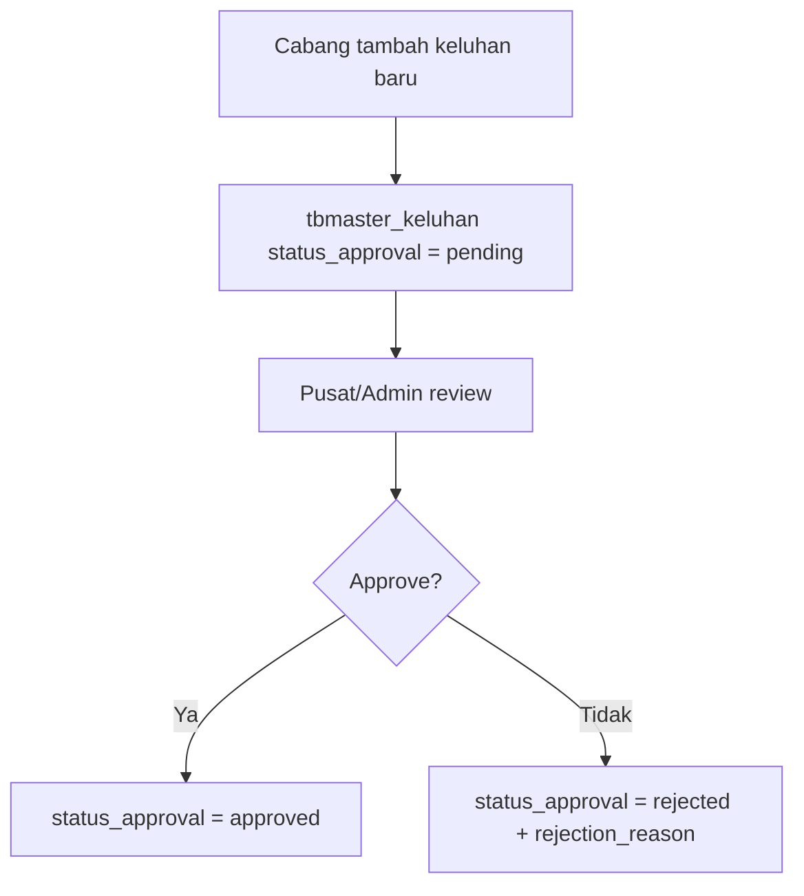
```mermaid
flowchart TD
    A[Cabang tambah keluhan baru] --> B[tbmaster_keluhan status_approval = pending]
    B --> C[Pusat/Admin review]
    C --> D{Approve?}
    D -- Ya --> E[status_approval = approved]
    D -- Tidak --> F[status_approval = rejected + rejection_reason]
```

## Alur Mapping Keluhan ke Work Order

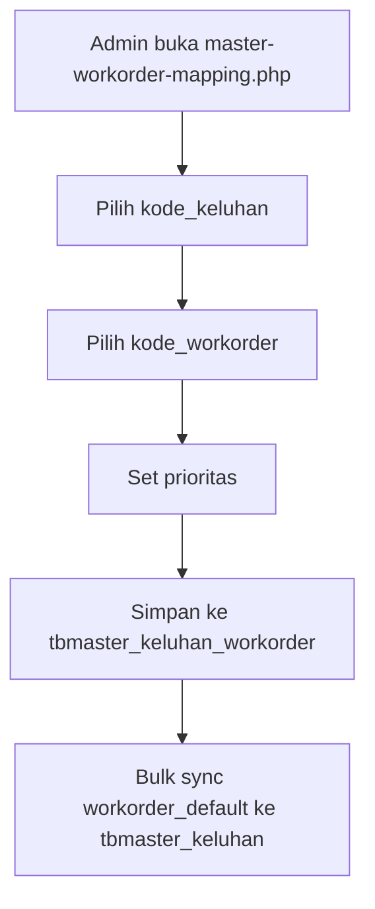
```mermaid
flowchart TD
    A[Admin buka master-workorder-mapping.php] --> B[Pilih kode_keluhan]
    B --> C[Pilih kode_workorder]
    C --> D[Set prioritas]
    D --> E[Simpan ke tbmaster_keluhan_workorder]
    E --> F[Bulk sync workorder_default ke tbmaster_keluhan]
```

## Alur Master Temuan

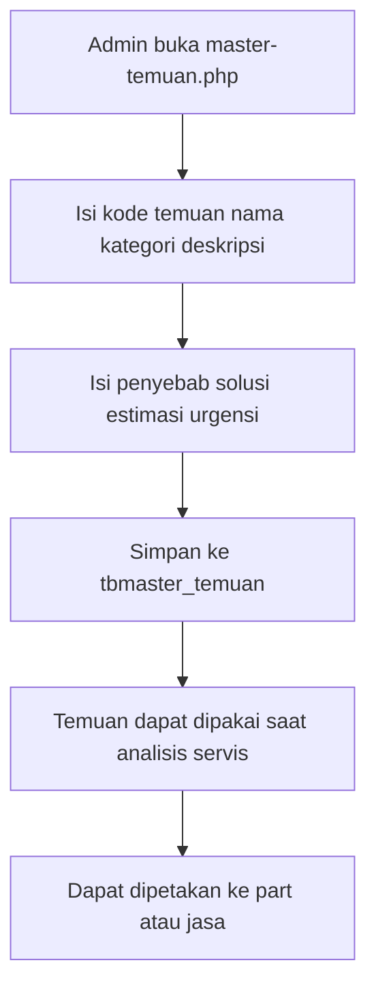
```mermaid
flowchart TD
    A[Admin buka master-temuan.php] --> B[Isi kode temuan nama kategori deskripsi]
    B --> C[Isi penyebab solusi estimasi urgensi]
    C --> D[Simpan ke tbmaster_temuan]
    D --> E[Temuan dapat dipakai saat analisis servis]
    E --> F[Dapat dipetakan ke part atau jasa]
```

## Alur CRM dan Loyalty Pelanggan

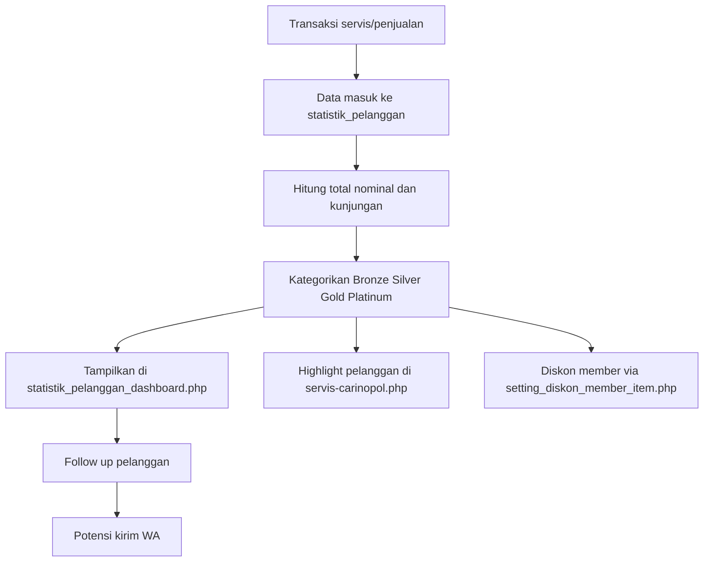
```mermaid
flowchart TD
    A[Transaksi servis/penjualan] --> B[Data masuk ke statistik_pelanggan]
    B --> C[Hitung total nominal dan kunjungan]
    C --> D[Kategorikan Bronze Silver Gold Platinum]
    D --> E[Tampilkan di statistik_pelanggan_dashboard.php]
    D --> F[Highlight pelanggan di servis-carinopol.php]
    D --> G[Diskon member via setting_diskon_member_item.php]
    E --> H[Follow up pelanggan]
    H --> I[Potensi kirim WA]
```

## Alur Setting Diskon Member

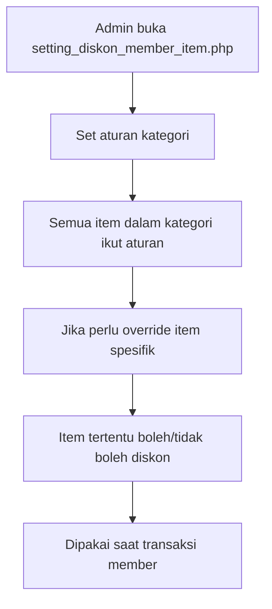
```mermaid
flowchart TD
    A[Admin buka setting_diskon_member_item.php] --> B[Set aturan kategori]
    B --> C[Semua item dalam kategori ikut aturan]
    C --> D[Jika perlu override item spesifik]
    D --> E[Item tertentu boleh/tidak boleh diskon]
    E --> F[Dipakai saat transaksi member]
```

## Alur Pembelian

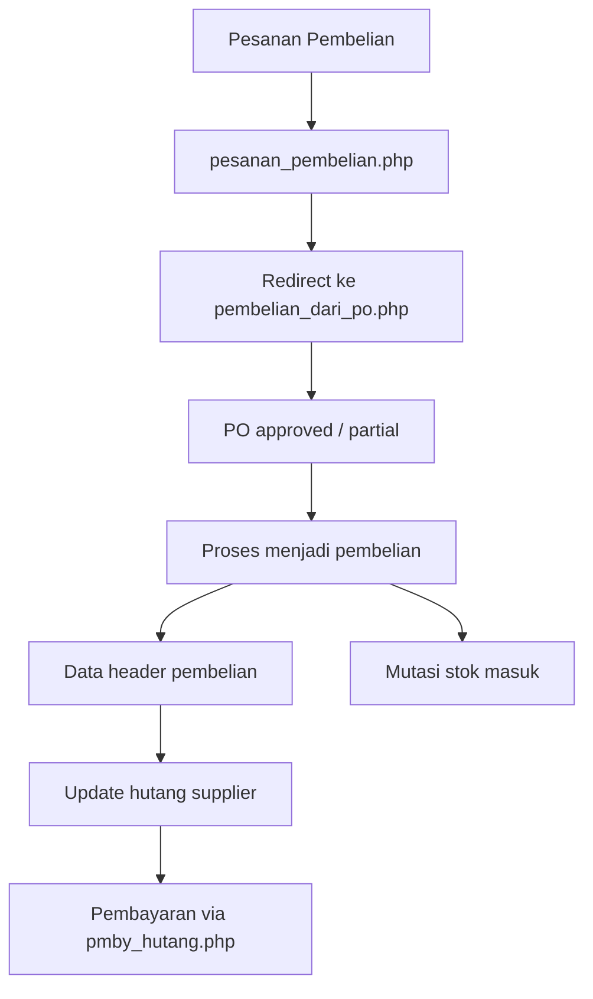
```mermaid
flowchart TD
    A[Pesanan Pembelian] --> B[pesanan_pembelian.php]
    B --> C[Redirect ke pembelian_dari_po.php]
    C --> D[PO approved / partial]
    D --> E[Proses menjadi pembelian]
    E --> F[Data header pembelian]
    F --> G[Update hutang supplier]
    G --> H[Pembayaran via pmby_hutang.php]
    E --> I[Mutasi stok masuk]
```

## Alur Penjualan

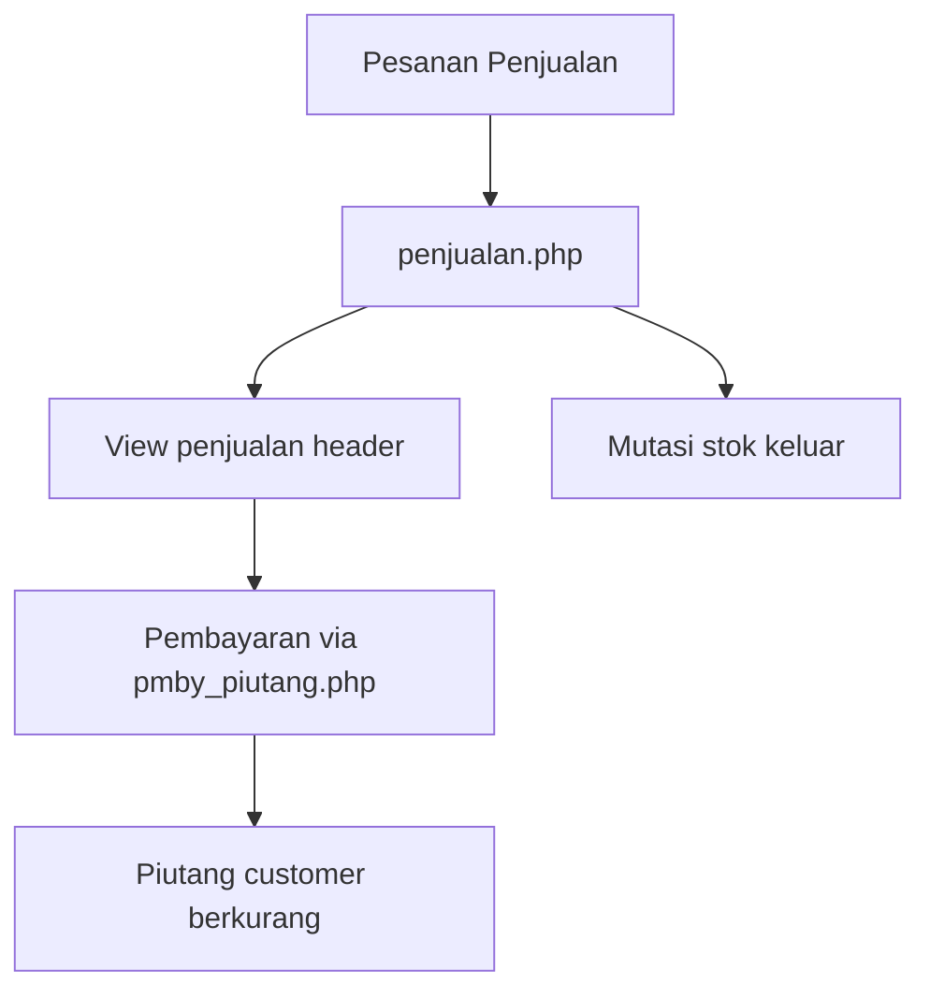
```mermaid
flowchart TD
    A[Pesanan Penjualan] --> B[penjualan.php]
    B --> C[View penjualan header]
    C --> D[Pembayaran via pmby_piutang.php]
    B --> E[Mutasi stok keluar]
    D --> F[Piutang customer berkurang]
```

## Alur Antar Cabang

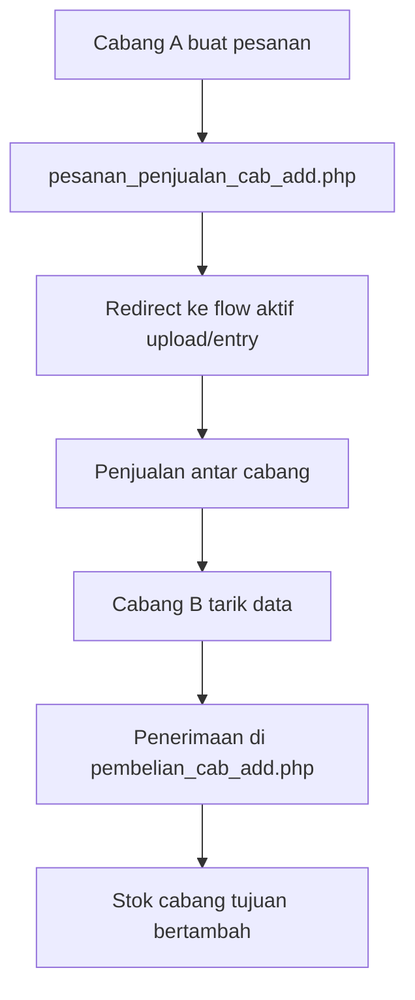
```mermaid
flowchart TD
    A[Cabang A buat pesanan] --> B[pesanan_penjualan_cab_add.php]
    B --> C[Redirect ke flow aktif upload/entry]
    C --> D[Penjualan antar cabang]
    D --> E[Cabang B tarik data]
    E --> F[Penerimaan di pembelian_cab_add.php]
    F --> G[Stok cabang tujuan bertambah]
```

## Alur Penyesuaian Stok

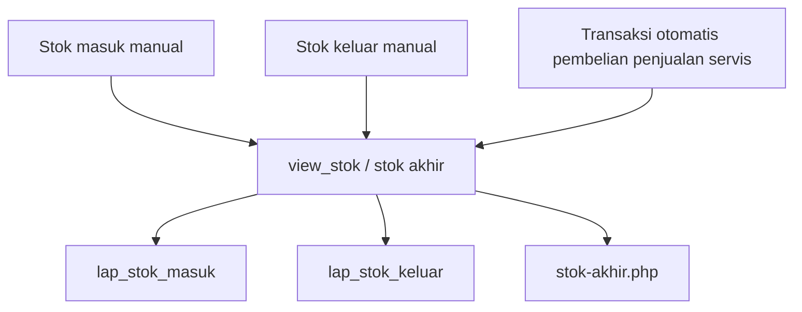
```mermaid
flowchart TD
    A[Stok masuk manual] --> D[view_stok / stok akhir]
    B[Stok keluar manual] --> D
    C[Transaksi otomatis pembelian penjualan servis] --> D
    D --> E[lap_stok_masuk]
    D --> F[lap_stok_keluar]
    D --> G[stok-akhir.php]
```

## Alur Laporan

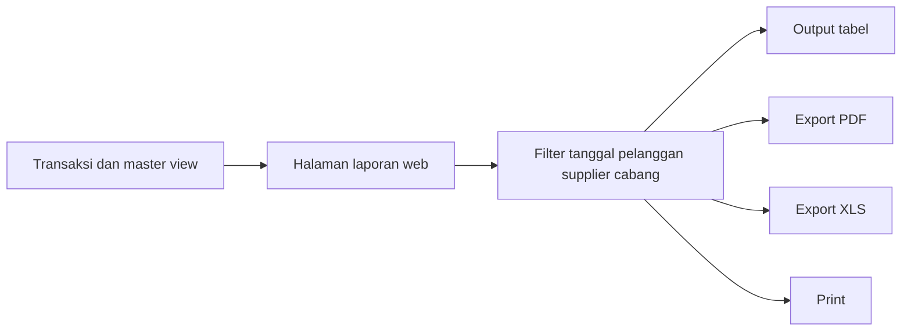
```mermaid
flowchart LR
    A[Transaksi dan master view] --> B[Halaman laporan web]
    B --> C[Filter tanggal pelanggan supplier cabang]
    C --> D[Output tabel]
    C --> E[Export PDF]
    C --> F[Export XLS]
    C --> G[Print]
```

## Hubungan Data Inti Sistem

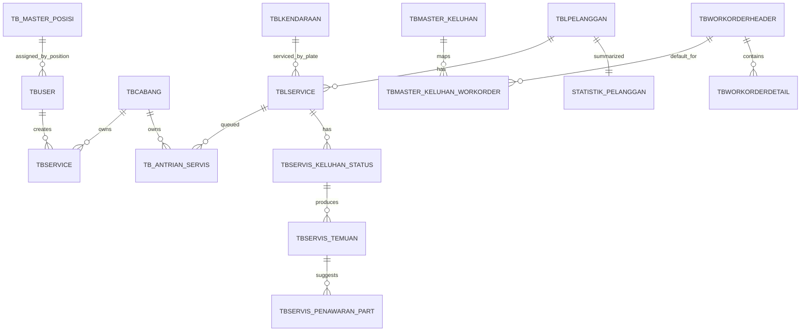
```mermaid
erDiagram
    TBUSER ||--o{ TBSERVICE : creates
    TBCABANG ||--o{ TBSERVICE : owns
    TBCABANG ||--o{ TB_ANTRIAN_SERVIS : owns
    TBLPELANGGAN ||--o{ TBLSERVICE : has
    TBLKENDARAAN ||--o{ TBLSERVICE : serviced_by_plate
    TBLSERVICE ||--o{ TB_ANTRIAN_SERVIS : queued
    TBLSERVICE ||--o{ TBSERVIS_KELUHAN_STATUS : has
    TBSERVIS_KELUHAN_STATUS ||--o{ TBSERVIS_TEMUAN : produces
    TBSERVIS_TEMUAN ||--o{ TBSERVIS_PENAWARAN_PART : suggests
    TBMASTER_KELUHAN ||--o{ TBMASTER_KELUHAN_WORKORDER : maps
    TBWORKORDERHEADER ||--o{ TBMASTER_KELUHAN_WORKORDER : default_for
    TBWORKORDERHEADER ||--o{ TBWORKORDERDETAIL : contains
    TBLPELANGGAN ||--|| STATISTIK_PELANGGAN : summarized
    TB_MASTER_POSISI ||--o{ TBUSER : assigned_by_position
```

## Diagram Lapisan Sistem

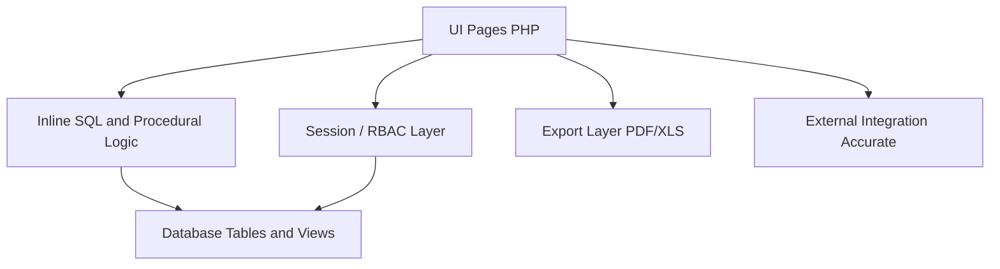
```mermaid
flowchart TB
    A[UI Pages PHP] --> B[Inline SQL and Procedural Logic]
    B --> C[Database Tables and Views]
    A --> D[Session / RBAC Layer]
    D --> C
    A --> E[Export Layer PDF/XLS]
    A --> F[External Integration Accurate]
```

## Area Transisi yang Perlu Diingat Saat Membaca Diagram

- login sudah mengarah ke `_admincab`, tetapi banyak halaman di dalam `_admincab` masih memakai menu lama
- menu RBAC baru belum sepenuhnya sinkron dengan semua nama file
- loyalty dan statistik pelanggan sudah ada secara implementasi, tetapi entrypoint menu belum final
- antar cabang dan pembelian punya wrapper redirect, menandakan flow aktif sudah dipindahkan

## Kesimpulan Diagram

Dari seluruh diagram, pusat domain sistem ini ada di:

- `tblservice` sebagai inti operasi bengkel
- `tblpelanggan` dan `tblkendaraan` sebagai inti customer/asset
- `tb_antrian_servis` sebagai inti operasional harian
- `tbmaster_keluhan`, `tbmaster_temuan`, `tbworkorderheader` sebagai inti diagnosis/workflow teknis
- `tb_master_posisi` sebagai inti RBAC baru
- `statistik_pelanggan` sebagai inti CRM/loyalty

Jika sistem ini ingin dirapikan bertahap, diagram di atas menunjukkan bahwa refactor terbaik dimulai dari domain servis dan RBAC, lalu baru ke transaksi lain.
