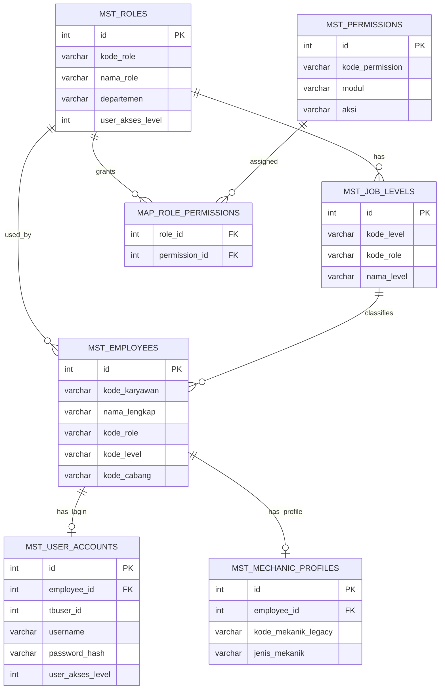

# Audit Migrasi Laravel Tahap 1

## Status Tahap

Tahap ini adalah **audit penuh project PHP Native** sebelum coding Laravel dimulai.

Sesuai instruksi:

- belum membuat project Laravel baru
- belum membuat folder baru di `C:\laragon\www`
- belum mengonversi file PHP ke Laravel
- fokus hanya pada audit, pemetaan risiko, dan rencana migrasi

## Kesiapan Environment untuk Laravel 12

Hasil cek lokal:

- PHP: `8.2.12`
- Composer: `2.8.8`

Catatan:

- environment ini secara umum **cukup untuk memulai Laravel 12**
- saat eksekusi nanti tetap perlu verifikasi extension PHP yang dibutuhkan Laravel dan package tambahan seperti:
  - `openssl`
  - `mbstring`
  - `pdo_mysql`
  - `tokenizer`
  - `xml`
  - `ctype`
  - `json`
  - `fileinfo`
  - `curl`
  - `zip`

## 1. Ringkasan Struktur Project

Project lama adalah **monolit PHP native** besar dengan pola:

- file PHP prosedural
- session manual
- query `mysqli` langsung di halaman
- layout campuran lama dan baru
- banyak folder role-based
- banyak file backup/legacy yang masih tersimpan

Folder utama yang terdeteksi:

- `_admin`
- `_admincab`
- `_booking`
- `_hrd`
- `_kasir`
- `_managemen`
- `_pengadaan`
- `config`
- `lib`
- `dashboard`
- `login_dashboard`
- `db`
- `vendor`

Jumlah file PHP utama per area:

- `_admin`: `698`
- `_admincab`: `1660`
- `_booking`: `1`
- `_hrd`: `549`
- `_kasir`: `932`
- `_managemen`: `440`
- `_pengadaan`: `1114`
- `login_dashboard`: `31`

Interpretasi:

- ini bukan aplikasi kecil
- `_admincab` adalah pusat sistem yang paling aktif dan paling cocok menjadi acuan migrasi ke Laravel
- `_kasir`, `_pengadaan`, `_admin`, `_managemen`, `_hrd` masih menyimpan banyak flow legacy yang belum dikonsolidasikan

## 2. Daftar Fitur / Module yang Terdeteksi

## Auth dan User

- login user
- session berbasis PHP native
- logout
- role/level akses
- RBAC statis dan dinamis
- master user
- master posisi
- master karyawan
- dashboard otoritas user (`login_dashboard`)

## Master Data

- barang / sparepart
- kategori barang
- satuan barang
- pabrik barang
- rak barang
- margin harga jual
- status harga
- work order / paket
- pelanggan
- kategori pelanggan
- supplier
- cabang
- tipe cabang
- sales
- mekanik
- level mekanik
- kepala mekanik
- tarif jemput antar
- kendaraan pelanggan
- tipe motor
- pabrik motor
- kategori motor
- warna motor
- wilayah administratif
- akun kas
- akun biaya
- nominal rupiah

## Servis Bengkel

- input servis reguler
- input servis garansi
- servis jemput antar
- antrian servis
- dashboard progress antrian
- progress mekanik
- keluhan servis
- tracking keluhan
- master keluhan
- approval keluhan
- mapping keluhan ke work order
- master temuan
- mapping temuan ke barang/jasa
- penawaran part
- status proses / selesai / batal
- riwayat servis

## Pelanggan / CRM / Member

- kategori member
- statistik pelanggan
- distribusi member
- follow up pelanggan
- setting highlight member
- setting diskon member per kategori/item
- indikasi integrasi kirim WA follow-up

## Pembelian

- pesanan pembelian / PO
- pembelian dari PO
- hutang supplier
- pembayaran hutang
- retur pembelian
- purchase request
- RFQ
- approval log pembelian / PR

## Penjualan

- pesanan penjualan
- penjualan
- pembayaran piutang
- retur penjualan
- sales commission

## Antar Cabang

- pesanan antar cabang
- tarik data penjualan antar cabang
- penerimaan antar cabang
- setting margin antar cabang

## Stok dan Inventory

- stok akhir
- kartu stok
- stok masuk manual
- stok keluar manual
- koreksi stok
- penyesuaian stok otomatis
- view stok
- mutasi item

## Keuangan / Kas

- kas masuk
- kas keluar
- kas kasir
- akun kas
- pengeluaran
- pemasukan

## HRD

- pegawai
- jabatan
- pendidikan
- keluarga
- training
- salary / tunjangan
- absensi
- upload/import absensi
- laporan absensi

## Laporan

- laporan pembelian
- laporan pesanan pembelian
- laporan penjualan
- laporan pesanan penjualan
- laporan pembayaran hutang
- laporan pembayaran piutang
- laporan servis
- laporan kas masuk
- laporan kas keluar
- laporan stok masuk
- laporan stok keluar
- indikasi laporan cancel service

## Integrasi Eksternal

- Accurate Online API
- OAuth callback
- multi-database employee/branch integration pada `login_dashboard`

## 3. Daftar Tabel Database yang Terdeteksi

Hasil dari dump `fitmotor_dbbengkel_FIXED_V7.sql`:

- total tabel: `242`
- total view: `42`

## Kelompok tabel inti yang sangat penting untuk migrasi tahap awal

### Auth / User / Access

- `tbuser`
- `tb_user_account`
- `tb_user_roles`
- `tb_permissions`
- `tb_master_posisi`
- `tb_master_level`
- `tbuser_karyawan`
- `tb_user_mekanik_mapping`
- `tb_user_activity_log`

### Cabang / Perusahaan

- `tbcabang`
- `tbcabang_tipe`
- `master_perusahaan`
- `tbperusahaan`
- `master_bank`
- `tb_bank`

### Pelanggan / Member / CRM

- `tblpelanggan`
- `tblpelanggangrup`
- `master_kategori_member`
- `master_kedatangan_pelanggan`
- `statistik_pelanggan`
- `setting_highlight_member`

### Kendaraan

- `tblkendaraan`
- `tbtipe_motor`
- `tbkategori_motor`
- `tbpabrik_motor`
- `tbwarna`
- `tbjenis_motor`

### Servis

- `tblservice`
- `tblservice_backup`
- `tblservis_jasa`
- `tblservis_barang`
- `tb_antrian_servis`
- `tb_log_antrian`
- `tb_progress_mekanik`
- `tb_mekanik_progress`
- `tbservis_pengerjaan`
- `tb_log_cancel_servis`

### Keluhan / Temuan / Work Order

- `tbmaster_keluhan`
- `tbmaster_keluhan_temuan`
- `tbmaster_keluhan_workorder`
- `tbmaster_temuan`
- `tbmaster_temuan_barang_mapping`
- `tbservis_keluhan`
- `tbservis_keluhan_status`
- `tbservis_keluhan_tracking`
- `tbservis_temuan`
- `tbservis_temuan_activity_log`
- `tbservis_workorder`
- `tbservis_penawaran_part`
- `tbservis_penawaran_log`
- `tbservis_penawaran_rejection_summary`
- `tbservis_pending_items`
- `tbworkorderheader`
- `tbworkorderdetail`

### Mekanik

- `tblmekanik`
- `tbmekanik_level`
- `tbl_kepala_mekanik_harian`
- `tbl_master_kepala_mekanik`
- `tb_kepala_mekanik_schedule`

### Barang / Item / Stok

- `tblitem`
- `tblitemjenis`
- `tblitemsatuan`
- `tblitem_spart`
- `tblitem_jasa`
- `tblitem_stok`
- `tbmaster_barang_custom`
- `tbmaster_barang_fastmoves`
- `tbmaster_barang_nonitem`
- `tbmaster_kategori_fastmoves`
- `tbmaster_kategori_item`
- `tbmaster_jenis_item`
- `tbpabrik_barang`
- `tbrakbarang`
- `tbstatus_harga`
- `tbhargajual`
- `tbhjual_jasa`
- `tbstok`
- `tbkoreksi_stok_header`
- `tbkoreksi_stok_detail`
- `tbitem_masuk_header`
- `tbitem_masuk_detail`
- `tbitem_keluar_header`
- `tbitem_keluar_detail`
- `tbbrg_masuk_header`
- `tbbrg_masuk_detail`
- `tbbrg_keluar_header`
- `tbbrg_keluar_detail`

### Pembelian

- `tblorder_header`
- `tblorder_detail`
- `tblpembelian_header`
- `tblpembelian_detail`
- `tblhutang_header`
- `tblhutang_detail`
- `tblpurchase_request_header`
- `tblpurchase_request_detail`
- `tblrfq_header`
- `tblrfq_detail`
- `tblrfq_supplier_response`
- `tblpo_approval_log`
- `tblpr_approval_log`
- `tblpr_tracking`

### Penjualan

- `tblorderjual_header`
- `tblorderjual_detail`
- `tblpenjualan_header`
- `tblpenjualan_detail`
- `tblpiutang_header`
- `tblpiutang_detail`
- `tblretur_penjualan_header`
- `tblretur_penjualan_detail`
- `tblsales`

### Kas / Keuangan

- `tblkas_keluar_masuk`
- `tbkas_kasir_header`
- `tbkas_kasir_detail`
- `tbkas_kasir`
- `tblakunkas`
- `tbakun`
- `tbakun_pos`

### HRD

- `tbpegawai`
- `tbpegawai_salary`
- `tbabsensi`
- `tbabsensi_upload`
- `tbabsensi_temp`
- `tbabsensi_temp_rst`
- `tbemp_education`
- `tbemp_family`
- `tbemp_training`
- `tbemp_tunjangan`
- `tbjabatan`
- `tbdivisi`
- `tbstatus_emp`
- `tbhistory_divisi`

## View penting yang harus diperhatikan

- `view_cari_item`
- `view_cari_kendaraan`
- `view_cari_pelanggan`
- `view_service`
- `view_servis_keluhan_lengkap`
- `view_servis_temuan_lengkap`
- `view_servis_workorder_lengkap`
- `view_servis_status_summary`
- `view_penawaran_part_lengkap`
- `view_penjualan_header`
- `view_pembelian_header`
- `view_pembayaran_hutang`
- `view_pembayaran_piutang`
- `view_stok`
- `view_statistik_pelanggan`
- `view_top_pelanggan`
- `view_pelanggan_follow_up`
- `view_ringkasan_kedatangan_pelanggan`
- `view_laporan_cancel_servis`

## 4. Daftar File Penting

## File auth / akses

- `index.php`
- `login.php`
- `cek_login.php`
- `logout.php`
- `config/koneksi.php`
- `config/session_check.php`
- `config/permission_check.php`
- `config/rbac.php`
- `lib/rbac.php`

## File RBAC baru dan dashboard utama

- `_admincab/index.php`
- `_admincab/menu_config.php`
- `_admincab/menu_dashboard.php`
- `_admincab/_include_menu_rbac.php`
- `_admincab/master-posisi.php`
- `_admincab/master_karyawan.php`

## File modul servis prioritas

- `_admincab/servis-carinopol.php`
- `_admincab/servis-reguler.php`
- `_admincab/servis-carinopol-garansi.php`
- `_admincab/servis-garansi.php`
- `_admincab/kelola-antrian.php`
- `_admincab/dashboard-antrian-servis.php`
- `_admincab/master-keluhan-crud.php`
- `_admincab/master-workorder-mapping.php`
- `_admincab/master-temuan.php`
- `_admincab/master-temuan-mapping.php`
- `_admincab/report-tracking-keluhan.php`

## File modul CRM / loyalty

- `_admincab/master_kategori_member.php`
- `_admincab/setting_diskon_member_item.php`
- `_admincab/setting-highlight-member.php`
- `_admincab/statistik_pelanggan_dashboard.php`
- `_admincab/statistik_pelanggan_send_wa.php`
- `_admincab/_include_statistik_pelanggan.php`
- `_admincab/_include_kategori_member.php`

## File transaksi utama

- `_admincab/pembelian_dari_po.php`
- `_admincab/pembelian.php`
- `_admincab/pmby_hutang.php`
- `_admincab/penjualan.php`
- `_admincab/pmby_piutang.php`
- `_admincab/pesanan_pembelian.php`
- `_admincab/pesanan_penjualan.php`
- `_admincab/pesanan_penjualan_cab_add.php`

## File laporan

- `_admincab/lap_servis.php`
- `_admincab/lap_pembelian.php`
- `_admincab/lap_penjualan.php`
- `_admincab/lap_pmby_hutang.php`
- `_admincab/lap_pmby_piutang.php`
- `_admincab/lap_kas_masuk.php`
- `_admincab/lap_kas_keluar.php`
- `_admincab/lap_stok_masuk.php`
- `_admincab/lap_stok_keluar.php`

## File integrasi eksternal

- `config/accurate_config.php`
- `login_accurate.php`
- `oauth-callback.php`
- `oauth_callback_log.txt`

## File database dan analisis existing

- `fitmotor_dbbengkel_FIXED_V7.sql`
- `DATABASE_STRUCTURE_ANALYSIS.md`
- `DATABASE_TABLE_LIST.txt`
- `DATABASE_ERD.txt`
- `DATABASE_ISSUES.txt`
- `DATABASE_OPTIMIZATION_TEMUAN.sql`

## 5. Daftar Query Penting

Audit ini tidak mencoba mengekstrak semua query dari ribuan file, tetapi menandai query yang secara bisnis paling penting untuk disamakan saat migrasi.

## Query auth / session

Sumber:

- `cek_login.php`

Pola penting:

- `SELECT * FROM tbuser WHERE nama_user=... AND password=...`
- set session `_iduser`, `_cabang`, `user_akses`

Implikasi migrasi:

- harus diganti ke Laravel Auth
- perlu compatibility untuk password lama

## Query user / role / permission

Sumber:

- `_admincab/_include_menu_rbac.php`
- `lib/rbac.php`
- `_admincab/master-posisi.php`

Pola penting:

- ambil permission JSON dari `tb_master_posisi`
- render menu berdasarkan permission
- simpan permission tree dari `menu_config.php`

## Query dashboard antrian

Sumber:

- `_admincab/index.php`
- `_admincab/dashboard-antrian-servis.php`
- `_admincab/kelola-antrian.php`

Pola penting:

- hitung total antrian berdasarkan status
- join `tb_antrian_servis`, `tblservice`, `tblpelanggan`, `tblkendaraan`
- update status antrian
- sinkronkan `tblservice.status_servis`

## Query servis reguler

Sumber:

- `_admincab/servis-carinopol.php`
- `_admincab/servis-reguler.php`

Pola penting:

- cari pelanggan/kendaraan dari `tblkendaraan`, `tblpelanggan`
- ambil kategori member dari `statistik_pelanggan`
- list servis dari `tblservice`
- hitung `total_display` dari total_grand / total_akhir / detail jasa+barang

## Query keluhan / workorder / temuan

Sumber:

- `_admincab/master-keluhan-crud.php`
- `_admincab/master-workorder-mapping.php`
- `_admincab/master-temuan.php`

Pola penting:

- CRUD `tbmaster_keluhan`
- approval `pending/approved/rejected`
- mapping `tbmaster_keluhan_workorder`
- sync default workorder ke keluhan
- CRUD `tbmaster_temuan`

## Query loyalty dan statistik pelanggan

Sumber:

- `_admincab/master_kategori_member.php`
- `_admincab/setting_diskon_member_item.php`
- `_admincab/statistik_pelanggan_dashboard.php`

Pola penting:

- hitung distribusi Bronze/Silver/Gold/Platinum
- hitung total nominal, rata-rata transaksi, follow-up
- atur kategori member berdasarkan nominal/kunjungan
- override diskon item tertentu

## Query pembelian

Sumber:

- `_admincab/pembelian_dari_po.php`
- `_admincab/pembelian.php`
- `_admincab/pmby_hutang.php`

Pola penting:

- daftar PO approved/partial
- konversi PO ke pembelian
- query dari `view_pembelian_header`
- pembayaran hutang dari `view_pembayaran_hutang`

## Query penjualan

Sumber:

- `_admincab/penjualan.php`
- `_admincab/pmby_piutang.php`

Pola penting:

- list data dari `view_penjualan_header`
- pembayaran piutang dari `view_pembayaran_piutang`
- ada fallback adaptif terhadap variasi kolom view

## Query laporan servis

Sumber:

- `_admincab/lap_servis.php`

Pola penting:

- filter tanggal
- filter pelanggan
- ambil dari `view_service`
- export PDF dan XLS

## 6. Potensi Masalah Saat Migrasi

## Risiko sangat tinggi

### 1. Password plaintext

- login lama mencocokkan password langsung dari tabel
- user creation lama menyimpan password mentah

Dampak migrasi:

- Laravel Auth tidak boleh langsung diasumsikan memakai hash
- perlu strategi migrasi password bertahap

### 2. Kredensial hardcoded

- koneksi database hardcoded
- token Accurate hardcoded

Dampak migrasi:

- semua harus dipindah ke `.env`

### 3. Banyak sistem akses hidup bersamaan

Ada sistem:

- `config/rbac.php`
- `config/permission_check.php`
- `config/session_check.php`
- `lib/rbac.php`
- menu statis lama
- menu dinamis `_admincab`

Dampak migrasi:

- perlu dipilih satu source of truth

## Risiko tinggi

### 4. Menu `_admincab` tidak sinkron penuh dengan file fisik

Mismatch yang terdeteksi:

- `member-loyalty-program.php` tidak ada
- `statistik-pelanggan.php` tidak ada
- `mekanik.php` tidak ada
- `master_kepala_mekanik.php` tidak ada
- `lap_cancel_servis.php` tidak ada

Dampak migrasi:

- route Laravel tidak boleh mengikuti menu mentah secara buta
- harus mengikuti implementasi nyata

### 5. Banyak halaman `_admincab` masih memakai menu lama

Contoh:

- `pelanggan.php` memakai `menu_pelanggan01.php`
- `servis-reguler.php` memakai `menu_servis01.php`
- `servis-garansi.php` memakai `menu_servis03.php`

Dampak migrasi:

- UI Laravel harus distandarkan
- tetapi flow lama tetap dipetakan dulu

### 6. Wrapper redirect / file shell

Contoh:

- `pesanan_pembelian.php` redirect ke `pembelian_dari_po.php`
- `pesanan_penjualan_cab_add.php` redirect ke `penjualan_antarcab_upload.php`

Dampak migrasi:

- perlu dipastikan mana entrypoint aktif, mana legacy shell

## Risiko sedang

### 7. SQL inline sangat dominan

- logika bisnis bercampur dengan tampilan
- sulit membedakan domain rule dan query presentasi

### 8. Struktur view/tabel pernah berubah

Indikasi:

- `penjualan.php` memakai `SHOW COLUMNS` untuk adaptasi kolom

Dampak migrasi:

- model Laravel harus dibuat kompatibel dengan schema existing

### 9. Banyak file backup / duplikasi

- `.bak`
- `.backup`
- `.ori`
- `Copy`

Dampak migrasi:

- rawan salah ambil sumber implementasi

### 10. Integrasi Accurate menempel ke login flow

Dampak migrasi:

- sebaiknya dipisah ke service khusus agar auth Laravel tidak tergantung API eksternal

## 7. Rekomendasi Struktur Laravel

## Prinsip migrasi

Migrasi tidak boleh berupa copy file satu per satu. Struktur Laravel harus dibangun berdasarkan domain bisnis, bukan sekadar folder lama.

## Struktur Laravel yang direkomendasikan

### Core app

- `app/Models`
- `app/Http/Controllers`
- `app/Http/Requests`
- `app/Services`
- `app/Repositories` jika query kompleks masih sangat banyak
- `app/Policies`
- `app/Providers`
- `app/Support`

### Auth dan access

- `app/Models/User.php`
- `app/Http/Controllers/Auth/*`
- `app/Http/Middleware/RoleMiddleware.php`
- `app/Http/Middleware/PermissionMiddleware.php`

### Domain modules yang direkomendasikan

- `app/Models/Master/*`
- `app/Models/Service/*`
- `app/Models/Sales/*`
- `app/Models/Purchase/*`
- `app/Models/Inventory/*`
- `app/Models/Finance/*`
- `app/Models/CRM/*`
- `app/Models/HR/*`

Atau jika ingin lebih bersih:

- `app/Domains/Auth/*`
- `app/Domains/Master/*`
- `app/Domains/Service/*`
- `app/Domains/Sales/*`
- `app/Domains/Purchase/*`
- `app/Domains/Inventory/*`
- `app/Domains/Finance/*`
- `app/Domains/CRM/*`
- `app/Domains/HR/*`

### Views

- `resources/views/layouts`
- `resources/views/auth`
- `resources/views/dashboard`
- `resources/views/master/*`
- `resources/views/service/*`
- `resources/views/purchase/*`
- `resources/views/sales/*`
- `resources/views/inventory/*`
- `resources/views/finance/*`
- `resources/views/reports/*`
- `resources/views/crm/*`
- `resources/views/hr/*`

### Database

- `database/migrations`
- `database/seeders`
- `database/factories`

## Rekomendasi pendekatan database

Karena project lama punya database besar dan aktif, pendekatan paling aman untuk fase awal adalah:

### Fase awal

- **pakai database existing**
- jangan ubah nama tabel/kolom
- model Laravel mengikuti struktur lama
- gunakan:
  - `protected $table`
  - `protected $primaryKey`
  - `public $timestamps = false` jika perlu
  - cast tanggal/angka manual

### Fase selanjutnya

- baru pertimbangkan migration rapih dan normalisasi tambahan
- hanya setelah semua flow utama stabil di Laravel

## Rekomendasi auth Laravel

Gunakan Laravel Auth modern, tetapi dengan compatibility layer:

- login membaca user dari tabel `tbuser`
- jika password user lama masih plaintext:
  - verifikasi plaintext sekali
  - setelah login sukses, rehash ke bcrypt/argon
- role dan permission membaca dari `tb_master_posisi`

## Revisi Arsitektur Routing dan Hak Akses

Keputusan arsitektur final:

- URL Laravel harus **universal berbasis fitur**
- role user **tidak boleh** menjadi prefix URL
- folder lama seperti `_admincab`, `_kasir`, `_pengadaan`, `_managemen`, `_hrd`, `_admin` hanya dipakai sebagai **sumber referensi audit dan migrasi**
- akses ditentukan oleh:
  - auth user
  - permission middleware
  - data scope per cabang
  - aksi yang diizinkan per modul

Contoh URL yang **tidak boleh** menjadi struktur Laravel final:

- `/admincab`
- `/_admincab`
- `/kasir`
- `/_kasir`
- `/pengadaan`
- `/_pengadaan`
- `/managemen`
- `/_managemen`
- `/hrd`
- `/_hrd`

Contoh URL yang **benar**:

- `/dashboard`
- `/master/pelanggan`
- `/master/kendaraan`
- `/master/barang`
- `/master/mekanik`
- `/service/queue`
- `/service/transactions`
- `/service/complaints`
- `/service/workorders`
- `/sales/orders`
- `/sales/invoices`
- `/purchase/orders`
- `/purchase/invoices`
- `/inventory/stocks`
- `/inventory/adjustments`
- `/finance/cash-in`
- `/finance/cash-out`
- `/reports/service`
- `/reports/sales`
- `/reports/purchase`
- `/reports/inventory`
- `/hr/employees`
- `/hr/attendance`

## Koreksi Rencana Routing

Role seperti:

- admin cabang
- kasir
- pengadaan
- manajemen
- HRD
- admin pusat

tidak boleh menentukan struktur URL.

Role hanya dipakai untuk:

1. menentukan menu yang tampil
2. menentukan halaman yang boleh diakses
3. menentukan aksi yang boleh dilakukan
4. menentukan data cabang mana yang boleh dilihat
5. menentukan tombol yang muncul seperti tambah, edit, hapus, approve, batal, export

Jadi secara prinsip:

- `role != route prefix`
- `role = permission + data visibility`

## Rekomendasi routing Laravel

### Web routes utama berbasis modul

- `/login`
- `/logout`
- `/dashboard`
- `/master/pelanggan`
- `/master/member-categories`
- `/master/kendaraan`
- `/master/barang`
- `/master/kategori-barang`
- `/master/satuan-barang`
- `/master/pabrik-barang`
- `/master/rak-barang`
- `/master/mekanik`
- `/master/mekanik-levels`
- `/master/workorders`
- `/master/complaints`
- `/master/findings`
- `/master/suppliers`
- `/master/branches`
- `/master/users`
- `/master/positions`
- `/master/employees`
- `/service/queue`
- `/service/transactions`
- `/service/warranty-transactions`
- `/service/complaints`
- `/service/workorders`
- `/service/findings`
- `/service/pickup-schedules`
- `/sales/orders`
- `/sales/invoices`
- `/sales/receivables/payments`
- `/purchase/orders`
- `/purchase/invoices`
- `/purchase/payables/payments`
- `/inventory/stocks`
- `/inventory/movements`
- `/inventory/adjustments`
- `/finance/cash-in`
- `/finance/cash-out`
- `/reports/service`
- `/reports/sales`
- `/reports/purchase`
- `/reports/inventory`
- `/reports/finance`
- `/crm/customer-stats`
- `/crm/follow-ups`
- `/crm/member-discounts`
- `/crm/member-categories`
- `/hr/employees`
- `/hr/attendance`

### Route naming yang direkomendasikan

- `dashboard.index`
- `master.customers.index`
- `master.vehicles.index`
- `master.items.index`
- `master.mechanics.index`
- `master.positions.index`
- `service.queue.index`
- `service.transactions.index`
- `service.warranty-transactions.index`
- `service.complaints.index`
- `service.workorders.index`
- `service.findings.index`
- `purchase.orders.index`
- `purchase.invoices.index`
- `sales.orders.index`
- `sales.invoices.index`
- `inventory.stocks.index`
- `inventory.adjustments.index`
- `finance.cash-in.index`
- `finance.cash-out.index`
- `reports.service.index`
- `reports.sales.index`
- `reports.purchase.index`
- `reports.inventory.index`
- `crm.customer-stats.index`
- `hr.employees.index`
- `hr.attendance.index`

## Daftar Route Universal Berbasis Modul

### Dashboard

- `GET /dashboard`

### Master

- `GET /master/pelanggan`
- `GET /master/pelanggan/create`
- `GET /master/pelanggan/{id}/edit`
- `GET /master/kendaraan`
- `GET /master/barang`
- `GET /master/mekanik`
- `GET /master/workorders`
- `GET /master/complaints`
- `GET /master/findings`
- `GET /master/suppliers`
- `GET /master/branches`
- `GET /master/users`
- `GET /master/positions`
- `GET /master/employees`

### Service

- `GET /service/queue`
- `PATCH /service/queue/{id}/status`
- `POST /service/queue/{id}/cancel`
- `GET /service/transactions`
- `GET /service/transactions/create`
- `GET /service/transactions/{id}`
- `GET /service/transactions/{id}/edit`
- `POST /service/transactions/{id}/cancel`
- `GET /service/warranty-transactions`
- `GET /service/complaints`
- `GET /service/workorders`
- `GET /service/findings`
- `GET /service/pickup-schedules`

### Sales

- `GET /sales/orders`
- `GET /sales/orders/create`
- `GET /sales/invoices`
- `GET /sales/invoices/create`
- `GET /sales/receivables/payments`

### Purchase

- `GET /purchase/orders`
- `GET /purchase/orders/create`
- `GET /purchase/invoices`
- `GET /purchase/invoices/create`
- `GET /purchase/payables/payments`

### Inventory

- `GET /inventory/stocks`
- `GET /inventory/movements`
- `GET /inventory/adjustments`
- `GET /inventory/adjustments/create`

### Finance

- `GET /finance/cash-in`
- `GET /finance/cash-in/create`
- `GET /finance/cash-out`
- `GET /finance/cash-out/create`

### Reports

- `GET /reports/service`
- `GET /reports/sales`
- `GET /reports/purchase`
- `GET /reports/inventory`
- `GET /reports/finance`

### CRM

- `GET /crm/customer-stats`
- `GET /crm/follow-ups`
- `GET /crm/member-discounts`
- `GET /crm/member-categories`

### HR

- `GET /hr/employees`
- `GET /hr/employees/create`
- `GET /hr/attendance`
- `GET /hr/attendance/import`

## Daftar Permission Key Per Modul

Format permission key yang direkomendasikan:

- `module.resource.action`

Contoh:

- `dashboard.view`
- `master.pelanggan.view`
- `master.pelanggan.create`

### Dashboard

- `dashboard.view`

### Master Pelanggan

- `master.pelanggan.view`
- `master.pelanggan.create`
- `master.pelanggan.update`
- `master.pelanggan.delete`

### Master Kendaraan

- `master.kendaraan.view`
- `master.kendaraan.create`
- `master.kendaraan.update`
- `master.kendaraan.delete`

### Master Barang

- `master.barang.view`
- `master.barang.create`
- `master.barang.update`
- `master.barang.delete`
- `master.barang.import`
- `master.barang.export`

### Master Mekanik

- `master.mekanik.view`
- `master.mekanik.create`
- `master.mekanik.update`
- `master.mekanik.delete`

### Master Workorder

- `master.workorder.view`
- `master.workorder.create`
- `master.workorder.update`
- `master.workorder.delete`

### Master Keluhan

- `master.keluhan.view`
- `master.keluhan.create`
- `master.keluhan.update`
- `master.keluhan.delete`
- `master.keluhan.approve`
- `master.keluhan.reject`

### Master Temuan

- `master.temuan.view`
- `master.temuan.create`
- `master.temuan.update`
- `master.temuan.delete`

### User / Posisi / Employee

- `master.user.view`
- `master.user.create`
- `master.user.update`
- `master.user.delete`
- `master.posisi.view`
- `master.posisi.create`
- `master.posisi.update`
- `master.posisi.delete`
- `hr.employee.view`
- `hr.employee.create`
- `hr.employee.update`
- `hr.employee.delete`

### Service Transaction

- `service.transaction.view`
- `service.transaction.create`
- `service.transaction.update`
- `service.transaction.cancel`
- `service.transaction.approve`
- `service.transaction.export`

### Service Queue

- `service.queue.view`
- `service.queue.update-status`
- `service.queue.cancel`

### Service Complaint / Workorder / Finding

- `service.complaint.view`
- `service.complaint.create`
- `service.complaint.update`
- `service.complaint.approve`
- `service.workorder.view`
- `service.workorder.create`
- `service.workorder.update`
- `service.finding.view`
- `service.finding.create`
- `service.finding.update`

### Purchase

- `purchase.order.view`
- `purchase.order.create`
- `purchase.order.update`
- `purchase.order.approve`
- `purchase.invoice.view`
- `purchase.invoice.create`
- `purchase.invoice.update`
- `purchase.payable-payment.view`
- `purchase.payable-payment.create`

### Sales

- `sales.order.view`
- `sales.order.create`
- `sales.order.update`
- `sales.invoice.view`
- `sales.invoice.create`
- `sales.invoice.update`
- `sales.invoice.cancel`
- `sales.receivable-payment.view`
- `sales.receivable-payment.create`

### Inventory

- `inventory.stock.view`
- `inventory.adjustment.view`
- `inventory.adjustment.create`
- `inventory.adjustment.update`
- `inventory.adjustment.delete`
- `inventory.movement.view`

### Finance

- `finance.cash-in.view`
- `finance.cash-in.create`
- `finance.cash-in.update`
- `finance.cash-out.view`
- `finance.cash-out.create`
- `finance.cash-out.update`

### Reports

- `reports.service.view`
- `reports.service.export`
- `reports.sales.view`
- `reports.sales.export`
- `reports.purchase.view`
- `reports.purchase.export`
- `reports.inventory.view`
- `reports.inventory.export`
- `reports.finance.view`
- `reports.finance.export`

### CRM

- `crm.customer-stats.view`
- `crm.follow-up.view`
- `crm.follow-up.send`
- `crm.member-discount.view`
- `crm.member-discount.update`
- `crm.member-category.view`
- `crm.member-category.update`

### HR

- `hr.attendance.view`
- `hr.attendance.import`
- `hr.attendance.export`

## Desain Middleware Permission

Middleware utama yang direkomendasikan:

### `auth`

Fungsi:

- memastikan user sudah login

### `permission`

Fungsi:

- memastikan user punya permission tertentu

Contoh pemakaian:

```php
Route::middleware(['auth', 'permission:master.pelanggan.view'])
    ->get('/master/pelanggan', [CustomerController::class, 'index'])
    ->name('master.customers.index');
```

Perilaku jika gagal:

- return HTTP `403`
- tampilkan halaman 403
- jangan redirect diam-diam ke dashboard
- log activity jika memungkinkan

### `branch.scope` atau data scope helper

Fungsi:

- bukan untuk mengubah URL
- tetapi untuk memastikan query otomatis difilter berdasarkan cabang user

Aturan:

- admin cabang/kasir/pengadaan hanya melihat data cabangnya
- pusat/manajemen bisa melihat multi cabang jika permission-nya mengizinkan

Implementasi bisa berupa:

- middleware ringan yang menaruh branch context
- service/helper untuk `allowedBranchIds()`
- global scope pada model tertentu jika aman

## Desain Sidebar Dinamis Berdasarkan Permission

Sidebar Laravel nanti tidak boleh dibangun dari nama role folder lama.

Sidebar dibangun dari:

1. user login
2. permission yang dimiliki
3. optional branch scope

Prinsip:

- menu tampil jika user punya permission `.view`
- tombol `Tambah`, `Edit`, `Delete`, `Approve`, `Batal`, `Export` muncul berdasarkan permission aksi
- route tetap harus diproteksi walaupun menu disembunyikan

Contoh:

Jika user = kasir:

- boleh melihat `/dashboard`
- boleh melihat `/sales/invoices`
- boleh create invoice penjualan
- tidak boleh membuka `/purchase/orders`

Jika user = pengadaan:

- boleh melihat `/purchase/orders`
- boleh melihat `/inventory/stocks`
- tidak boleh membuka `/sales/invoices`

Jika user = manajemen:

- boleh melihat dashboard ringkasan
- boleh melihat laporan
- tidak harus boleh edit transaksi

## Desain Route Group Contoh

```php
Route::middleware(['auth'])->group(function () {
    Route::get('/dashboard', DashboardController::class)
        ->name('dashboard.index');

    Route::middleware('permission:master.pelanggan.view')->group(function () {
        Route::resource('/master/pelanggan', CustomerController::class);
    });

    Route::middleware('permission:service.transaction.view')->group(function () {
        Route::resource('/service/transactions', ServiceTransactionController::class);
    });

    Route::middleware('permission:purchase.order.view')->group(function () {
        Route::resource('/purchase/orders', PurchaseOrderController::class);
    });

    Route::middleware('permission:sales.invoice.view')->group(function () {
        Route::resource('/sales/invoices', SalesInvoiceController::class);
    });

    Route::middleware('permission:reports.service.view')->group(function () {
        Route::get('/reports/service', ServiceReportController::class)
            ->name('reports.service.index');
    });
});
```

## Bagaimana Folder Lama Dipakai Dalam Migrasi

Folder lama:

- `_admincab`
- `_kasir`
- `_pengadaan`
- `_hrd`
- `_managemen`
- `_admin`

tidak boleh menjadi struktur URL Laravel final.

Folder-folder itu hanya dipakai untuk:

1. audit fitur lama
2. menemukan alur bisnis
3. menemukan query penting
4. menemukan form dan report lama
5. menemukan validasi, rule, dan perhitungan
6. memetakan fitur ke domain Laravel baru

Contoh pemetaan:

- `_admincab/servis-carinopol.php` -> referensi `ServiceTransactionController`
- `_kasir/penjualan.php` -> referensi `SalesInvoiceController`
- `_pengadaan/pembelian.php` -> referensi `PurchaseInvoiceController`
- `_hrd/pegawai.php` -> referensi `Hr/EmployeeController`

Hasil akhir Laravel tetap harus berbentuk:

- controller berbasis domain
- route berbasis modul
- blade views berbasis fitur

## Implikasi ke Tahap Migrasi Berikutnya

Dengan keputusan ini, tahap setup Laravel nanti harus mengikuti aturan:

1. jangan buat controller utama berdasarkan nama folder role lama
2. controller utama harus berbasis domain seperti:
   - `CustomerController`
   - `VehicleController`
   - `ItemController`
   - `ServiceTransactionController`
   - `ServiceQueueController`
   - `PurchaseOrderController`
   - `SalesInvoiceController`
3. query data harus discoping berdasarkan cabang user, bukan dari prefix URL
4. menu dibangun dari permission, bukan dari role-folder mapping

## 8. Compatibility Strategy untuk Migrasi Bertahap

Strategi yang direkomendasikan:

### Strategy A — Laravel membaca database lama

Ini strategi terbaik untuk fase 1 dan 2:

- Laravel dibuat di folder baru
- Laravel memakai database existing
- modul dibangun ulang bertahap
- sistem lama tetap hidup selama modul Laravel belum lengkap

### Strategy B — Module by module replacement

Urutan yang direkomendasikan:

1. setup Laravel 12
2. koneksi database existing
3. auth/login
4. layout dashboard
5. master data utama
6. servis dan antrian
7. pembelian / penjualan
8. laporan
9. import/export
10. UI polish + testing + dokumentasi

### Strategy C — Dual-run sementara

Selama transisi:

- project lama tetap tersedia sebagai referensi operasional
- Laravel baru berjalan berdampingan
- data tetap membaca tabel lama

## 9. Rekomendasi Modul Migrasi Pertama

Berdasarkan nilai bisnis dan tingkat pusat sistem, prioritas migrasi yang paling aman:

### Batch 1

- Auth/login
- session/access
- dashboard
- master posisi
- master karyawan

### Batch 2

- pelanggan
- kendaraan
- mekanik
- item/sparepart/jasa

### Batch 3

- servis reguler
- antrian
- keluhan
- workorder
- temuan

### Batch 4

- loyalty/member/statistik pelanggan

### Batch 5

- pembelian
- penjualan
- hutang/piutang

### Batch 6

- laporan
- import/export
- integrasi Accurate

## 9A. Analisa Detail User, Karyawan, Mekanik, Kepala Mekanik, dan Hak Akses

### Ringkasan cepat

Secara arsitektur, **bisa dirapikan dan sangat layak dijadikan satu model master**, tetapi saat ini struktur data dan aksesnya masih bercampur antara:

- model user lama
- model karyawan baru
- model HR/pegawai lama
- model mekanik operasional
- model role/permission baru yang belum sepenuhnya konsisten dipakai

Artinya, kebingungan yang muncul sekarang memang berasal dari desain data yang masih bertumpuk.

### Entitas yang hidup bersamaan saat ini

#### 1. `tbuser`

Tabel ini saat ini menjadi pusat login utama aplikasi.

Isi utamanya campuran antara:

- akun login
- identitas orang
- info jabatan/posisi
- cabang
- metadata role

Kolom penting:

- `id`
- `nama_user`
- `password`
- `user_akses`
- `kode_karyawan`
- `kode_posisi`
- `kode_level`
- `kode_cabang`
- `role_name`
- `department`

Masalah:

- satu tabel memegang terlalu banyak tanggung jawab
- ada duplikasi data identitas dengan tabel karyawan
- masih memakai `user_akses` angka sebagai sumber role lama
- password masih plaintext

#### 2. `tbuser_karyawan`

Ini terlihat sebagai upaya normalisasi yang lebih baik.

Tabel ini menyimpan:

- identitas karyawan
- posisi
- level
- cabang
- kontak
- spesialisasi

Secara konsep, tabel ini paling dekat dengan calon **master karyawan**.

Masalah:

- belum sepenuhnya dijadikan single source of truth
- data yang sama masih muncul di `tbuser`
- relasi akun login ke karyawan masih setengah jalan

#### 3. `tbpegawai`

Ini adalah model HR lama.

Tabel ini menyimpan:

- biodata pegawai lengkap
- payroll
- divisi
- jabatan
- rekening
- status kerja
- bahkan `user_name` dan `password`

Masalah:

- mencampur data HR, payroll, dan login
- paralel dengan `tbuser` dan `tbuser_karyawan`
- struktur lama ini kemungkinan masih dipakai modul HR, tetapi tidak cocok lagi menjadi fondasi auth modern

#### 4. `tblmekanik`

Ini adalah entitas mekanik operasional bengkel.

Fungsinya dipakai di banyak flow servis seperti:

- pilih mekanik di SPK
- penugasan pengerjaan
- progress mekanik

Masalah:

- mekanik disimpan sebagai entitas khusus terpisah dari master karyawan
- beberapa flow masih membaca `tblmekanik` langsung, bukan `tbuser_karyawan`
- ada view `view_mekanik_users` yang justru menunjukkan bahwa sistem sedang mencoba menjembatani dua dunia ini

#### 5. `tbl_master_kepala_mekanik`

Ini bukan tabel fisik murni, tetapi **view** yang dibentuk dari `tbuser_karyawan` dengan filter `kode_posisi = 'KM'`.

Ini justru sinyal yang bagus:

- sistem baru sebenarnya sudah mulai memosisikan kepala mekanik sebagai bagian dari master karyawan
- tetapi di sisi operasional, banyak halaman masih memperlakukan kepala mekanik sebagai kategori mekanik khusus

#### 6. `tb_master_posisi`

Ini calon fondasi terbaik untuk master role/jabatan operasional.

Contoh posisi yang sudah ada:

- `ADM`
- `MNG`
- `CS`
- `KSR`
- `MK`
- `KM`
- `PGD`
- `CRM`
- `KEU`
- `HRD`

Tabel ini sudah punya:

- `kode_posisi`
- `nama_posisi`
- `departemen`
- `user_akses_level`
- `permissions` JSON

Ini adalah kandidat paling tepat untuk menjadi **master role aplikasi** tahap awal.

#### 7. `tb_master_level`

Tabel ini memecah level di dalam posisi, misalnya:

- `MK-1`, `MK-2`, `MK-3`
- `KM-1`, `KM-2`
- `CS-1`, `CS-2`

Secara konsep ini cocok menjadi **master jabatan level / grade operasional**.

#### 8. `tb_user_roles` dan `tb_permissions`

Ini adalah lapisan role/permission tambahan.

Masalahnya:

- fungsinya tumpang tindih dengan `tb_master_posisi.permissions`
- `view_user_details` membaca permission dari `tb_user_roles`
- menu RBAC di `_admincab` justru membaca permission dari `tb_master_posisi`

Artinya sekarang ada **dua sumber kebenaran hak akses**:

- `tb_master_posisi`
- `tb_user_roles`

Ini sumber inkonsistensi utama.

### Masalah arsitektur yang paling penting

#### A. User, karyawan, dan pegawai belum dipisah secara jelas

Saat ini satu orang bisa direpresentasikan di beberapa tempat:

- `tbpegawai`
- `tbuser_karyawan`
- `tbuser`
- kadang juga terhubung ke `tblmekanik`

Akibatnya:

- update data orang berpotensi tidak sinkron
- sulit menentukan tabel induk
- sulit migrasi ke Laravel tanpa menentukan satu master utama

#### B. Role, jabatan, posisi, dan level masih bercampur istilah

Di proyek ini istilah yang dipakai bercampur:

- `user_akses`
- role
- posisi
- jabatan
- level
- department

Padahal secara domain seharusnya dibedakan:

- **role** = hak akses aplikasi
- **jabatan/posisi** = fungsi organisasi
- **level** = senioritas/grade

#### C. Mekanik dan kepala mekanik masih diperlakukan sebagai entitas khusus

Secara domain bisnis, itu wajar.

Tetapi secara data master, seharusnya:

- kepala mekanik = karyawan dengan posisi `KM`
- mekanik = karyawan dengan posisi `MK`

Bukan tabel orang yang benar-benar terpisah permanen dari master karyawan.

#### D. Middleware/session lama belum sinkron dengan role baru

Contoh nyata:

- login utama mengisi session dasar dari `tbuser`
- `Kepala Mekanik` memakai `user_akses = 10`
- tetapi middleware lama masih memvalidasi level akses hanya `1..9`

Ini bukti bahwa transisi model lama ke model baru belum selesai.

#### E. Sistem permission belum punya satu pola final

Saat ini ada beberapa gaya sekaligus:

- cek langsung `user_akses`
- menu berbasis `tb_master_posisi.permissions`
- AJAX `role_management` berbasis `$_SESSION['_permissions']`
- `tb_user_roles` sebagai role registry kedua

Secara praktik, ini harus disatukan sebelum migrasi besar.

### Kesimpulan analisa domain

Kalau pertanyaannya:

> apakah bisa user, kepala mekanik, mekanik, admin, dll dijadikan satu dan dirapikan?

Jawabannya:

**bisa, sangat bisa, dan justru itu arah yang paling benar.**

Tetapi yang disatukan bukan berarti semua orang masuk ke satu tabel tanpa struktur.

Yang benar adalah:

- satu master orang/karyawan
- satu master akun login
- satu master posisi/jabatan
- satu master level
- satu sistem role/permission
- entitas mekanik/kepala mekanik menjadi turunan dari master karyawan, bukan dunia terpisah

### Rekomendasi desain target yang rapi

#### 1. `employees` / master karyawan

Satu tabel induk untuk semua orang internal:

- admin
- kasir
- CS
- mekanik
- kepala mekanik
- HRD
- pengadaan
- keuangan
- manajemen

Isi utama:

- identitas karyawan
- cabang
- posisi
- level
- status aktif
- data kontak

Calon sumber awal migrasi:

- `tbuser_karyawan`

#### 2. `users` / akun login

Tabel khusus akun, bukan biodata lengkap.

Isi utama:

- relasi ke `employee_id`
- username
- password hash
- status login
- last login

Calon sumber awal migrasi:

- `tbuser`

Catatan:

- kolom identitas di `tbuser` sebaiknya nanti tidak lagi dijadikan sumber utama

#### 3. `roles`

Master role aplikasi, misalnya:

- Administrator
- Manager
- Customer Service
- Kasir
- Mekanik
- Kepala Mekanik
- Pengadaan
- CRM
- Keuangan
- HRD

Sumber paling realistis untuk tahap awal:

- `tb_master_posisi`

Karena tabel ini sudah paling dekat dengan kebutuhan menu dan modul.

#### 4. `permissions`

Master permission per fitur, misalnya:

- `dashboard.read`
- `service.read`
- `service.create`
- `user.manage`
- `employee.manage`

Sumber awal bisa:

- normalisasi dari JSON `permissions` di `tb_master_posisi`

#### 5. `role_permission`

Pivot many-to-many antara role dan permission.

Dengan ini kita tidak perlu lagi menyimpan JSON permission di banyak tempat.

#### 6. `employee_positions` atau cukup `position_id` + `level_id`

Kalau satu karyawan hanya punya satu posisi aktif, cukup:

- `position_id`
- `level_id`

Kalau satu orang bisa merangkap, buat tabel riwayat/assignment.

#### 7. `mechanic_profiles` hanya jika memang perlu

Kalau mekanik butuh data tambahan khusus seperti:

- spesialisasi
- sertifikasi
- produktivitas
- rating internal

maka buat tabel turunan profil mekanik, bukan tabel orang baru.

Artinya:

- `employee` = orangnya
- `mechanic_profile` = atribut khusus mekanik

### Pemetaan konsep lama ke konsep target

- `tbuser_karyawan` -> basis `employees`
- `tbuser` -> basis `users`
- `tb_master_posisi` -> basis `roles` atau `positions` tahap awal
- `tb_master_level` -> basis `job_levels`
- `tblmekanik` -> dipetakan ke `employees` posisi mekanik/kepala mekanik
- `tbl_master_kepala_mekanik` -> tidak perlu jadi tabel inti karena cukup jadi turunan query dari master karyawan
- `tb_user_roles` -> sebaiknya dipensiunkan atau digabung ke model role final
- `tbpegawai` -> dijadikan sumber historis HR/payroll, bukan fondasi auth utama

### Keputusan desain yang saya rekomendasikan

Untuk migrasi Laravel nanti, saya sarankan memilih salah satu jalur tegas berikut:

#### Jalur yang direkomendasikan

- `tbuser_karyawan` dijadikan master karyawan utama
- `tbuser` dijadikan master akun login sementara
- `tb_master_posisi` dijadikan master role/jabatan operasional
- `tb_master_level` dijadikan master level
- `tb_user_roles` tidak dijadikan sumber utama baru
- `tblmekanik` dipetakan sebagai data legacy yang perlahan diserap ke master karyawan

#### Kenapa ini paling aman

- paling dekat dengan pengembangan terbaru di proyek
- sejalan dengan menu RBAC `_admincab`
- sejalan dengan view `tbl_master_kepala_mekanik`
- mengurangi duplikasi tanpa langsung merusak modul HR lama

### Urutan perapihan yang aman

#### Fase 1. Tetapkan satu sumber data induk

- master orang/karyawan: `tbuser_karyawan`
- master akun: `tbuser`
- master posisi: `tb_master_posisi`
- master level: `tb_master_level`

#### Fase 2. Hentikan penambahan fitur baru ke model lama

Jangan tambah logic baru ke:

- `tbpegawai` untuk auth
- `tb_user_roles` jika nanti `tb_master_posisi` dipilih sebagai role utama
- `tblmekanik` untuk identitas orang baru

#### Fase 3. Buat mapping legacy

Mapping yang perlu dibuat:

- `tbuser.kode_karyawan` -> `tbuser_karyawan.kode_karyawan`
- `tblmekanik.nomekanik` -> `tbuser_karyawan.kode_karyawan` atau mapping khusus legacy
- `user_akses` -> `kode_posisi`

#### Fase 4. Rapikan permission menjadi satu jalur

Pilih satu:

- seluruh permission dibaca dari `tb_master_posisi`

lalu:

- hapus ketergantungan ganda ke `tb_user_roles`
- hentikan penggunaan session permission yang tidak pernah diisi konsisten

#### Fase 5. Laravel menjadi lapisan unifikasi

Saat masuk Laravel:

- model `Employee`
- model `User`
- model `Role`
- model `Permission`
- middleware permission tunggal
- relasi mekanik/kepala mekanik dipandang sebagai atribut role/position

### Risiko jika tidak dirapikan lebih dulu

- bug akses user akan terus muncul acak
- menu dan aksi backend bisa berbeda hasilnya
- data karyawan akan dobel terus
- migrasi Laravel akan tersendat karena model domain tidak tegas
- mekanik/kepala mekanik/admin akan terus terasa seperti sistem yang terpisah padahal seharusnya satu keluarga data

### Kesimpulan final untuk area user dan akses

Kesimpulan audit khusus area ini:

- struktur saat ini **belum rapi**
- tetapi fondasi untuk dirapikan **sudah ada**
- kandidat fondasi terbaik adalah:
  - `tbuser_karyawan`
  - `tbuser`
  - `tb_master_posisi`
  - `tb_master_level`
- `tbpegawai` dan `tblmekanik` sebaiknya diperlakukan sebagai legacy/sumber migrasi, bukan desain target akhir

Dengan kata lain:

**ya, sangat memungkinkan dijadikan satu dan dibuat jauh lebih enak**, khususnya kalau nanti diarahkan ke pola:

- master karyawan
- master akun user
- master role/posisi
- master level
- master permission
- profile khusus mekanik bila memang diperlukan

## 9B. ERD Target Unifikasi User, Role, dan Karyawan

ERD target yang direkomendasikan untuk desain baru:



Interpretasi desain:

- semua orang internal masuk ke `MST_EMPLOYEES`
- semua akun login masuk ke `MST_USER_ACCOUNTS`
- semua role/hak akses utama masuk ke `MST_ROLES`
- semua level jabatan masuk ke `MST_JOB_LEVELS`
- atribut khusus mekanik dipisahkan ke `MST_MECHANIC_PROFILES`

## 9C. Mapping Tabel Lama ke Desain Target

| Sumber Lama | Tabel Target | Fungsi Migrasi | Catatan |
|---|---|---|---|
| `tbuser_karyawan` | `mst_employees` | sumber utama master karyawan | ini kandidat paling bersih |
| `tbuser` | `mst_user_accounts` | akun login | tetap dipakai sementara untuk compatibility |
| `tb_master_posisi` | `mst_roles` | master role/jabatan operasional | menjadi sumber hak akses utama |
| `tb_master_level` | `mst_job_levels` | master level/grade | tetap dipertahankan |
| `tblmekanik` | `mst_mechanic_profiles` | profil khusus mekanik | jangan lagi jadi master orang |
| `tbl_master_kepala_mekanik` | view/query turunan | tidak perlu jadi master inti | cukup hasil query dari employee role `KM` |
| `tb_user_roles` | dipensiunkan bertahap | legacy role registry | tumpang tindih dengan `tb_master_posisi` |
| `tb_permissions` | normalisasi ke `mst_permissions` | katalog permission | bisa diisi bertahap dari JSON permission |
| `tbpegawai` | referensi HR historis | legacy payroll/HR | jangan jadi pondasi auth baru |

Aturan migrasi yang direkomendasikan:

1. `tbuser_karyawan` jadi sumber induk data orang
2. `tbuser` hanya jadi sumber akun/login sampai migrasi Laravel selesai
3. `tb_master_posisi` jadi satu-satunya sumber role dan permission aplikasi
4. `tblmekanik` hanya menyimpan atribut bengkel yang spesifik

## 9D. SQL Refactor Bertahap

Saya sudah siapkan blueprint SQL refactor di:

- [2026-06-01_unifikasi_user_role_tahap_awal.sql](/c:/laragon/www/web-bengkel/aplikasi/aplikasi/db/migrations/2026-06-01_unifikasi_user_role_tahap_awal.sql:1)

Isi file tersebut mencakup:

- pembuatan tabel target `mst_roles`
- pembuatan tabel target `mst_permissions`
- pivot `map_role_permissions`
- tabel target `mst_job_levels`
- tabel target `mst_employees`
- tabel target `mst_user_accounts`
- tabel target `mst_mechanic_profiles`
- seed awal dari `tb_master_posisi`
- seed awal dari `tb_master_level`
- seed awal dari `tbuser_karyawan`
- seed akun dari `tbuser`
- view kompatibilitas `v_user_role_unified`

Catatan penting:

- script ini disiapkan sebagai **tahap awal refactor**
- script ini **tidak mengganti total sistem lama saat ini**
- tabel legacy tetap dipertahankan untuk transisi
- Laravel nanti bisa membaca tabel target baru atau view kompatibilitas

## 9E. Keputusan Routing dan Portal Tunggal

Untuk portal web aktif saat ini, keputusan yang paling konsisten adalah:

- semua user login ke **satu portal**: `_admincab`
- sidebar/menu tampil berdasarkan permission
- halaman tidak lagi dibatasi berdasarkan folder role
- URL langsung ke halaman tetap harus dicek permission-nya

Implementasi arah ini sudah paling cocok dengan:

- `cek_login.php`
- `_admincab/menu_dashboard.php`
- `_admincab/_include_menu_rbac.php`
- `tb_master_posisi.permissions`

Artinya target final bukan:

- admin ke folder admin
- mekanik ke folder mekanik
- kasir ke folder kasir

Tetapi:

- semua role masuk ke portal yang sama
- fitur yang muncul disaring berdasarkan role/permission

## 10. Keputusan Audit Tahap 1

### Kesimpulan

Project ini **layak direbuild ke Laravel 12**, tetapi harus dilakukan sebagai:

- **rebuild arsitektur**
- **bukan copy file**
- **bukan rename folder**
- **bukan convert blind**

### Keputusan penting sebelum coding

1. gunakan database lama sebagai sumber data awal
2. jadikan `_admincab` sebagai acuan utama
3. jadikan `tb_master_posisi` sebagai fondasi role/permission
4. migrasikan auth lebih dulu dengan compatibility password lama
5. pilih domain servis sebagai modul bisnis prioritas tertinggi

## 11. Rencana Sebelum Masuk Tahap 2

Pada tahap berikutnya, langkah pertama yang aman adalah:

1. buat folder Laravel 12 baru di `C:\laragon\www`
2. hubungkan ke database existing via `.env`
3. buat auth Laravel berbasis `tbuser`
4. buat layout dashboard dasar
5. buat middleware role/permission
6. lanjut master data paling inti

Sebelum itu, audit Tahap 1 ini dianggap selesai.
