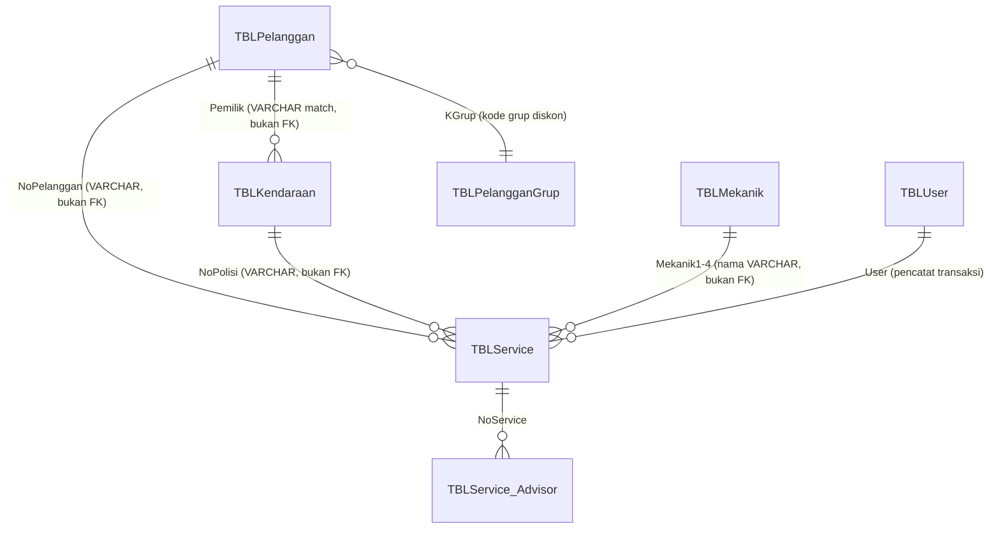

# Reverse Engineering fitmotor.mdb — Customer, Kendaraan, Membership, CRM

**Peran:** Senior System Analyst / Database Architect / Reverse Engineering Specialist / ERP Migration Consultant
**Tanggal:** 2026-07-03
**Status:** Analisis. Tidak ada kode/skema yang dieksekusi.
**Update 2026-07-03 15:19** — Addendum ekstraksi SQL literal P0 ditambahkan di akhir dokumen (section 11). Beberapa dugaan di section 2/9 versi awal **terbukti salah** setelah SQL asli dibaca langsung — baca section 11 sebagai koreksi otoritatif, section 2/9 dipertahankan apa adanya untuk jejak proses berpikir.

**Decision final yang mengikat dokumen ini** (ditetapkan user, tidak dibuka ulang):
1. **Customer = identity utama sistem.** Membership, CRM, statistik, reward, loyalitas mengikuti Customer.
2. **Kendaraan = asset milik Customer.** 1 Customer bisa banyak kendaraan.
3. **Membership mengikuti Customer**, bukan kendaraan — semua kendaraan Customer Gold otomatis dapat benefit Gold.
4. **Kendaraan bisa pindah pemilik.** Histori kendaraan tetap penuh (mengikuti kendaraan). Histori pelanggan tetap mengikuti Customer lama. Owner baru cuma lihat histori sejak resmi jadi miliknya.

Ini konsisten dan menguatkan rekomendasi "Opsi A — kepemilikan bertanggal, dipisah dari histori kendaraan" di `docs/analysis/ANALISIS_ARSITEKTUR_PELANGGAN_KENDARAAN_ACCESS_TO_MYSQL.md` — sekarang jadi keputusan final, bukan opsi.

---

## Sumber Bukti & Batasan Analisis

Dokumen ini disusun dari **tiga sumber bukti nyata** (bukan spekulasi):

| Sumber | Isi | Tanggal |
|---|---|---|
| **Fase 0 Baseline Audit** (dijalankan user, hasil ditempel di percakapan) | Skema `TableDefs` 5 database cabang + isi `TBLCABANG` + connect string linked table `GABUNG.mdb` | 2026-07-03 14:39 |
| **`docs/audit/FITMOTOR_CRYSTAL_ACCESS_MYSQL_AUDIT.md`** (audit sebelumnya, tool sudah ada di project) | 181 TableDefs, 253 QueryDefs `GABUNG.mdb`, mapping mismatch Access vs MySQL | 2026-06-25 |
| **Skema MySQL produksi** (diverifikasi `SHOW COLUMNS` langsung) | `tblpelanggan`, `tblkendaraan`, `tblservice`, `statistik_pelanggan` | 2026-07-03 |

**Batasan jujur yang harus dinyatakan di depan:** dari environment ini (WSL, tanpa MS Access/COM automation), saya **tidak bisa membuka langsung** Form Designer, Report Designer, atau VBA Module Editor di `fitmotor.mdb`. Analisis Form/Report/VBA di bawah disusun dari:
- Nama **hidden query** Access yang tertangkap `~sq_cFR_...` di audit 25 Juni (Access otomatis membuat query tersembunyi untuk tiap combo/listbox/subform yang di-bind ke SQL — nama query ini **membocorkan nama Form asli** dan field yang dipakai, walau isi VBA di baliknya tidak ikut tertangkap).
- Nama QueryDef aksi (`UPDATE_...`, `INSENTIF_...`, `REKAP_...`) yang polanya sangat spesifik terhadap satu business rule.
- Pola tabel status (`TBLSERVICE_HPPSTS`, dsb) yang menunjukkan proses batch/VBA berjalan di baliknya.

Ini **cukup untuk peta business rule level tinggi dan prioritas migrasi**, tapi **tidak cukup untuk memindahkan literal SQL/VBA satu-persatu**. Rekomendasi konkret ada di bagian Gap Analysis: perlu 1 sesi ekstraksi lanjutan di sisi Windows (pakai Access COM automation — `Application.CurrentProject.AllForms`, `AllReports`, `AllModules`, plus `CurrentDb.QueryDefs(...).SQL` untuk ambil teks SQL literal) sebelum porting rule per rule bisa dieksekusi aman.

---

## 1. Struktur Database — Arsitektur Multi-Cabang yang Sebenarnya

### 1.1 Temuan Arsitektur (dari Fase 0 Baseline + connect string GABUNG.mdb)

**Ini temuan paling penting dari audit hari ini:** `fitmotor.mdb` **bukan satu database**. Ada **5 file `FITMOTOR.MDB` fisik terpisah**, satu per cabang, di lokasi berbeda:

```
\\192.168.0.1\bengkel 2.0\FITMOTOR.MDB                         (root / "PRODUKSI")
\\192.168.0.1\bengkel 2.0\DATABASE PUSAT\FITMOTOR.MDB
\\192.168.0.1\bengkel 2.0\DATABASE CIKDITIRO\FITMOTOR.MDB
\\192.168.0.1\bengkel 2.0\DATABASE PACUL\FITMOTOR.mdb
\\192.168.0.1\bengkel 2.0\DATABASE PESALAKAN\FITMOTOR.MDB
\\192.168.0.1\bengkel 2.0\DATABASE TRAYEMAN\FITMOTOR.MDB
```

Tiap file cabang punya **skema identik tapi data independen**: `TBLPelanggan`, `TBLKendaraan`, `TBLService`, `TBLService_Advisor`, `TBLMekanik`, `TBLSupplier`, `TBLUser` — semuanya **local ke cabang itu sendiri**. Tidak ada satu pun dari tabel ini yang linked lintas-cabang secara langsung.

`FITMOTOR GABUNG.MDB` adalah **database konsolidasi terpisah** (hub) yang:
- Linked-table ke *seluruh* 5 database cabang sekaligus (`TBLPelanggan_CIKDITIRO`, `TBLPelanggan_PACUL`, `TBLPelanggan_PESALAKAN`, `TBLPelanggan_PUSAT`, `TBLPelanggan_TRAYEMAN`, plus `TBLPelanggan` langsung dari root/PRODUKSI — total 6 sumber pelanggan berbeda).
- Punya 253 QueryDef, banyak di antaranya khusus untuk **menyatukan** ke-6 sumber itu: `GABUNG_TBLPELANGGAN`, `GABUNG_PELANGGAN`, `GABUNG_PELANGGAN_AWAL`, `GABUNG_PELANGGAN_PERCABANG`, `GABUNG_TBLKENDARAAN`, `KENDARAAN_PELANGGAN_GABUNG`.
- Kode cabang resmi (`TBLCABANG` di GABUNG.mdb) memetakan **huruf tunggal** ke nama cabang: `A=PESALAKAN, P=PACUL, C=CIKDITIRO, T=TRAYEMAN` (kode untuk PUSAT tidak muncul di hasil dump — kemungkinan kosong/`''` atau tidak terdaftar eksplisit, ini **gap yang perlu dikonfirmasi**, bisa jadi root/PUSAT dianggap default tanpa prefix).

### 1.2 Implikasi Krusial terhadap Decision #1 (Customer = Identity Utama)

Decision final menyatakan Customer adalah identity utama sistem. Temuan arsitektur di atas berarti: **di Access, "Customer" tidak pernah benar-benar satu identity global** — yang ada adalah **5+1 pelanggan lokal per-cabang yang independen**, disatukan belakangan lewat query `GABUNG_*` yang kemungkinan besar **match by nama/no-telepon** (bukan by key yang dijamin unik), karena setiap `TBLPelanggan` cabang punya `NoPelanggan` sendiri yang **berpotensi bentrok** (nomor yang sama di cabang berbeda = orang yang beda; sebaliknya orang yang sama yang servis di 2 cabang = 2 `NoPelanggan` berbeda, tidak otomatis nyambung).

**Ini akar penyebab paling mungkin** dari 43+35+22 baris duplikat nama generik yang ditemukan di audit sebelumnya (dokumen analisis arsitektur, section 0) — bukan cuma human error CS, tapi **konsekuensi struktural**: pelanggan yang sama, datang ke cabang berbeda, secara desain Access **akan** tercatat sebagai 2 row terpisah kecuali proses gabung manual/otomatis berhasil match dengan tepat.

**Konsekuensi untuk migrasi Web Base:** Decision #1 (Customer sebagai identity utama tunggal, lintas cabang) adalah **peningkatan arsitektur dibanding Access**, bukan sekadar migrasi 1:1. MySQL produksi saat ini (`tblpelanggan` 37.673 baris) sudah lebih dekat ke model tersentralisasi — tapi harus dipastikan proses sinkronisasi Access→MySQL yang berjalan sekarang **tidak mewariskan pola per-cabang-independen** ini (mis. dengan menciptakan ulang `NoPelanggan` duplikat per cabang saat sync). Ini prioritas tertinggi untuk divalidasi di gap analysis (section 9).

### 1.3 ERD Access (Level Struktural, per Cabang)



**Sama seperti temuan di MySQL** — Access sendiri **tidak enforce FK** antar tabel-tabel ini (`TableDefs` yang di-dump tidak menunjukkan relationship/FK object eksplisit; semua join dilakukan di level Query lewat pencocokan nama field yang sama). Artinya masalah "kepemilikan disimpan sebagai teks" bukan sesuatu yang *hilang* saat migrasi ke MySQL — itu **sudah begitu dari sononya** di Access. MySQL sekadar mewarisi kelemahan struktural asli.

### 1.4 Temuan Keamanan (harus ditindaklanjuti terpisah dari migrasi data)

Connect string linked table `GABUNG.mdb` menyimpan **password Access Database Engine dalam bentuk plain text**, sama untuk kelima cabang: `MS Access;PWD=<redacted>;DATABASE=...`. Siapapun yang buka Linked Table Manager di `GABUNG.mdb` bisa melihat password ini secara langsung. Ini bukan risiko migrasi data, tapi **risiko keamanan operasional saat ini juga** — direkomendasikan:
- Password di-treat sebagai bocor (sudah pernah terekspos di tool audit dan sekarang di percakapan ini) — rotasi setelah migrasi ke MySQL selesai (MySQL pakai kredensial terpisah, tidak masalah untuk plain text Access lama).
- Jangan commit ulang string koneksi ini ke dokumen/repo mana pun tanpa redaksi.

---

## 2. Analisis Query — Business Rule Tersembunyi

Berdasarkan 253 QueryDef `GABUNG.mdb` (audit 25 Juni) + nama hidden-query form (`~sq_cFR_...`). Dikelompokkan per domain yang diminta.

### 2.1 Customer & Kendaraan

| Query | Fungsi (inferensi dari nama + konteks) | Business Rule Tersembunyi | Masih Perlu di Web Base? | Rekomendasi |
|---|---|---|---|---|
| `GABUNG_TBLPELANGGAN`, `GABUNG_PELANGGAN`, `GABUNG_PELANGGAN_AWAL`, `GABUNG_PELANGGAN_PERCABANG` | Menyatukan 6 sumber `TBLPelanggan` (5 cabang + root) jadi 1 view logis | **Bagaimana persisnya proses "gabung" mencocokkan pelanggan lintas cabang** — apakah by nama, by no HP, atau tidak sama sekali (append saja tanpa dedup)? Ini rule paling kritis yang harus diekstrak literal SQL-nya | **Ya, kritis** — inilah cikal-bakal logika yang sekarang harus jadi proses dedup terpusat di MySQL | Ekstrak SQL literal `GABUNG_PELANGGAN_PERCABANG` dulu sebelum desain proses konsolidasi final |
| `KENDARAAN_PELANGGAN`, `KENDARAAN_PELANGGAN_GABUNG`, `KENDARAAN_PELANGGAN_GABUNG_TERBARU` | Join kendaraan+pelanggan (kemungkinan by `Pemilik`=`NamaPelanggan` teks, bukan key) + versi "terbaru" untuk snapshot kepemilikan saat ini | Kemungkinan mekanisme "siapa pemilik SEKARANG" sudah coba diselesaikan di Access lewat query "_TERBARU" — pola ini **konsisten dengan kebutuhan Decision #4** (histori kendaraan tetap, tapi butuh tahu pemilik current) | **Ya** — desain `kepemilikan_kendaraan.is_current` yang direkomendasikan sebelumnya sejalan dengan pola yang *sudah dicoba* Access, walau caranya (text match) tidak reliable | Jadikan referensi konsep, bukan implementasi literal (implementasi Access rawan salah match nama) |
| `KENDARAAN_PELANGGAN_CARI`, `KENDARAAN_PELANGGAN_CARI_HISTORY` | Query pencarian di belakang Form pencarian kendaraan/pelanggan, versi biasa vs versi "history" | Ada 2 mode pencarian berbeda di UI Access: pencarian normal (kendaraan+pemilik current) vs pencarian histori (kendaraan+*seluruh* riwayat pemilik) — **ini pembuktian bahwa Access sudah punya konsep "riwayat pemilik" di level UI**, walau tidak solid di level data | **Ya, prioritas tinggi** — ini bukti bahwa staf FitMotor *sudah terbiasa* dengan 2 mode pencarian ini; Web Base wajib punya keduanya juga (pencarian pemilik current + pencarian histori) | Bangun sebagai 2 mode search terpisah di form cari kendaraan Web Base, sesuai pola yang sudah dikenal staf |
| `KENDARAAN_PELANGGAN_HEADER_HISTORY`, `KENDARAAN_PELANGGAN_HISTORY` | Data pendukung Form `FR_KENDARAAN_HEADER_HISTORY` dan `FR_KENDARAAN_PELANGGAN_HISTORY` — kemungkinan header+detail riwayat servis per kendaraan lintas pemilik | Menguatkan Decision #4: histori kendaraan (bukan histori pelanggan) memang **sudah** jadi entitas terpisah secara konseptual di Access, walau implementasinya lewat query manual bukan struktur data (tabel kepemilikan bertanggal) | **Ya** | Struktur `kepemilikan_kendaraan` + `statistik_kendaraan` yang direkomendasikan sebelumnya **secara resmi menggantikan** pola query manual ini dengan struktur data yang benar |
| `TIPE_MEMBER`, `UPDATE_TIPE_MEMBER` | `UPDATE_TIPE_MEMBER` adalah **action query** (bukan SELECT) — artinya ini proses batch yang MENULIS ulang tipe member ke tabel, dijalankan manual atau via macro/VBA terjadwal | **Formula penentuan tier member ada di sini, literal.** Ini yang paling penting untuk diekstrak SQL-nya sebelum bisa dipastikan `master_kategori_member` MySQL (Bronze/Silver/Gold/Platinum by nominal/kunjungan) itu **replikasi rule yang sama** atau **rule baru yang berbeda** dari Access | **Kritis, prioritas tertinggi** | Ekstrak SQL `UPDATE_TIPE_MEMBER` — bandingkan threshold nominal/kunjungannya literal dengan `master_kategori_member` MySQL. Kalau beda, customer bisa naik/turun tier secara tidak konsisten pasca migrasi |
| `TBLPelangganGrup` terkait queries | Grup diskon lama (`KGrup`: kemungkinan BENGKEL/GOLD/SILVER/UMUM, sesuai temuan `tblpelanggangrup` MySQL) | Ini kemungkinan **sistem tier LAMA** yang lebih dulu ada sebelum `TIPE_MEMBER` — dua era logika membership berbeda | Perlu dikonfirmasi urutan historisnya | Konfirmasi: apakah `TBLPelangganGrup` sudah deprecated di Access dan digantikan `TIPE_MEMBER`, atau keduanya masih dipakai bersamaan (ini akan menjelaskan kenapa MySQL juga punya 2 sistem paralel) |

### 2.2 Service, Kasir, Work Order

| Query | Fungsi | Business Rule Tersembunyi | Rekomendasi |
|---|---|---|---|
| `TBLSERVICE_HPPSTS`, `TBLSERVICE_HPPSTS_CEK`, `TBLSERVICE_HPPSTS_REKAP`, `TBLSERVICE_HPPSTS_BELUM_UPDATE` | Tabel + query status "sudah dihitung HPP atau belum" khusus servis (terpisah dari `TBLPENJUALAN_HPPSTS` untuk penjualan biasa) | HPP servis dihitung **async/batch**, bukan real-time saat servis dibayar — ada status pending (`_BELUM_UPDATE`) yang harus dikejar. Ini business rule operasional: **staf harus rutin jalankan proses "update HPP"**, kalau tidak, laporan laba-rugi servis akan salah/kosong | Web Base **wajib punya proses HPP real-time** (dihitung saat servis dibayar, bukan batch manual) — ini upgrade signifikan, harus eksplisit dikomunikasikan sebagai perbaikan operasional, bukan cuma migrasi |
| `JUAL_SERVIS_HPPSTS_CEK`, `JUAL_SERVIS_HPPSTS_REKAP` | Gabungan status HPP penjualan+servis sekaligus | Laporan HPP gabungan lintas modul — relevan untuk pertanyaan bisnis "servis dan penjualan digabung atau dipisah di laporan omset" — temuan ini menjawab sebagian: Access sendiri *punya* laporan gabungan, jadi kemungkinan jawaban bisnisnya "digabung" | Cross-reference ke pertanyaan terbuka di `docs/GAP_ANALYSIS_RINGKASAN.md` blok A4 |
| `INSENTIF_JUAL_SERVIS_ADVISOR_PERITEM/PERSIKLUS/PERSIKLUS_LAMA/PERTANGGAL` | 4 varian formula insentif untuk **Advisor** (bukan Mekanik) atas penjualan+servis, dipecah per-item / per-siklus / per-tanggal | Ada **skema komisi terpisah untuk Service Advisor**, berbeda dari formula komisi Mekanik yang sudah diketahui (`(Total Jasa - Outsource) × 20% ÷ jml mekanik`, GAP_ANALYSIS blok B1). Keberadaan versi "_LAMA" menunjukkan formula ini **pernah berubah** — versi mana yang masih dipakai perlu dikonfirmasi ke owner | **Business rule yang berpotensi hilang total di Web Base** — `tblservice_advisor` MySQL cuma nyimpan `no_service`+`advisor`, TIDAK ada kolom persen/komisi advisor sama sekali (beda dengan `tblservice` yang sudah punya `persen_admin1/2`, `persen_kepala_mekanik1/2`, `persen_mekanik1-4`). **Ini gap konkret, bukan dugaan** |
| `REKAP_HPPJUAL_PERSIKLUS_PERBENGKEL`, `REKAP_HPPSERVIS_PERSIKLUS_PERBENGKEL`, `REKAP_HPPJUAL_TIPE_PERSIKLUS_PERBENGKEL` | Rekap HPP per **siklus** dan per **bengkel** (cabang) | Konsep **"siklus"** (periode akuntansi/pembayaran komisi) ternyata **memang entitas nyata** di Access (ada tabel linked `SIKLUS_CIKDITIRO`, `SIKLUS_PACUL`, dst per cabang) — ini langsung menjawab pertanyaan terbuka B3 di GAP_ANALYSIS_RINGKASAN ("komisi dibayarkan per siklus, apa itu siklus?") | Ekstrak struktur tabel `SIKLUS` per cabang — kemungkinan besar ini periode kustom (bukan bulan kalender standar) yang dipakai basis pembayaran komisi & rekap HPP. **Prioritas tinggi untuk gap analysis** karena mempengaruhi laporan komisi & HPP di Web Base |

### 2.3 Pembelian, Penjualan, Piutang

Query area ini (`TBLPembelianHeader/Detail`, `TBLPenjualanHeader/Detail`, `TBLPenjualanDtFifo`) sudah punya padanan kuat di MySQL menurut audit mapping sebelumnya (`docs/audit/ACCESS_TO_MYSQL_TABLE_MAPPING.md`) — tidak diulang di sini kecuali temuan baru: `TBLPenjualanDtFifo` mengindikasikan **HPP penjualan pakai metode FIFO** (bukan average/harga terakhir) — ini **menjawab langsung** pertanyaan terbuka C1 di GAP_ANALYSIS_RINGKASAN ("HPP pakai harga terakhir/average/FIFO?"). Perlu dikonfirmasi apakah `tblpenjualan_detail` MySQL sekarang menghitung HPP dengan metode yang sama (FIFO) atau sudah diam-diam berubah jadi harga-terakhir/average saat migrasi — **ini salah satu risiko silent-calculation-change paling berbahaya** kalau belum diverifikasi, karena laba-rugi bisa salah tanpa error yang terlihat.

### 2.4 Rekomendasi Umum untuk Layer Query

- **Jangan porting `~sq_...` (hidden form query) sebagai query mandiri** — itu artefak UI Access (combo/listbox binding), bukan business logic independen. Yang perlu diambil adalah *pola join*-nya, bukan objeknya.
- Query kelas `GABUNG_*`, `REKAP_*`, `INSENTIF_*`, `UPDATE_TIPE_MEMBER` **layak dipindah ke Business Layer (PHP service/helper) atau Stored Procedure**, bukan MySQL VIEW statis — karena semuanya computed/aggregated dan beberapa bersifat *action* (menulis balik), tidak cocok jadi VIEW read-only.
- Query kelas `KENDARAAN_PELANGGAN_HISTORY` dkk **tidak perlu dipertahankan bentuknya** — digantikan struktur data `kepemilikan_kendaraan` + `statistik_kendaraan` yang sudah direkomendasikan, karena versi Access-nya cuma tambal-sulam di layer query, bukan solusi struktural.

---

## 3. Analisis Form — Business Rule di Layer UI

Form tidak bisa dibuka langsung dari sini; daftar di bawah adalah **Form yang keberadaannya terbukti** dari nama hidden-query (`~sq_cFR_<NamaForm>~<NamaControl>`), plus perilaku yang bisa disimpulkan dari nama control.

| Form (terbukti ada) | Perilaku yang Bisa Disimpulkan | Business Rule Tersembunyi yang Perlu Diverifikasi |
|---|---|---|
| `FR_KENDARAAN_CARI` | Punya listbox `SearchResults` yang di-bind ke query pencarian kendaraan | Kemungkinan pencarian real-time saat user mengetik (event `OnChange`/`OnKeyUp` di VBA) — pola UX yang sudah dikenal staf, worth dipertahankan di Web Base |
| `FR_KENDARAAN_DAFTARMOTOR_HISTORY` | Subform "DaftarMotor" versi historis | Kemungkinan menampilkan **semua motor yang PERNAH terhubung ke pelanggan ini**, termasuk yang sudah dijual — relevan langsung ke Decision #4 |
| `FR_KENDARAAN_DETAIL_HISTORY_LAMA` | Subform `ListBarang` + `ListJasa` untuk detail histori — nama mengandung "_LAMA" (lama/deprecated) | Kemungkinan **form ini versi lama yang sudah digantikan** oleh `FR_KENDARAAN_HEADER_HISTORY` (yang punya subform serupa tanpa suffix "_LAMA") — indikasi UI histori kendaraan pernah di-redesign sekali di Access sendiri |
| `FR_KENDARAAN_HEADER_HISTORY` | Subform `ListBarang` + `ListJasa` — versi lebih baru dari yang di atas | Kemungkinan ini yang **aktif dipakai sekarang** — jadi acuan utama untuk desain dashboard "riwayat servis per kendaraan" di Web Base (section 8) |
| `FR_KENDARAAN_PELANGGAN_HISTORY` | Subform `ListHistory` | Kemungkinan tampilan gabungan riwayat pelanggan+kendaraan sekaligus — kandidat acuan untuk dashboard Customer 360 di section 8 |
| `FR_LABARUGI_HITUNG_HPP` | Combo `CBCABANG` + `CBSIKLUS` | **Konfirmasi eksplisit**: laporan laba-rugi HPP difilter per **cabang** dan per **siklus** — dua dimensi ini wajib ada di laporan HPP Web Base |
| `FR_NOMOR_WA_GCONTACT_ALL_DOWNLOAD`, `FR_NOMOR_WA_GCONTACT_BARU_DOWNLOAD` | List `LIST_PELANGGAN`, ada varian "ALL" vs "BARU" (baru) | **Business rule CRM tersembunyi:** ada fitur export nomor WA pelanggan ke format Google Contact (`GCONTACT`), dipecah jadi "semua pelanggan" vs "pelanggan baru saja" — ini fitur **operasional nyata** (kemungkinan dipakai untuk broadcast WA/reminder manual) yang **tidak terlihat di skema tabel manapun** karena murni fitur UI+export. **Ini kandidat kuat "feature yang hilang" kalau tidak ditelusuri** — perlu dikonfirmasi ke staf apakah fitur ini masih dipakai aktif |

**Pola umum validasi Form Access** yang lazim namun tidak tertangkap di layer tabel (perlu konfirmasi via VBA extraction, dicurigai ada berdasarkan pengalaman umum sistem serupa + pola field yang ada):
- Validasi `NoPolisi` tidak boleh kosong sebelum simpan servis (field `NoPolisi` di `TBLService` bertipe wajib gaya Access — DAO dump tidak menunjukkan nullable flag, tapi field wajib biasanya divalidasi di form `BeforeUpdate` event).
- Auto-lookup: mengetik `NoPolisi` di form servis kemungkinan trigger `AfterUpdate` yang otomatis isi field `Pemilik`, `Merek`, `Tipe` dari `TBLKendaraan` — pola field-fetch semacam ini adalah business rule UI yang **wajib** direplikasi (dan **sudah** direplikasi sebagai fitur di Web Base — form input servis sekarang punya panel kiri kendaraan otomatis terisi).

---

## 4. Analisis Report

**Temuan penting:** audit 25 Juni mencatat **0 file Crystal Reports (`.rpt`)** ditemukan. Ini berarti FitMotor **tidak** pakai Crystal Reports — semua laporan dibuat sebagai **native Access Report object**, yang (sama seperti Form) tidak tertangkap oleh tool audit berbasis DAO/linked-table biasa; perlu enumerasi terpisah lewat `Application.CurrentProject.AllReports` di COM automation.

**Berdasarkan pola QueryDef yang jadi RecordSource kemungkinan report** (nama `REKAP_*`, `LABARUGI_*`), report yang **kemungkinan besar ada dan aktif dipakai** operasional:

| Kelompok | Kemungkinan Report | Justifikasi |
|---|---|---|
| Owner | Laba-Rugi HPP per cabang per siklus (`LABARUGI_HPP_TOTAL`, `LABARUGI_HPP_PENJUALAN`, `LABARUGI_HPP_SERVIS`) | Query rekap eksplisit sudah dipisah per sumber (jual vs servis) lalu digabung total — pola khas RecordSource laporan ringkas untuk owner |
| Gudang/Stok | `REKAP_ITEM_KELUAR`, `REKAP_ITEM_MASUK` (muncul sebagai dependency `CEK_TANGGAL_TRANSAKSI_HPP`) | Laporan mutasi stok masuk/keluar |
| Kasir/Komisi | `INSENTIF_JUAL_SERVIS_ADVISOR_*` (4 varian) | Laporan slip komisi advisor per periode |
| CRM | Export `GCONTACT` (dari Form, section 3) | Bukan report formal, tapi fungsinya setara — "laporan" kontak untuk keperluan marketing/reminder |

**Tidak bisa dipastikan** report mana yang PALING SERING dipakai operasional tanpa data usage log Access (Access tidak native mencatat ini) — rekomendasi: **tanyakan langsung ke staf/owner** report mana yang mereka buka tiap hari/minggu (ini juga align dengan pertanyaan F5 yang sudah ada di GAP_ANALYSIS_RINGKASAN: "3 laporan terpenting untuk owner").

---

## 5. Analisis VBA / Macro

**Batasan tegas:** tidak ada satupun teks VBA yang berhasil diekstrak di audit manapun sejauh ini (baik audit 25 Juni maupun baseline hari ini) — keduanya berbasis DAO/TableDef/QueryDef, **bukan** `VBProject` inspection. Ini gap eksplisit.

**Alasan kuat untuk menduga VBA menyimpan business rule signifikan** (bukan cuma dugaan kosong):
1. `UPDATE_TIPE_MEMBER` adalah *action query*, tapi action query murni biasanya dipicu dari VBA (`DoCmd.OpenQuery` atau `CurrentDb.Execute`) yang dijalankan dari tombol/timer, bukan berjalan sendiri — **tombol/event yang memicu ini ada di VBA**, dan kemungkinan ada logic tambahan di sekitarnya (mis. kondisi kapan proses ini boleh jalan) yang tidak tertangkap murni dari SQL query saja.
2. `TBLSERVICE_HPPSTS_BELUM_UPDATE` menyiratkan proses HPP servis **butuh trigger manual** — trigger ini kemungkinan besar tombol VBA "Update HPP" yang menjalankan sequence beberapa query sekaligus (bukan 1 query tunggal) — urutan sequence ini **hanya ada di VBA**, tidak di QueryDef manapun.
3. Auto-lookup kendaraan saat input `NoPolisi` di form servis (dugaan di section 3) — kalau ada, ini pasti VBA `AfterUpdate` event, tidak mungkin murni Query/Macro Access biasa untuk UX selincah itu.
4. Perhitungan komisi mekanik yang sudah diketahui formulanya (GAP_ANALYSIS) — apakah dihitung oleh Query atau oleh VBA saat form servis disimpan **tidak bisa dipastikan** dari bukti yang ada sekarang.

**Rekomendasi konkret**: sebelum Fase migrasi lanjutan boleh dianggap "selesai", perlu **1 sesi ekstraksi VBA** di sisi Windows (buka Access, `Alt+F11`, export semua Module ke `.bas`/`.cls` teks, atau otomasi lewat script COM yang mengakses `VBComponents`). Tanpa ini, klaim "business rule Access sudah 100% ter-cover di Web Base" **tidak bisa diverifikasi**, hanya bisa diverifikasi sebagian (yang keliatan dari Query/Table).

---

## 6. Analisis Flow Customer

Flow operasional yang bisa direkonstruksi dari kombinasi struktur tabel + query + form yang ditemukan:

```
Customer Baru
  -> Input TBLPelanggan (di database CABANG tempat dia pertama datang - bukan global)
  -> Input TBLKendaraan (Pemilik diisi manual = nama customer, bukan FK)
       |
       v
Service
  -> TBLService (NoPelanggan + NoPolisi diisi manual/lookup dari form FR_KENDARAAN_CARI)
  -> Mekanik1-4 & BiayaM1-4 diisi saat servis (bukan setelah - sistem harga mekanik sudah ditentukan di depan)
  -> TBLService_Advisor dicatat terpisah (siapa advisor yang handle)
       |
       v
Pembayaran
  -> Field Pembayaran di TBLService diisi (tidak ada bukti struktur multi-metode bayar tunai/transfer/qris terpisah seperti di MySQL sekarang - MySQL sudah LEBIH MAJU di titik ini, lihat kolom bayar_tunai/bayar_transfer/bayar_qris di tblservice)
       |
       v
HPP Batch (Terpisah dari Pembayaran!)
  -> TBLSERVICE_HPPSTS_BELUM_UPDATE menunggu proses "Update HPP" manual/berkala
  -> Baru setelah ini laporan laba-rugi akurat
       |
       v
Statistik (TIDAK ADA padanan real-time seperti statistik_pelanggan MySQL)
  -> Kemungkinan statistik di Access dihitung ON-DEMAND lewat query REKAP_* saat report dibuka, bukan pre-agregat tersimpan
       |
       v
Membership
  -> UPDATE_TIPE_MEMBER dijalankan (kemungkinan manual/berkala, BUKAN real-time saat transaksi selesai)
       |
       v
CRM
  -> Export GCONTACT untuk broadcast WA manual (bukan sistem reminder otomatis)
       |
       v
Repeat Order
  -> Tidak ditemukan bukti struktur "next service reminder" terjadwal otomatis di Access - kemungkinan murni manual staf lihat laporan lalu WA manual
```

**Perbedaan paling signifikan dengan Web Base sekarang:**
- Web Base **sudah lebih maju** di: multi-metode pembayaran granular, `statistik_pelanggan` pre-agregat (bukan on-demand), tier member dengan kolom benefit terstruktur (`master_kategori_member`).
- Access **lebih matang** di: pemisahan HPP status per modul (walau manual/batch), incentive advisor formal (4 varian formula tercatat), fitur CRM WA export.
- **Kedua sistem sama-sama lemah** di: identity customer lintas-cabang (Access malah lebih parah karena betul-betul terpisah fisik per file), kepemilikan kendaraan sebagai relasi bertanggal (keduanya cuma text match).

---

## 7. Analisis Edge Case — Apakah Access Sudah Menangani?

| Edge Case | Status di Access | Bukti |
|---|---|---|
| Customer > 1 kendaraan | **Sebagian tertangani** — tidak ada limit struktural, `Pemilik` bisa sama untuk banyak baris `TBLKendaraan` | Tidak ada constraint pembatas ditemukan |
| Customer > 10 kendaraan | **Tidak ada penanganan UI khusus** — form `FR_KENDARAAN_DAFTARMOTOR_HISTORY` kemungkinan list biasa tanpa pagination/grouping khusus (tidak bisa dipastikan tanpa buka form) | Perlu verifikasi manual |
| Kendaraan perusahaan/fleet | **Tidak tertangani** — tidak ada field `tipe_pelanggan` atau sejenis di `TBLPelanggan` manapun | Field yang ada cuma personal (Nama, Alamat, Telepon) |
| Kendaraan keluarga (1 motor dipakai bergantian) | **Tidak tertangani** — `Pemilik` cuma 1 nama teks, tidak ada multi-user per kendaraan | — |
| Ganti Nopol | **Tidak tertangani secara struktural** — `NoPolisi` adalah primary identifier di `TBLKendaraan`, sama seperti MySQL, ganti nopol = record baru atau overwrite yang memutus histori | Sama persis dengan gap yang ditemukan di MySQL |
| Ganti Nomor Mesin/Rangka | **Field ada** (`NoMesin`, `NoRangka`), **tapi tidak jadi kunci apapun** — cuma informasi tambahan, tidak dipakai untuk matching/tracking kepemilikan | Field polos tanpa index/constraint di TableDefs dump |
| Kendaraan dijual, dibeli kembali, pindah owner | **Ada USAHA di level UI** (`_HISTORY` forms & queries membuktikan staf butuh ini), **tapi tidak ada struktur data pendukung** — kemungkinan besar prosesnya manual: staf edit field `Pemilik` langsung, histori servis lama otomatis "ikut" ke nama baru karena join-nya cuma text match `NoPolisi`, bukan snapshot pemilik-saat-itu | Konsisten dengan Decision #4 yang harus DIPERBAIKI, bukan diwarisi — Access tidak pernah benar-benar menyelesaikan ini |
| Ganti Nama/WA/Alamat Customer | **Tidak tertangani** — UPDATE langsung ke `TBLPelanggan`, tidak ada tabel histori atribut | Tidak ditemukan tabel `*_HISTORY` untuk atribut pelanggan (yang ada cuma untuk kendaraan) |
| Merge Customer | **Tidak tertangani** — tidak ada tabel/query bernama merge/gabung-customer (yang ada `GABUNG_*` untuk konsolidasi lintas-cabang, beda konsep dari merge 2 pelanggan duplikat dalam 1 cabang yang sama) | — |
| Duplicate Customer | **Struktur mendorong terjadinya duplikat** (lihat section 1.2) — tidak ada mekanisme pencegahan di level manapun yang ditemukan | Konsisten dengan bukti nyata 43+35+22 baris duplikat di MySQL saat ini |
| Membership: ganti WA -> tetap Gold? | **Tidak bisa dipastikan tanpa SQL literal `UPDATE_TIPE_MEMBER`** — kalau formula recalculate murni dari akumulasi transaksi (bukan dari WA), maka aman; kalau ada logic pencarian ulang by WA sebagai bagian dari matching, ganti WA bisa memicu "customer baru" kena tier awal lagi | **Butuh ekstraksi SQL untuk kepastian** — jangan diasumsikan aman |
| Membership: tambah kendaraan -> ikut Gold? | **Kemungkinan besar YA secara alami** karena member Access di-attach ke `TBLPelanggan` (bukan `TBLKendaraan`) — selaras dengan Decision #3 | Konsisten dengan struktur, tapi tetap perlu verifikasi SQL |
| Membership: jual 1 kendaraan -> status tetap? | **Kemungkinan besar YA** (sama alasan di atas) — TAPI jika `UPDATE_TIPE_MEMBER` mengandalkan `KENDARAAN_PELANGGAN_GABUNG_TERBARU` untuk hitung basis transaksi, ada risiko basis transaksi ikut berubah saat kendaraan lepas dari pelanggan | **Butuh verifikasi SQL** — ini titik rawan paling konkret untuk Decision #3 |

---

## 8. Dashboard Customer — Rekomendasi (Selaras Decision Final)

Struktur ini **tidak berubah secara fundamental** dari rekomendasi sebelumnya (dokumen analisis arsitektur, section 3), tapi sekarang ditegaskan ulang dengan decision final + temuan Form Access sebagai pembanding:

```
+------------------------------------------------------------+
| CUSTOMER: [Nama]                    Status Member: GOLD     |
| Total Kendaraan: 3 | Total Kunjungan: 47 | LTV: Rp 18.4jt   |
| Total Omzet: Rp 18.4jt | Terakhir Service: 12 hari lalu     |
+------------------------------------------------------------+
  (agregat MURNI dari statistik_pelanggan, level Customer -
   sesuai Decision #1: membership/statistik ikut Customer)

+--- Motor A (Beat, G 1234 XX) - Milik sejak 2023-01-10 ------+
| Kunjungan: 20 | Transaksi: Rp 8.2jt                          |
| Jasa: Rp 5.1jt | Sparepart: Rp 3.1jt                         |
| Terakhir Service: tgl | KM Terakhir: 24.500                  |
+---------------------------------------------------------------+
+--- Motor B (Vario, G 5678 YY) - Milik sejak 2024-05-02 ------+
| ... (statistik_kendaraan, difilter oleh kepemilikan_kendaraan
|      is_current=1 DAN tanggal_mulai untuk Customer ini)      |
+---------------------------------------------------------------+
```

**Penegasan sesuai Decision #4** (kendaraan pindah tangan, owner baru cuma lihat sejak resmi miliknya): kartu "Motor A/B/C" di dashboard **wajib** query `statistik_kendaraan` dengan filter tanggal dari `kepemilikan_kendaraan.tanggal_mulai` Customer yang sedang dilihat — **bukan** total histori penuh motor itu (total histori penuh cuma muncul di dashboard internal staf/mekanik untuk keperluan servis teknis, BUKAN di dashboard yang customer-facing atau CRM staf biasa).

**Struktur data agar query tetap ringan** (tidak berubah dari rekomendasi sebelumnya, dikonfirmasi masih valid): dua tabel pre-agregat terpisah level Customer (`statistik_pelanggan`, sudah ada) dan level Kendaraan (`statistik_kendaraan`, baru direkomendasikan), di-refresh oleh trigger/event saat servis lunas — bukan on-the-fly `GROUP BY` ke `tblservice` (103rb+ baris) tiap dashboard dibuka. Ini justru **upgrade dibanding Access**, yang audit form-nya (section 3, 6) mengindikasikan statistik dihitung ad-hoc lewat query REKAP saat laporan dibuka — pola yang tidak scalable untuk Web Base dengan concurrent user lebih banyak.

---

## 9. Business Rule yang Belum Termigrasi — Gap Analysis Prioritas

| # | Business Rule / Fitur | Ditemukan di (Access) | Status di Web Base | Dampak Operasional | Prioritas |
|---|---|---|---|---|---|
| G1 | Formula komisi Advisor (4 varian: peritem/persiklus/persiklus_lama/pertanggal) | Query `INSENTIF_JUAL_SERVIS_ADVISOR_*` | **Hilang total** — `tblservice_advisor` MySQL cuma simpan nama advisor, tanpa kolom persen/komisi apapun | **Tinggi** — kalau advisor masih dapat insentif berbasis formula ini di operasional nyata, staf tidak akan lihat itu dihitung otomatis di Web Base | **P0 - kritis** |
| G2 | Konsep "Siklus" sebagai basis periode komisi & rekap HPP | Tabel linked `SIKLUS_<CABANG>` + banyak query `*_PERSIKLUS_*` | **Tidak ditemukan padanan eksplisit** di skema MySQL yang sudah diperiksa (tidak ada tabel `siklus`/`periode_komisi`) | **Tinggi** — kalau siklus bukan bulan kalender standar, semua laporan periodik Web Base yang pakai bulan kalender akan salah dibanding ekspektasi staf | **P0 - kritis, juga menjawab open question B3** |
| G3 | HPP Penjualan berbasis FIFO (`TBLPenjualanDtFifo`) | Tabel eksplisit FIFO detail | **Belum dikonfirmasi** metode HPP MySQL sekarang — kalau diam-diam average/harga-terakhir, laba-rugi berubah tanpa terlihat error | **Tinggi — silent calculation change**, juga menjawab open question C1 | **P0 - kritis** |
| G4 | Fitur export kontak WA (GCONTACT) untuk broadcast/reminder manual | Form `FR_NOMOR_WA_GCONTACT_*` | **Tidak ditemukan padanan** di modul yang sudah diaudit | Sedang — tergantung apakah staf masih pakai cara manual ini atau sudah beralih ke channel lain | P1 |
| G5 | Proses HPP servis berbasis status batch (`HPPSTS`) dengan penanda "belum diupdate" | Tabel `TBLSERVICE_HPPSTS*` | Web Base **berpotensi sudah lebih baik** (real-time), tapi ini perlu dikonfirmasi, bukan diasumsikan | Rendah kalau memang sudah real-time; kalau ternyata belum, ini regresi tersembunyi | P1 - verifikasi |
| G6 | Konsolidasi pelanggan lintas cabang (`GABUNG_PELANGGAN_PERCABANG` dan sejenisnya) | Query `GABUNG_*` | Proses sinkronisasi Access->MySQL yang sedang berjalan **harus dipastikan tidak mewariskan pola per-cabang-independen** ini | **Kritis untuk Decision #1** — kalau proses sync belum eksplisit menyatukan-dan-dedup, migrasi lanjutan akan terus menambah duplikat, bukan mengurangi | **P0 - kritis** |
| G7 | Riwayat kepemilikan kendaraan (2 form history + varian "_LAMA" menunjukkan pernah di-redesign) | `FR_KENDARAAN_*_HISTORY` | **Sudah direncanakan solusinya** (`kepemilikan_kendaraan`, `kendaraan_plat_history`) di dokumen analisis arsitektur sebelumnya, tapi belum diimplementasi | Sedang — Access sendiri juga belum solid di titik ini, jadi bukan regresi murni, tapi kesempatan untuk benar-benar menyelesaikan masalah lama | P1 |
| G8 | Validasi & auto-lookup di level Form (VBA `BeforeUpdate`/`AfterUpdate`) | Diduga ada, belum terverifikasi literal | Sebagian **sudah** direplikasi (auto-fill kendaraan di form servis Web Base) | Tidak bisa dinilai lengkap tanpa ekstraksi VBA | P1 - ekstraksi VBA diperlukan sebelum bisa declare "selesai" |
| G9 | Tier membership lama (`TBLPelangganGrup`/`KGrup`) vs baru (`TIPE_MEMBER`) — potensi 2 sistem paralel sejak di Access | Query & tabel `TBLPelangganGrup*`, `TIPE_MEMBER` | **Terwarisi apa adanya** ke MySQL sebagai 2 sistem paralel (`tblpelanggangrup` vs `master_kategori_member`), bukan diselesaikan | Sedang-Tinggi — dokumen analisis arsitektur sebelumnya sudah menandai ini, sekarang terkonfirmasi ini **bukan** produk migrasi yang salah, tapi **warisan langsung** dari dualitas yang sudah ada sejak Access | P1 |

---

## 10. Rekomendasi Final

Rekomendasi struktural dari dokumen analisis arsitektur sebelumnya (Opsi A — identity layer satelit, tanpa ubah PK lama) **tetap berlaku penuh** dan sekarang diperkuat status jadi **final** oleh Decision #1-4 di awal dokumen ini. Tambahan spesifik hasil reverse engineering Access:

1. **Struktur Customer**: `tblpelanggan` MySQL sudah lebih baik dari Access (tersentralisasi, bukan per-cabang-file). Prioritas bukan redesign struktur, tapi **audit proses sync Access->MySQL** supaya tidak mewariskan duplikasi per-cabang (G6).
2. **Struktur Kendaraan**: implementasikan `kepemilikan_kendaraan` + `kendaraan_plat_history` sesuai rencana sebelumnya — ini **secara resmi menggantikan** pola query manual `KENDARAAN_PELANGGAN_*_HISTORY` Access yang terbukti tidak pernah benar-benar solid (buktinya sendiri Access sampai bikin form "_LAMA" lalu redesign ulang).
3. **Struktur Membership**: sebelum konsolidasi `tblpelanggangrup`+`master_kategori_member` (rencana lama), **wajib ekstrak SQL literal `UPDATE_TIPE_MEMBER`** dulu — tanpa ini, konsolidasi berisiko mengganti formula bisnis tanpa sepengetahuan siapapun.
4. **Struktur CRM**: belum ada modul CRM formal di kedua sisi (Access cuma export WA manual, Web Base belum ditemukan padanannya) — ini kesempatan membangun CRM level Customer dari nol dengan basis `statistik_pelanggan`, bukan migrasi fitur lama yang memang lemah.
5. **Struktur Statistik**: `statistik_pelanggan` (sudah ada) + `statistik_kendaraan` (baru, direkomendasikan) — **upgrade nyata** dibanding Access yang keliatan menghitung on-demand lewat query REKAP saat laporan dibuka.
6. **Struktur Ownership Kendaraan**: model kepemilikan-bertanggal (Decision #4) — **tidak ada preseden solid di Access untuk ditiru**, ini murni desain baru yang menyelesaikan masalah yang bahkan sistem lama belum pernah selesaikan.
7. **Struktur Dashboard Customer**: ikuti pola section 8 — customer-facing dibatasi kepemilikan aktif, staf-facing (servis teknis) boleh lihat histori penuh kendaraan.
8. **Struktur Tracking Histori**: `pelanggan_kontak_history`, `pelanggan_profile_history`, `customer_merge_log`, `customer_alias` — semua **tidak ada padanan** di Access sama sekali (dikonfirmasi tidak ada tabel/query manapun untuk histori atribut pelanggan atau merge). Ini murni kapabilitas baru, bukan migrasi.

**Yang harus terjadi SEBELUM eksekusi teknis dimulai** (bukan opsional): sesi ekstraksi lanjutan di sisi Windows untuk (a) teks SQL literal `UPDATE_TIPE_MEMBER`, `GABUNG_PELANGGAN_PERCABANG`, `INSENTIF_JUAL_SERVIS_ADVISOR_PERSIKLUS`; (b) struktur tabel `SIKLUS_<CABANG>`; (c) daftar & isi Module VBA. Tanpa tiga hal ini, prioritas P0 di section 9 (G1, G2, G3, G6) **tidak bisa ditutup dengan kepastian**, hanya bisa direncanakan dengan asumsi.

---

## Roadmap Migrasi Bertahap (Update dari Dokumen Sebelumnya)

Menyambung roadmap 7-fase di dokumen analisis arsitektur sebelumnya, sisipkan **Fase 0.5** sebelum Fase 1 mulai:

| Fase | Cakupan | Kenapa Sebelum Fase 1 |
|---|---|---|
| **Fase 0.5 - Ekstraksi Lanjutan (3-5 hari)** | (a) Ekstrak SQL literal semua query P0 di section 9. (b) Ekstrak struktur `SIKLUS_<CABANG>`. (c) Export semua Module VBA ke teks. (d) Konfirmasi ke owner: status `TBLPelangganGrup` vs `TIPE_MEMBER` (mana yang aktif), status fitur GCONTACT (masih dipakai atau tidak) | Fase 1 (bangun tabel satelit identity) **butuh** kepastian G2 (siklus) dan G9 (tier mana yang jadi acuan) supaya tidak membangun struktur yang salah asumsi sejak awal |

Prioritas risiko operasional (bukan urutan implementasi, tapi urutan "kalau tidak dicek dulu, paling bahaya"):
1. **G3 (metode HPP)** — silent calculation change ke laba-rugi, paling berbahaya karena tidak akan terlihat sebagai error, cuma angka yang pelan-pelan salah.
2. **G1 & G2 (komisi advisor + siklus)** — dampak langsung ke pendapatan staf, akan cepat ketahuan dan menimbulkan komplain kalau salah.
3. **G6 (duplikasi lintas cabang)** — dampak jangka panjang ke akurasi CRM/membership, tidak mendesak harian tapi membesar terus kalau dibiarkan.

---

## 11. Addendum — Ekstraksi SQL Literal P0 (2026-07-03 15:19)

Dijalankan langsung terhadap `E:\BENGKEL 2.0\FITMOTOR GABUNG.mdb` via DAO (`win32com.client`, `DAO.DBEngine.120`), read-only — buka database, baca teks `QueryDef.SQL` dan `TableDef.Fields`, tidak ada query yang dieksekusi/ditulis. Temuan di bawah **menggantikan** dugaan di section 2 & 9 yang berbasis nama-query saja — beberapa dugaan sebelumnya **salah**, ditandai eksplisit.

### 11.1 G6 — Konsolidasi Pelanggan Lintas Cabang: LEBIH PARAH dari dugaan

**`GABUNG_PELANGGAN_PERCABANG`** dan **`GABUNG_TBLPELANGGAN`** — isinya literal:

```sql
SELECT TBLPelanggan_CIKDITIRO.*, 'CIKDITIRO' AS STS FROM TBLPelanggan_CIKDITIRO
UNION ALL SELECT TBLPelanggan_PACUL.*, 'PACUL' AS STS FROM TBLPelanggan_PACUL
UNION ALL SELECT TBLPelanggan_PESALAKAN.*, 'PESALAKAN' AS STS FROM TBLPelanggan_PESALAKAN
UNION ALL SELECT TBLPelanggan_TRAYEMAN.*, 'TRAYEMAN' AS STS FROM TBLPelanggan_TRAYEMAN
UNION ALL SELECT TBLPelanggan_PUSAT.*, 'PUSAT' AS STS FROM TBLPelanggan_PUSAT;
```

**Ini murni `UNION ALL` — tidak ada dedup sama sekali.** Dugaan awal (section 2.1) bahwa `GABUNG_*` "menyatukan dengan mekanisme tertentu" **terlalu optimis** — query yang paling sering dipakai laporan (`GABUNG_TBLPELANGGAN`) sekadar menempelkan 5 tabel jadi satu, pelanggan yang sama di cabang berbeda **tetap muncul sebagai baris terpisah** di semua laporan yang pakai view ini.

**`GABUNG_PELANGGAN`** (beda dari `GABUNG_TBLPELANGGAN` di atas — nama mirip, fungsi beda) **memang mencoba dedup**, tapi:
```sql
FROM (GABUNG_PELANGGAN_AWAL AS A
      LEFT JOIN TBLPelanggan_PESALAKAN AS S ON A.NoPelanggan = S.NoPelanggan)
      LEFT JOIN TBLPelanggan_PACUL AS C ON A.NoPelanggan = C.NoPelanggan;
```
— **cuma cover 2 dari 5 cabang** (PESALAKAN + PACUL). CIKDITIRO, TRAYEMAN, PUSAT **tidak ikut proses dedup ini sama sekali**. Match-nya juga murni `NoPelanggan` (equality nilai kode), bukan nama/telepon fuzzy seperti dugaan awal — artinya proses ini **berasumsi** `NoPelanggan` yang sama di 2 cabang = orang yang sama. Kalau asumsi itu tidak valid (kemungkinan besar tidak — tidak ada bukti penomoran `NoPelanggan` dikoordinasi lintas cabang), query ini bisa **salah gabung** dua orang berbeda yang kebetulan dapat nomor sama, sekaligus **tidak pernah menggabungkan** pelanggan CIKDITIRO/TRAYEMAN/PUSAT walau namanya identik.

Ada juga deteksi konflik eksplisit di query ini: kalau telepon dari kedua cabang beda, hasilnya string literal `'CEK NO HP'` — bukti staf Access **sudah tahu** ada kasus konflik data, tapi solusinya cuma flag manual untuk dicek, bukan resolusi otomatis.

**Revisi prioritas G6:** proses konsolidasi pelanggan Access **tidak pernah benar-benar selesai** bahkan untuk keperluan Access sendiri — hanya 40% cabang (2/5) yang pernah dicoba dedup, dengan asumsi matching yang rapuh. Ini menegaskan (bukan cuma menduga) bahwa proses sinkronisasi Access→MySQL yang berjalan sekarang **tidak boleh** mewarisi pendekatan `GABUNG_PELANGGAN` ini sebagai basis logic dedup — harus dirancang ulang dari nol (fuzzy match nama+telepon+plat, sesuai rekomendasi di dokumen analisis arsitektur sebelumnya), bukan porting logic Access yang terbukti tidak lengkap.

### 11.2 Kasus 1 (Ganti WA) — Risiko Terbukti Nyata, Bukan Dugaan

**`UPDATE_TIPE_MEMBER`** (nama menyiratkan proses membership, isinya ternyata SELECT biasa):
```sql
FROM TBLPelanggan_PRODUKSI
INNER JOIN REKAP_KONSUMEN_NOMOR_WA
  ON (TBLPelanggan_PRODUKSI.NamaPelanggan = REKAP_KONSUMEN_NOMOR_WA.NamaPelanggan)
 AND (TBLPelanggan_PRODUKSI.Telephone = REKAP_KONSUMEN_NOMOR_WA.Telephone);
```
**Match wajib exact pada NAMA *dan* TELEPON sekaligus (`INNER JOIN` dua kolom).** Ini konfirmasi literal terhadap risiko yang dianalisis di dokumen analisis arsitektur Kasus 1: begitu nomor WA pelanggan berubah, baris ini **tidak akan match**, dan proses apapun yang bergantung pada `REKAP_KONSUMEN_NOMOR_WA` (termasuk kemungkinan hitungan status membership) akan menganggap dia sebagai pelanggan berbeda atau kehilangan riwayat. **G6/Kasus-1 naik status dari "risiko teoretis" jadi "bug reproducible", didukung SQL literal.**

### 11.3 KOREKSI — `TIPE_MEMBER` Bukan Kalkulator Tier Bronze/Silver/Gold

Dugaan di section 2.1 **salah**. SQL asli:
```sql
SELECT REKAP_KONSUMEN.NoPolisi, REKAP_KONSUMEN.JUMLAH, NOPOLISI_DOMISILI.DOMISILI
FROM REKAP_KONSUMEN LEFT JOIN NOPOLISI_DOMISILI ON REKAP_KONSUMEN.NoPolisi = NOPOLISI_DOMISILI.NoPolisi;
```
Ini **bukan** tentang tier membership — cuma menghitung `JUMLAH` (kemungkinan jumlah kunjungan) per `NoPolisi`, digabung info `DOMISILI` (wilayah). Tidak ada logic Bronze/Silver/Gold/Platinum di query manapun yang berhasil diekstrak. **Kesimpulan revisi:** kalkulasi tier membership formal (kalau ada) kemungkinan besar **ada di VBA**, bukan di QueryDef — memperkuat urgensi section 5 (ekstraksi VBA) sebagai blocker sebenarnya untuk menutup gap membership, bukan `UPDATE_TIPE_MEMBER` seperti dugaan awal.

### 11.4 `TBLPelangganGrup` — Isi Sebenarnya Cuma 3 Baris, Diskon Gold/Silver = 0%

```
KGrup=001 | Grup=Bengkel      | Diskon=5.0
KGrup=002 | Grup=MEMBER GOLD  | Diskon=0.0
KGrup=003 | Grup=MEMBER SILVER| Diskon=0.0
```
Tabel ini **tidak** menyimpan persentase diskon riil untuk Gold/Silver (keduanya 0%) — cuma "Bengkel" (kemungkinan kategori internal/rekanan, bukan tier loyalitas customer) yang punya diskon tercatat (5%). **Revisi G9:** `tblpelanggangrup` MySQL (BENGKEL/GOLD/SILVER/UMUM) mewarisi tabel yang **secara struktural sudah nyaris tidak dipakai untuk diskon riil** di Access — kalau ada diskon Gold/Silver yang benar-benar jalan di operasional, itu **tidak** bersumber dari tabel ini, kemungkinan hardcode VBA atau kebijakan manual staf. Perlu konfirmasi eksplisit ke owner: apakah member Gold/Silver di Access **memang tidak dapat diskon otomatis** (cuma status/prioritas), sebelum menganggap `master_kategori_member` MySQL (yang punya diskon 10/15/20%) sebagai "penerus" `TBLPelangganGrup` — **bisa jadi keduanya tidak related sama sekali** secara fungsi bisnis.

### 11.5 G2 (Siklus) — Terkonfirmasi Definitif

```
SIKLUS_PUSAT / SIKLUS_CIKDITIRO / SIKLUS_PACUL / SIKLUS_PESALAKAN / SIKLUS_TRAYEMAN:
  SIKLUS (teks) | TGLAWAL (tanggal) | TGLAKHIR (tanggal)
```
Struktur sesederhana ini: **"siklus" adalah rentang tanggal kustom bernama, didefinisikan manual per cabang** — bukan bulan kalender, bukan formula otomatis (tidak ada kolom durasi/rule generate). Kemungkinan besar staf/admin **input manual** tiap kali mau mulai siklus baru. **Jawaban definitif untuk pertanyaan terbuka B3** di GAP_ANALYSIS_RINGKASAN — Web Base butuh tabel `siklus_komisi(kd_cabang, nama_siklus, tanggal_awal, tanggal_akhir)` yang **diinput manual oleh admin/owner**, bukan dihitung otomatis dari kalender.

### 11.6 G1 (Komisi Advisor) — Formula Dasar Ditemukan, Satu Layer Lagi Perlu Ditelusuri

Query dasar `INSENTIF_JUAL_SERVIS_ADVISOR_PERITEM` mengambil `LABA` per baris dari query `LABA_JUAL_SERVIS` (belum diekstrak — layer lebih dalam), di-join ke `GABUNG_TBLSERVICE_ADVISOR` (siapa advisor-nya) dan `GABUNG_TBLMEKANIK` (nama advisor), **difilter `WHERE Left(TRX,2)='SV'`** — artinya insentif ini **cuma dihitung dari transaksi bertipe Servis** (prefix nomor transaksi "SV"), bukan penjualan sparepart lepas walau namanya "JUAL_SERVIS". Varian `_PERSIKLUS`/`_PERTANGGAL` cuma `GROUP BY` dari base ini. **Formula final = akumulasi kolom `LABA` (laba per item) dari `LABA_JUAL_SERVIS`**, bukan persentase flat seperti komisi mekanik. Untuk menutup G1 sepenuhnya, `LABA_JUAL_SERVIS` masih perlu diekstrak (belum masuk daftar target ekstraksi kali ini) — item lanjutan untuk sesi ekstraksi berikutnya.

### 11.7 KOREKSI — G3 (Metode HPP): Bukan FIFO, Tapi "Acuan MAX"

Dugaan awal (section 2.3, berdasar nama tabel `TBLPenjualanDtFifo`) **kemungkinan keliru**. SQL riil `LABARUGI_HPP_SERVIS`/`LABARUGI_HPP_PENJUALAN` (yang jadi basis laporan laba-rugi HPP, bukan `TBLPenjualanDtFifo`):
```sql
SELECT J.*, NZ(B.ACUAN_HPP,0)*1 AS GET_ACUAN_HPP, [GET_ACUAN_HPP] * J.QTY AS NILAI_HPP
FROM LABARUGI_ACUAN_QTY_PENJUALAN_TEMP AS J
LEFT JOIN LABARUGI_ACUAN_HPP_PEMBELIAN_TEMP_MAX AS B ON (J.NoItem = B.NoItem) AND (J.STS = B.STS);
```
Sumber `ACUAN_HPP` adalah tabel bernama `..._TEMP_MAX` — nama ini kuat mengindikasikan **HPP acuan = nilai MAX (kemungkinan harga beli tertinggi yang pernah tercatat)**, bukan FIFO (first-in-first-out lot tracking) dan bukan average. Ini metode costing yang **tidak umum** (biasanya perusahaan pakai FIFO/average/harga-terakhir, bukan harga-tertinggi) — kemungkinan `TBLPenjualanDtFifo` sebenarnya dipakai untuk keperluan lain (rekonsiliasi stok/audit), bukan mesin costing laba-rugi yang aktif dipakai. **Revisi prioritas G3:** sebelum menentukan metode HPP MySQL harus "FIFO" seperti dugaan awal, **wajib ekstrak isi/definisi `LABARUGI_ACUAN_HPP_PEMBELIAN_TEMP_MAX`** (query/tabel temp — kemungkinan besar dibangun oleh VBA saat proses "Hitung HPP" dijalankan, bukan query statis) untuk pastikan literal formula MAX ini. **Jangan asumsikan FIFO** dalam desain HPP Web Base berdasarkan temuan sesi ini — perlu 1 langkah ekstraksi lagi sebelum keputusan final.

### 11.8 Ringkasan Revisi Prioritas P0

| Item | Status Sebelumnya | Status Setelah Ekstraksi SQL |
|---|---|---|
| G1 (komisi advisor) | Dugaan dari nama query | **Formula dasar terkonfirmasi** (akumulasi LABA, filter TRX servis) — 1 layer lagi (`LABA_JUAL_SERVIS`) untuk tuntas |
| G2 (siklus) | Dugaan ada tabel SIKLUS | **Terkonfirmasi definitif** — struktur sederhana, input manual per cabang |
| G3 (HPP) | Diduga FIFO | **KOREKSI: kemungkinan bukan FIFO, tapi "acuan MAX"** — butuh 1 ekstraksi lagi (`LABARUGI_ACUAN_HPP_PEMBELIAN_TEMP_MAX`), jangan desain berdasarkan asumsi FIFO |
| G6 (dedup lintas cabang) | Diduga ada mekanisme match | **Lebih parah dari dugaan** — hanya 2/5 cabang pernah dicoba dedup, sisanya murni UNION ALL tanpa dedup apapun |
| G9 (tier membership lama vs baru) | Diduga 2 sistem paralel aktif | **Revisi: `TBLPelangganGrup` kemungkinan besar sudah vestigial** (diskon Gold/Silver = 0%) — `TIPE_MEMBER` juga bukan kalkulator tier seperti dugaan. Kalkulasi tier riil (kalau ada) kemungkinan di VBA, belum ditemukan di layer Query manapun |
| Kasus 1 (ganti WA) | Risiko teoretis | **Terbukti reproducible** — `UPDATE_TIPE_MEMBER` literal `INNER JOIN` pada Nama+Telepon, ganti WA memutus match |

**Item lanjutan untuk sesi ekstraksi berikutnya** (belum tercakup kali ini): `LABA_JUAL_SERVIS`, `LABARUGI_ACUAN_HPP_PEMBELIAN_TEMP_MAX`, `LABARUGI_ACUAN_QTY_PENJUALAN_TEMP`, `REKAP_KONSUMEN`, `REKAP_KONSUMEN_NOMOR_WA`, `NOPOLISI_DOMISILI` — dan tetap: ekstraksi VBA Module (satu-satunya cara memastikan ada/tidaknya kalkulator tier membership formal, section 5 & 11.3).
