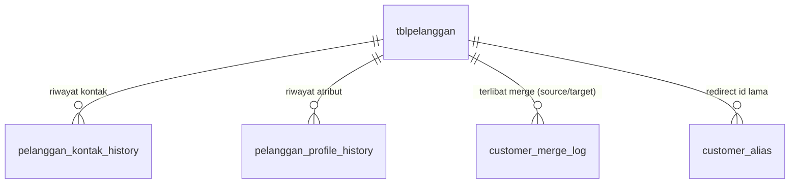

# Functional Specification Document — Modul Customer

**Versi:** 1.0 Draft
**Tanggal:** 2026-07-03
**Status:** Menunggu approval
**Referensi:** `docs/analysis/ANALISIS_ARSITEKTUR_PELANGGAN_KENDARAAN_ACCESS_TO_MYSQL.md`, `docs/audit/REVERSE_ENGINEERING_ACCESS_FITMOTOR_CUSTOMER_VEHICLE.md`

**Decision yang mengikat dokumen ini** (final, tidak dibuka ulang):
- Customer adalah identity utama sistem. Membership, CRM, statistik, reward, loyalitas semua mengikuti Customer.
- Kendaraan adalah asset milik Customer (lihat `FSD_KENDARAAN.md` untuk detail).

---

## 1. Ringkasan & Tujuan

Modul Customer mendefinisikan bagaimana identitas pelanggan disimpan, dicari, diubah, dan dijaga integritasnya sepanjang siklus hidup hubungan dengan FitMotor — termasuk saat atributnya berubah (nama, WA, alamat) dan saat ditemukan duplikat.

**Masalah yang diselesaikan** (bukti dari audit, bukan hipotetis):
- 43+35+22+... baris pelanggan duplikat nama generik tanpa telepon sudah ada di data produksi.
- Sistem lama (Access) tidak pernah punya proses konsolidasi identitas pelanggan yang lengkap — hanya 2 dari 5 cabang pernah dicoba di-dedup, sisanya digabung mentah tanpa dedup.
- Ganti nomor WA memutus kemampuan sistem mengenali "ini pelanggan yang sama" (terbukti dari query `UPDATE_TIPE_MEMBER` Access yang match wajib Nama+Telepon exact).

## 2. Ruang Lingkup

**In scope:**
- Struktur data identitas Customer + riwayat atribut (kontak, profil).
- Pencarian & pencegahan duplikat saat input.
- Proses merge Customer (2 record jadi 1, dengan riwayat transaksi utuh).
- Proses koreksi data (typo) vs perubahan data sah (ganti alamat/WA beneran) — dua alur berbeda.

**Out of scope** (dibahas di FSD terpisah):
- Kepemilikan kendaraan & riwayat plat -> `FSD_KENDARAAN.md`.
- Kalkulasi tier & benefit membership -> `FSD_MEMBERSHIP.md`.
- Dashboard 360 & broadcast WA -> `FSD_CRM.md`.

## 3. Aktor & Role

| Aktor | Hak Akses di Modul Ini |
|---|---|
| CS / Kasir | Cari, tambah, edit atribut Customer. **Tidak boleh** merge/split Customer. |
| Kepala Cabang / Supervisor | Semua hak CS + approve request merge Customer level cabang. |
| Owner / Admin Pusat | Semua hak di atas + approve merge lintas cabang, lihat `customer_merge_log` penuh. |
| Sistem (background job) | Refresh `statistik_pelanggan`, deteksi kandidat duplikat otomatis. |

## 4. Glosarium

| Istilah | Arti |
|---|---|
| Customer / Pelanggan | Identity utama sistem — satu manusia atau satu entitas (perusahaan/fleet). |
| `nopelanggan` | Primary key existing (varchar), **tidak diganti** oleh FSD ini. |
| Merge | Menggabungkan 2 record Customer yang terbukti orang yang sama menjadi 1. |
| Split | Memisahkan 1 record Customer yang ternyata berisi data 2 orang berbeda (kebalikan merge). |
| Kandidat Duplikat | Pasangan record Customer yang similarity score-nya di atas threshold, belum dikonfirmasi merge. |

## 5. Model Data

### 5.1 Tabel Existing (tidak diubah strukturnya)

`tblpelanggan` (PK `nopelanggan`) — tetap dipakai apa adanya. Field signifikan untuk modul ini: `namapelanggan`, `no_wa`, `notlp`, `alamat`, `kota`, `propinsi`, `kgrup`.

### 5.2 Tabel Baru

**`pelanggan_kontak_history`**
| Kolom | Tipe | Keterangan |
|---|---|---|
| `id` | INT PK AUTO_INCREMENT | |
| `nopelanggan` | VARCHAR(20) FK -> tblpelanggan | |
| `no_wa` | VARCHAR(30) | Nilai kontak pada periode ini |
| `notlp` | VARCHAR(20) | |
| `tanggal_mulai` | DATETIME | |
| `tanggal_akhir` | DATETIME NULL | NULL = masih berlaku |
| `is_current` | TINYINT(1) | 1 = nilai aktif saat ini |
| `diubah_oleh` | INT FK -> tbuser_karyawan | |
| `created_at` | TIMESTAMP | |

**`pelanggan_profile_history`**
| Kolom | Tipe | Keterangan |
|---|---|---|
| `id` | INT PK AUTO_INCREMENT | |
| `nopelanggan` | VARCHAR(20) FK | |
| `field_diubah` | VARCHAR(50) | nama field yang berubah (`namapelanggan`, `alamat`, dst) |
| `nilai_lama` | TEXT | |
| `nilai_baru` | TEXT | |
| `diubah_oleh` | INT FK -> tbuser_karyawan | |
| `diubah_pada` | TIMESTAMP | |

**`customer_merge_log`**
| Kolom | Tipe | Keterangan |
|---|---|---|
| `id` | INT PK AUTO_INCREMENT | |
| `nopelanggan_source` | VARCHAR(20) | record yang di-merge (jadi tidak aktif) |
| `nopelanggan_target` | VARCHAR(20) | record tujuan (tetap aktif) |
| `alasan` | TEXT | |
| `snapshot_before_json` | JSON | snapshot penuh kedua record sebelum merge, untuk rollback |
| `diajukan_oleh` | INT FK -> tbuser_karyawan | |
| `disetujui_oleh` | INT FK NULL | wajib diisi sebelum eksekusi (lihat FR-05) |
| `status` | ENUM('diajukan','disetujui','dieksekusi','ditolak') | |
| `created_at`, `executed_at` | TIMESTAMP | |

**`customer_alias`**
| Kolom | Tipe | Keterangan |
|---|---|---|
| `nopelanggan_lama` | VARCHAR(20) PK | |
| `nopelanggan_baru` | VARCHAR(20) | redirect permanen setelah merge |
| `created_at` | TIMESTAMP | |

### 5.3 ERD Ringkas



## 6. Functional Requirements

### FR-01 — Pencarian Customer Multi-Kriteria
**Deskripsi:** Form pencarian Customer (dipakai di semua titik input: servis, penjualan, dsb) mencari berdasarkan kombinasi nama (partial/fuzzy), no HP (partial match, toleransi format 08xx/+628xx), dan nomor polisi kendaraan yang pernah terdaftar ke Customer tsb.
**Business rule:** Pencarian **wajib** dijalankan dan hasil ditampilkan sebelum tombol "Customer Baru" bisa diklik — mencegah pola gagal-cari-langsung-bikin-baru yang jadi penyebab duplikat di Access/data lama.
**Input:** kata kunci (nama/HP/plat), cabang (opsional filter).
**Output:** daftar Customer match, diurut berdasar relevansi (exact match HP > exact match plat > fuzzy nama).
**Precondition:** -
**Postcondition:** Kalau ada hasil match kuat (HP exact), tombol "Customer Baru" disembunyikan/diberi konfirmasi tambahan ("yakin ini bukan [Nama] yang sudah terdaftar?").

### FR-02 — Tambah Customer Baru
**Deskripsi:** Input Customer baru setelah FR-01 tidak menemukan match.
**Validasi wajib:** minimal salah satu dari (no WA valid, no telepon valid) harus diisi — mencegah pengulangan kasus "PAK"/"SUGENG, BPK" tanpa kontak yang ditemukan di data lama.
**Business rule:** `nopelanggan` digenerate otomatis (format existing dipertahankan), tidak diinput manual.

### FR-03 — Update Atribut Customer (Kasus 1 & 4: ganti nama/WA/alamat/email)
**Deskripsi:** Edit data Customer existing.
**Business rule:**
- Setiap perubahan `no_wa` menutup baris `pelanggan_kontak_history` lama (`is_current=0`, isi `tanggal_akhir`) dan buka baris baru (`is_current=1`).
- Setiap perubahan field profil lain (nama, alamat, email) dicatat 1 baris di `pelanggan_profile_history`.
- Ini adalah **UPDATE pada `nopelanggan` yang sama** — tidak pernah membuat row `tblpelanggan` baru.
**Acceptance:** setelah ganti WA, pencarian pakai WA lama tetap bisa menemukan Customer ini (lewat lookup ke `pelanggan_kontak_history`), bukan "not found".

### FR-04 — Deteksi Kandidat Duplikat (Background)
**Deskripsi:** Job berkala membandingkan seluruh `tblpelanggan` mencari pasangan dengan similarity tinggi (nama mirip + no HP sama persis, ATAU no HP mirip + nama sama persis).
**Output:** daftar kandidat masuk antrian review manual (lihat `FSD_CRM.md` untuk tiket forward-issue), **tidak** auto-merge.
**Business rule:** threshold similarity dan algoritma matching didefinisikan di level implementasi, tapi wajib eksplisit diuji terhadap dataset duplikat yang sudah diketahui (43 baris "SUGENG, BPK" dkk) sebagai regression test sebelum go-live.

### FR-05 — Merge Customer (Kasus 5)
**Deskripsi:** Menggabungkan 2 record Customer terbukti orang yang sama.
**Alur:**
1. CS/Kasir **tidak bisa langsung eksekusi** — hanya bisa "ajukan merge" (insert `customer_merge_log` status `diajukan`).
2. Supervisor/Owner review, approve (`status='disetujui'`, isi `disetujui_oleh`) atau tolak.
3. Setelah approved, sistem eksekusi dalam 1 transaction SQL:
   - Snapshot kedua record penuh ke `snapshot_before_json`.
   - Re-point semua FK anak (`tblservice.no_pelanggan`, `tblservice_advisor` jika relevan, kepemilikan kendaraan — lihat `FSD_KENDARAAN.md`) dari `nopelanggan_source` -> `nopelanggan_target`.
   - Rebuild `statistik_pelanggan` target (gabungan agregat).
   - Insert `customer_alias(nopelanggan_source, nopelanggan_target)`.
   - Tandai `tblpelanggan.status` source jadi non-aktif (**tidak** hard delete).
   - `status` log jadi `dieksekusi`.
**Business rule kritis:** status membership hasil merge **tidak boleh turun** dari yang tertinggi di antara kedua record sebelum merge (aturan detail di `FSD_MEMBERSHIP.md`).
**Rollback:** kalau ditemukan merge salah, gunakan `snapshot_before_json` untuk restore manual (proses manual terkendali, bukan tombol "undo" otomatis — merge yang salah butuh review kasus per kasus).

### FR-06 — Koreksi Data (Typo) vs Perubahan Data Sah
**Deskripsi:** Bedakan 2 skenario yang di Access sering tercampur:
- **Koreksi typo** (nama salah ketik saat input): edit langsung in-place, TIDAK butuh approval, TIDAK generate entry riwayat yang tidak perlu (opsional: tetap log tapi dengan flag `jenis='koreksi'` di `pelanggan_profile_history`, bukan `jenis='perubahan'`).
- **Perubahan data sah** (customer benar-benar ganti alamat/nama karena menikah dsb): FR-03, dengan riwayat penuh.
**Rekomendasi UI:** saat edit, tanyakan "ini koreksi kesalahan input atau memang data berubah?" — pilihan ini menentukan apakah masuk riwayat formal atau tidak.

### FR-07 — Redirect Alias Permanen
**Deskripsi:** Setiap kali sistem menerima referensi ke `nopelanggan` yang sudah di-merge (source), otomatis resolve ke `nopelanggan_target` lewat `customer_alias` — berlaku untuk laporan lama, link lama, bookmark, dsb.
**Business rule:** proses resolve ini harus **transparan** (tidak error 404), dan idealnya menampilkan notice "data ini sudah digabung ke [Nama Target]".

## 7. Business Rules Konsolidasi

| Kode | Aturan |
|---|---|
| BR-CUST-01 | `nopelanggan` tidak pernah berubah nilainya kecuali lewat proses merge resmi (FR-05), tidak pernah lewat UPDATE biasa. |
| BR-CUST-02 | Setiap perubahan kontak (`no_wa`) wajib tercatat di `pelanggan_kontak_history` — tidak ada UPDATE langsung ke `tblpelanggan.no_wa` tanpa membuka riwayat. |
| BR-CUST-03 | Merge Customer wajib approval role Supervisor/Owner ke atas — tidak bisa dieksekusi CS/Kasir langsung. |
| BR-CUST-04 | Hard delete Customer **tidak pernah diizinkan** di level manapun — status non-aktif adalah satu-satunya cara "menghapus". |
| BR-CUST-05 | Tombol "Customer Baru" di form manapun wajib melalui FR-01 (pencarian) terlebih dahulu. |

## 8. Alur Utama

```
CS input keyword cari -> FR-01 search
  |-- ada match kuat --> pilih Customer existing --> lanjut transaksi
  |-- tidak ada match --> konfirmasi --> FR-02 tambah baru
  |
  v (kapan saja)
Customer minta update data (WA baru, alamat baru)
  --> FR-03 update + riwayat otomatis

Job background jalan harian
  --> FR-04 deteksi kandidat duplikat --> masuk tiket (FSD_CRM)
  --> Supervisor review tiket --> ajukan merge (FR-05) --> Owner approve --> eksekusi
```

## 9. Edge Case Handling

| Edge Case | Penanganan |
|---|---|
| Customer ganti WA (Kasus 1) | FR-03 — histori kontak tersimpan, pencarian pakai WA lama tetap ketemu |
| Ganti nama/alamat/email sekaligus (Kasus 4) | FR-03 — tiap field dicatat terpisah di `pelanggan_profile_history` |
| Merge Customer (Kasus 5) | FR-05, approval wajib, snapshot untuk rollback |
| Admin salah pilih Customer existing saat transaksi | Di luar scope modul ini — ditangani "Pindahkan Transaksi" (partial-merge 1 transaksi) di FSD modul Servis/Kasir, referensi silang ke `customer_merge_log` pattern tapi scope lebih sempit |
| Customer perusahaan/fleet | **Belum diputuskan** — lihat section 13 |
| Nomor WA dipakai bersama keluarga | Tidak dicegah di level struktur (1 `no_wa` bisa jadi kontak sah beberapa Customer secara kebetulan) — FR-01 tetap kombinasikan dengan nama untuk kurangi false-positive match |

## 10. Non-Functional Requirements

- Semua operasi tulis ke `pelanggan_kontak_history`/`pelanggan_profile_history` harus atomic dengan UPDATE `tblpelanggan` (1 transaction).
- Proses merge (FR-05) wajib logged lengkap — `customer_merge_log` tidak boleh punya baris ter-`DELETE`.
- Pencarian FR-01 target response < 1 detik untuk dataset 37rb+ customer — butuh index pada `no_wa`, `notlp`, dan full-text/prefix index pada `namapelanggan`.

## 11. Dependency Antar Modul

- `FSD_KENDARAAN.md` — kepemilikan kendaraan referensi `nopelanggan` sebagai identity pemilik.
- `FSD_MEMBERSHIP.md` — tier dihitung dari `statistik_pelanggan` yang terikat ke `nopelanggan`, harus konsisten pasca merge.
- `FSD_CRM.md` — dashboard 360 dan tiket kandidat-duplikat menempel di modul ini.
- Modul Servis/Kasir/Penjualan (FSD terpisah, belum dibuat) — titik pemakaian FR-01/FR-02 paling sering terjadi.

## 12. Kriteria Penerimaan

1. Input Customer baru tanpa lewat pencarian dulu tidak mungkin dilakukan dari UI manapun.
2. Ganti WA pada Customer existing tidak pernah membuat baris `tblpelanggan` baru, dan pencarian pakai WA lama tetap menemukan Customer tsb.
3. Merge Customer hanya bisa dieksekusi setelah ada baris `customer_merge_log` berstatus `disetujui` oleh role Supervisor+.
4. Menjalankan FR-04 terhadap dataset produksi saat ini berhasil mengidentifikasi minimal 90% dari kasus duplikat yang sudah diketahui manual ("SUGENG, BPK" dkk) sebagai kandidat.
5. Tidak ada satupun endpoint yang melakukan hard `DELETE FROM tblpelanggan`.

## 13. Open Items — Butuh Keputusan Sebelum Implementasi

| # | Pertanyaan | Kenapa Penting |
|---|---|---|
| O1 | Apakah perlu field `tipe_pelanggan` (perorangan/perusahaan/fleet) di FSD ini, atau ditunda ke iterasi berikutnya? | Menentukan apakah `tblpelanggan` perlu `ALTER TABLE ADD COLUMN` di fase ini |
| O2 | Threshold similarity untuk FR-04 (deteksi duplikat) — berapa persen kemiripan nama dianggap "kandidat"? | Menentukan tuning algoritma, false-positive vs false-negative |
| O3 | Siapa saja yang punya role "Supervisor" untuk approval merge (FR-05) — perlu role baru atau pakai role existing? | Menentukan perubahan di modul RBAC (`lib/rbac.php`) |
