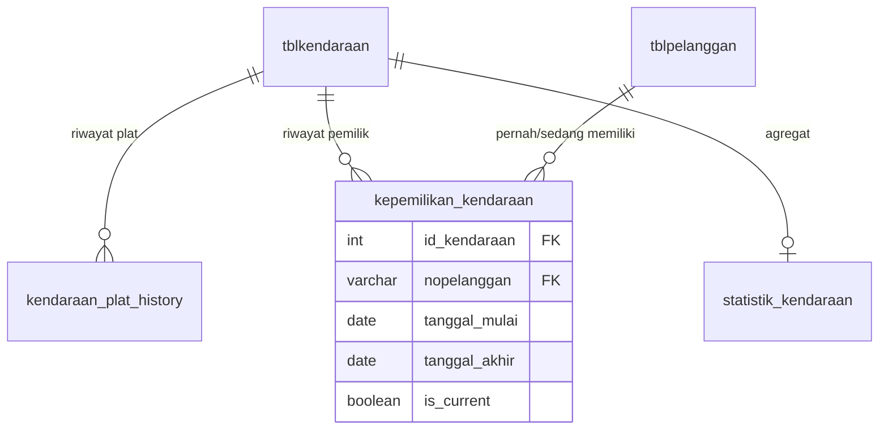

# Functional Specification Document — Modul Kendaraan

**Versi:** 1.0 Draft
**Tanggal:** 2026-07-03
**Status:** Menunggu approval
**Referensi:** `docs/analysis/ANALISIS_ARSITEKTUR_PELANGGAN_KENDARAAN_ACCESS_TO_MYSQL.md`, `docs/audit/REVERSE_ENGINEERING_ACCESS_FITMOTOR_CUSTOMER_VEHICLE.md`, `FSD_CUSTOMER.md`

**Decision yang mengikat dokumen ini** (final):
- Kendaraan adalah asset milik Customer, bukan identity utama.
- Kendaraan dapat berpindah pemilik. Histori kendaraan tetap penuh (mengikuti kendaraan). Histori pelanggan tetap mengikuti Customer lama. Owner baru hanya melihat histori sejak resmi jadi miliknya.

---

## 1. Ringkasan & Tujuan

Modul ini mendefinisikan kendaraan sebagai asset dengan identitas independen dari plat nomor (yang bisa berubah), dan mekanisme kepemilikan bertanggal yang memisahkan "histori teknis kendaraan" dari "histori yang boleh dilihat pemilik saat ini".

**Masalah yang diselesaikan:**
- `tblkendaraan.nopolisi` adalah PK sekaligus satu-satunya identitas — ganti plat = record baru atau histori putus.
- `pemilik` adalah field teks bebas, bukan FK — tidak ada cara sistem tahu "siapa pemilik SEKARANG" secara reliable.
- Access sendiri sudah mencoba menyelesaikan ini lewat form/query `*_HISTORY` (dan bahkan versi "_LAMA" yang di-redesign ulang) tapi tidak pernah solid secara struktural — FSD ini harus menyelesaikan yang Access gagal selesaikan.

## 2. Ruang Lingkup

**In scope:** identitas kendaraan independen dari plat, riwayat plat, riwayat kepemilikan bertanggal, statistik per-kendaraan.

**Out of scope:** identitas Customer (`FSD_CUSTOMER.md`), kalkulasi membership (`FSD_MEMBERSHIP.md`), tampilan dashboard gabungan (`FSD_CRM.md`).

## 3. Aktor & Role

| Aktor | Hak Akses |
|---|---|
| CS / Kasir / Admin Servis | Tambah kendaraan baru, cari kendaraan, input servis (baca kepemilikan current). |
| Kepala Cabang / Supervisor | Semua hak di atas + approve "Ganti Plat", approve "Pindah Kepemilikan". |
| Mekanik / Service Advisor | Baca histori servis penuh kendaraan (lintas kepemilikan) untuk keperluan teknis. |
| Owner | Semua akses + laporan lintas cabang. |

## 4. Glosarium

| Istilah | Arti |
|---|---|
| Kendaraan / Asset | Satu unit motor fisik, identitas independen dari plat/pemilik. |
| `id_kendaraan` | Surrogate key baru, immutable, tidak pernah berubah sepanjang umur kendaraan. |
| Kepemilikan Aktif | Baris `kepemilikan_kendaraan` dengan `is_current=1` — pemilik saat ini. |
| Koreksi Nopol | Perbaikan typo input plat, BUKAN ganti plat asli kendaraan. |
| Ganti Plat | Plat fisik kendaraan benar-benar berganti (plat baru dari Samsat). |

## 5. Model Data

### 5.1 Tabel Existing

`tblkendaraan` (PK `nopolisi`) — **struktur tidak diubah**, ditambah 1 kolom baru: `id_kendaraan INT NULL UNIQUE` (surrogate, backfill di migrasi, wajib diisi untuk baris baru).

### 5.2 Tabel Baru

**`kendaraan_plat_history`**
| Kolom | Tipe | Keterangan |
|---|---|---|
| `id` | INT PK AUTO_INCREMENT | |
| `id_kendaraan` | INT FK -> tblkendaraan.id_kendaraan | |
| `nopolisi` | VARCHAR(20) | nilai plat pada periode ini |
| `tanggal_mulai` | DATE | |
| `tanggal_akhir` | DATE NULL | NULL = plat aktif sekarang |
| `is_current` | TINYINT(1) | |
| `alasan` | ENUM('ganti_plat','koreksi_typo','kendaraan_baru') | |
| `diinput_oleh` | INT FK -> tbuser_karyawan | |
| `created_at` | TIMESTAMP | |

**`kepemilikan_kendaraan`**
| Kolom | Tipe | Keterangan |
|---|---|---|
| `id` | INT PK AUTO_INCREMENT | |
| `id_kendaraan` | INT FK | |
| `nopelanggan` | VARCHAR(20) FK -> tblpelanggan | |
| `tanggal_mulai` | DATE | |
| `tanggal_akhir` | DATE NULL | NULL = pemilik saat ini |
| `is_current` | TINYINT(1) | |
| `sumber` | ENUM('input_awal','jual_beli','koreksi_admin','migrasi_backfill') | |
| `diinput_oleh` | INT FK -> tbuser_karyawan | |
| `created_at` | TIMESTAMP | |

**`statistik_kendaraan`**
| Kolom | Tipe | Keterangan |
|---|---|---|
| `id_kendaraan` | INT PK/UNIQUE FK | |
| `nopelanggan_current` | VARCHAR(20) | denormalized, sumber kebenaran tetap `kepemilikan_kendaraan` |
| `total_transaksi` | INT | |
| `total_kunjungan` | INT | |
| `total_nominal` | DECIMAL(15,2) | |
| `total_jasa` | DECIMAL(15,2) | |
| `total_sparepart` | DECIMAL(15,2) | |
| `km_terakhir` | INT | |
| `tanggal_servis_terakhir` | DATE | |
| `updated_at` | TIMESTAMP | |

### 5.3 ERD Ringkas



## 6. Functional Requirements

### FR-01 — Registrasi Kendaraan Baru
**Deskripsi:** Tambah kendaraan baru untuk Customer yang sudah ada/baru dibuat (lewat `FSD_CUSTOMER.md` FR-01/FR-02).
**Business rule:**
- `id_kendaraan` digenerate otomatis, `nopolisi` diinput sesuai plat fisik saat ini.
- Otomatis insert 1 baris `kendaraan_plat_history` (`alasan='kendaraan_baru'`, `is_current=1`) dan 1 baris `kepemilikan_kendaraan` (`sumber='input_awal'`, `is_current=1`, `nopelanggan` = Customer yang sedang dipilih).
**Validasi:** `nopolisi` tidak boleh sudah aktif (`is_current=1`) di `kendaraan_plat_history` kendaraan lain — cegah duplikat asset.

### FR-02 — Pencarian Kendaraan, Dua Mode
Mengikuti pola yang **sudah dikenal staf dari Access** (form `FR_KENDARAAN_CARI` vs `FR_KENDARAAN_CARI_HISTORY`):
- **Mode Normal:** cari berdasarkan plat/nama pemilik **saat ini** — hasil difilter `kepemilikan_kendaraan.is_current=1`.
- **Mode Histori:** cari lintas seluruh riwayat plat & pemilik (termasuk yang sudah dijual/pindah tangan) — dipakai staf servis/teknis untuk lacak riwayat motor tertentu.
**Business rule:** kedua mode wajib tersedia sebagai pilihan eksplisit di UI, tidak digabung jadi satu hasil pencarian membingungkan.

### FR-03 — Koreksi Nomor Polisi (Typo)
**Deskripsi:** Perbaikan salah ketik plat, BUKAN ganti plat fisik.
**Business rule:** UPDATE langsung `tblkendaraan.nopolisi` dan baris `kendaraan_plat_history` yang `is_current=1` (`alasan='koreksi_typo'`) — **tidak** membuka baris histori baru dengan `tanggal_akhir` di baris lama (karena secara fisik plat tidak pernah berganti, cuma salah catat).
**Validasi:** hanya bisa dilakukan admin yang sama hari input, atau butuh approval Supervisor kalau sudah lewat (mencegah penyalahgunaan "koreksi" untuk menutupi ganti plat asli tanpa approval FR-04).

### FR-04 — Ganti Plat (Kasus 2)
**Deskripsi:** Plat fisik kendaraan benar-benar berganti (STNK baru).
**Alur:**
1. Tutup baris `kendaraan_plat_history` lama (`is_current=0`, isi `tanggal_akhir`).
2. Insert baris baru (`nopolisi` baru, `alasan='ganti_plat'`, `is_current=1`).
3. `tblkendaraan.nopolisi` (kolom utama, untuk kompatibilitas kode lama) di-UPDATE ke plat baru.
**Business rule:** `id_kendaraan` **tidak pernah berubah** — semua histori servis lama (yang terhubung via `id_kendaraan`, bukan `nopolisi`) tetap utuh dan bisa ditemukan lewat FR-02 Mode Histori maupun pencarian plat lama.
**Acceptance:** setelah ganti plat, mencari pakai plat LAMA di Mode Histori tetap menemukan kendaraan ini dengan seluruh riwayat servisnya.

### FR-05 — Pindah Kepemilikan / Jual-Beli Kendaraan (Kasus 3)
**Deskripsi:** Kendaraan berpindah tangan ke Customer lain.
**Alur:**
1. **Validasi block:** cek tidak ada transaksi servis `status_servis` belum `bayar`/`selesai` yang masih menggantung atas kendaraan ini — kalau ada, proses ditolak sampai transaksi lama diselesaikan/dibatalkan secara eksplisit.
2. Tutup baris `kepemilikan_kendaraan` lama (`is_current=0`, `tanggal_akhir` = tanggal transaksi jual-beli).
3. Insert baris baru (`nopelanggan` = pemilik baru, `sumber='jual_beli'`, `is_current=1`).
4. `statistik_kendaraan.nopelanggan_current` di-refresh.
**Business rule kritis (Decision #4):**
- Histori servis kendaraan (semua baris `tblservice` terhubung `id_kendaraan`) **tetap utuh**, dapat diakses staf teknis (FR-02 Mode Histori).
- Histori yang tampil ke pemilik BARU di dashboard Customer-facing (`FSD_CRM.md`) **difilter** hanya sejak `tanggal_mulai` kepemilikan barunya — **tidak** melihat transaksi/data pemilik lama.
- Statistik/omzet pemilik LAMA (`statistik_pelanggan`) **tidak berkurang** saat kendaraan lepas — riwayat transaksi tetap miliknya secara historis (lihat `FSD_MEMBERSHIP.md` untuk aturan status member terkait ini).
**Approval:** perlu approval Supervisor (mengingat dampak ke data 2 Customer sekaligus) — dicatat di tabel/tiket forward-issue (`FSD_CRM.md`).

### FR-06 — Statistik Per-Kendaraan
**Deskripsi:** Refresh `statistik_kendaraan` setiap servis berstatus `bayar`/lunas.
**Trigger:** event/hook setelah `tblservice.status_servis` berubah jadi status lunas.
**Business rule:** agregasi HANYA dari transaksi yang terjadi selama kendaraan itu terhubung ke `id_kendaraan` yang sama (tidak terpisah per kepemilikan — statistik kendaraan itu sendiri **selalu lifetime penuh**; pemisahan per-kepemilikan hanya terjadi di layer tampilan Customer-facing, FR-05 poin terakhir).

## 7. Business Rules Konsolidasi

| Kode | Aturan |
|---|---|
| BR-KEND-01 | `id_kendaraan` immutable sepanjang umur kendaraan — tidak pernah berubah oleh proses apapun (ganti plat, pindah tangan, koreksi). |
| BR-KEND-02 | Ganti plat asli (FR-04) selalu membuka baris histori baru; koreksi typo (FR-03) selalu update in-place tanpa baris baru. |
| BR-KEND-03 | Pindah kepemilikan (FR-05) diblokir kalau ada transaksi servis belum lunas menggantung. |
| BR-KEND-04 | Dashboard Customer-facing wajib filter berdasarkan rentang tanggal kepemilikan aktif pengguna yang login; dashboard staf teknis boleh lihat lifetime penuh. |
| BR-KEND-05 | `nopolisi` aktif (`is_current=1`) harus unik lintas seluruh kendaraan — dicek di FR-01 dan FR-04. |

## 8. Alur Utama

```
Kendaraan baru didaftarkan --> FR-01 (id_kendaraan + plat_history + kepemilikan awal)
       |
       v
Servis berjalan normal --> tblservice terhubung id_kendaraan
       |
       v
[Kasus: plat ganti]      --> FR-04, id_kendaraan tetap, riwayat servis lama tetap nyambung
[Kasus: dijual]          --> FR-05, cek transaksi menggantung, tutup kepemilikan lama, buka baru
       |
       v
Servis berjalan (pemilik baru) --> statistik_kendaraan tetap lifetime,
                                     tampilan dashboard pemilik baru difilter tanggal
```

## 9. Edge Case Handling

| Edge Case | Penanganan |
|---|---|
| Ganti Nopol (Kasus 2) | FR-04 |
| Ganti Nomor Mesin/Rangka | Di luar prioritas P0 — field `no_rangka`/`no_mesin` existing tetap disimpan sebagai informasi, direkomendasikan jadi unique index sekunder untuk deteksi duplikat kendaraan (lihat O1) tapi bukan mekanisme utama tracking |
| Kendaraan dijual, dibeli kembali oleh pemilik yang sama | `kepemilikan_kendaraan` insert baris baru lagi dengan `nopelanggan` yang sama seperti sebelumnya — tidak perlu penanganan khusus, riwayat kepemilikan boleh "bolak-balik" |
| Kendaraan berpindah owner berkali-kali | Setiap perpindahan = 1 baris baru `kepemilikan_kendaraan` — tidak ada batas jumlah |
| Duplicate kendaraan (2 baris untuk motor fisik sama) | **Belum diputuskan mekanisme deteksinya** — lihat O1 |
| Admin salah input nopol saat servis (bukan saat registrasi) | Servis tetap terhubung ke `id_kendaraan` yang salah dipilih — perlu "Pindahkan Servis ke Kendaraan Lain" (di luar scope modul ini, referensi silang ke modul Servis FSD terpisah) |

## 10. Non-Functional Requirements

- FR-02 Mode Normal harus tetap performant untuk 37rb+ kendaraan — index pada `kepemilikan_kendaraan(id_kendaraan, is_current)` dan `kendaraan_plat_history(nopolisi, is_current)`.
- `statistik_kendaraan` refresh (FR-06) tidak boleh blocking alur pembayaran servis — jalankan async/queue kalau volume tinggi.

## 11. Dependency Antar Modul

- `FSD_CUSTOMER.md` — `kepemilikan_kendaraan.nopelanggan` FK ke Customer; merge Customer (FR-05 di FSD Customer) harus ikut re-point baris `kepemilikan_kendaraan`.
- `FSD_MEMBERSHIP.md` — status member TIDAK dihitung dari kendaraan, tapi transaksi kendaraan berkontribusi ke statistik pemiliknya masing-masing sesuai periode kepemilikan.
- `FSD_CRM.md` — dashboard per-kendaraan (kartu Motor A/B/C) konsumsi `statistik_kendaraan` + `kepemilikan_kendaraan`.

## 12. Kriteria Penerimaan

1. Ganti plat tidak pernah memutus riwayat servis kendaraan (dapat diverifikasi lewat FR-02 Mode Histori memakai plat lama).
2. Pindah kepemilikan diblokir sistem kalau ada transaksi servis belum lunas.
3. Dashboard Customer pemilik baru tidak menampilkan data transaksi dari sebelum tanggal kepemilikannya.
4. `id_kendaraan` tidak pernah muncul 2x sebagai nilai berbeda untuk fisik motor yang sama dalam skenario test ganti-plat dan pindah-kepemilikan berurutan.

## 13. Open Items — Butuh Keputusan Sebelum Implementasi

| # | Pertanyaan | Kenapa Penting |
|---|---|---|
| O1 | Apakah `no_rangka` dijadikan unique index untuk deteksi duplikat kendaraan otomatis, atau cukup manual review? | Menentukan validasi tambahan di FR-01 |
| O2 | Siapa yang berwenang approve FR-05 (pindah kepemilikan) — sama dengan approval merge Customer atau role terpisah? | Menentukan alur approval & RBAC |
| O3 | Untuk kendaraan yang statistik lifetime-nya sudah campur beberapa pemilik sebelum migrasi (data lama) — bagaimana proses backfill `kepemilikan_kendaraan` menentukan `tanggal_mulai` kepemilikan pertama? | Menentukan strategi migrasi Fase 2 |
